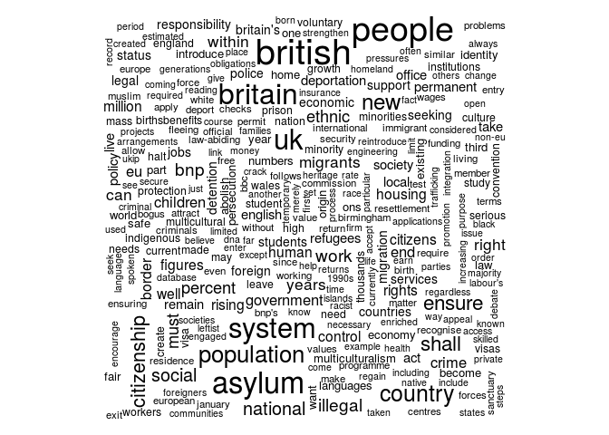

<!-- README.md is generated from README.Rmd. Please edit that file -->
quanteda: Quantitative Analysis of Textual Data
===============================================

An R package for managing and analyzing text, by Ken Benoit and Paul Nulty.

quanteda makes it easy to manage texts in the form of a corpus, defined as a collection of texts that includes document-level variables specific to each text, as well as meta-data for documents and for the collection as a whole. quanteda includes tools to make it easy and fast to manuipulate the texts the texts in a corpus, for instance by tokenizing them, with or without stopwords or stemming, or to segment them by sentence or paragraph units.

quanteda implements bootstrapping methods for texts that makes it easy to resample texts from pre-defined units, to facilitate computation of confidence intervals on textual statistics using techniques of non-parametric bootstrapping, but applied to the original texts as data. quanteda includes a suite of sophisticated tools to extract features of the texts into a quantitative matrix, where these features can be defined according to a dictionary or thesaurus, including the declaration of collocations to be treated as single features.

Once converted into a quantitative matrix (known as a "dfm" for document-feature matrix), the textual feature can be analyzed using quantitative methods for describing, comparing, or scaling texts, or used to train machine learning methods for class prediction.

How to Install
--------------

You can download the files and build the package from source, or you can use the devtools library to install the package directly from github.

Some preliminaries:

1.  To install the package from github, you will need to install the `devtools` package, using (from R):

    ``` s
    install.packages("devtools")
    ```

2.  To build the C++ parts of quanteda on Windows platforms, you will need also to install the [Rtools](http://cran.r-project.org/bin/windows/Rtools/) software available from CRAN. (OS X and Linux users can skip this step.)

3.  To access the topic modelling functionality, you will need to install the package topicmodels from CRAN. On most platforms, this will be done automatically when you install quanteda, but will fail on OS X unless you have some additional tools installed. [See instructions on installing **topicmodels** on OS X Mavericks or Yosemite here.](http://www.kenbenoit.net/how-to-install-the-r-package-topicmodels-on-os-x/)

4.  (Optional) You can install the additional corpus data from **quantedaData** using

    ``` s
    ## devtools required to install quanteda from Github
    devtools::install_github("kbenoit/quantedaData")
    ```

To install the latest master branch of `quanteda`:

``` s
devtools::install_github("kbenoit/quanteda")

## ALTERNATIVELY, to install the latest version `dev` branch version:
devtools::install_github("kbenoit/quanteda", ref="dev")
```

**Additional Libraries you may need for installation:**

-   the LAPACK C libraries
    -   for Mac, install [homebrew](http://brew.sh/) and then `brew install LAPACK`
    -   for [Windows](http://icl.cs.utk.edu/lapack-for-windows/lapack/)
    -   for Linux, `sudo apt-get install liblapack-dev`

Documentation
-------------

An introductory vignette is in progress and can be viewed here: [here](http://pnulty.github.io).

In-depth tutorials in the form of a gitbook will be available here [here](http://kbenoit.github.io/quanteda).

Examples for any function can also be seen using (for instance, for `corpus()`):

``` s
example(corpus)
```

There are also some demo functions that show off some of the package capabilities, such as `demo(quanteda)`.

Example
-------

``` r
library(quanteda)
# create a corpus from the immigration texts from UK party platforms
uk2010immigCorpus <- corpus(ukimmigTexts,
                            docvars=data.frame(party=names(ukimmigTexts)),
                            notes="Immigration-related sections of 2010 UK party manifestos",
                            enc="UTF-8")
#>   note: converted texts from UTF-8 to UTF-8.
uk2010immigCorpus
#> Corpus consisting of 9 documents.
summary(uk2010immigCorpus, showmeta=TRUE)
#> Corpus consisting of 9 documents.
#> 
#>          Text Types Tokens Sentences        party _encoding
#>           BNP   969   2765       130          BNP     UTF-8
#>     Coalition   133    231        12    Coalition     UTF-8
#>  Conservative   234    452        15 Conservative     UTF-8
#>        Greens   301    608        29       Greens     UTF-8
#>        Labour   279    615        29       Labour     UTF-8
#>        LibDem   239    434        22       LibDem     UTF-8
#>            PC    72    101         5           PC     UTF-8
#>           SNP    81    124         4          SNP     UTF-8
#>          UKIP   303    625        41         UKIP     UTF-8
#> 
#> Source:  /Users/kbenoit/Dropbox/QUANTESS/quanteda_kenlocal_gh/* on x86_64 by kbenoit.
#> Created: Tue Apr  7 10:21:29 2015.
#> Notes:   Immigration-related sections of 2010 UK party manifestos.

# key words in context for "deport", 3 words of context
kwic(uk2010immigCorpus, "deport", 3)
#>                                               preword         word
#>     [BNP, 71]                further immigration, the deportation 
#>    [BNP, 139]                            The BNP will    deport   
#>   [BNP, 1628] long-term resettlement programme.\n\n2.    Deport   
#>   [BNP, 1633]          illegal immigrants\n\nWe shall    deport   
#>   [BNP, 1653]                current unacceptably lax deportation 
#>   [BNP, 1659]                           of people are   deported  
#>   [BNP, 2169]                     enforced by instant deportation,
#>   [BNP, 2180]         British immigration laws.\n\n8. Deportation 
#>   [BNP, 2186]           Foreign Criminals\n\nWe shall    deport   
#>   [BNP, 2198]                       This includes the deportation 
#> [Greens, 566]                      subject to summary deportation.
#> [LibDem, 194]         illegal labour.\n\n- Prioritise deportation 
#> [LibDem, 394]                  flight risks.\n\n- End deportations
#>   [UKIP, 317]                            laws or face deportation.
#>                                   postword
#>     [BNP, 71] of all illegal              
#>    [BNP, 139] all foreigners convicted    
#>   [BNP, 1628] all illegal immigrants\n\nWe
#>   [BNP, 1633] all illegal immigrants      
#>   [BNP, 1653] policies, thousands of      
#>   [BNP, 1659] from the UK                 
#>   [BNP, 2169] for anyone found            
#>   [BNP, 2180] of all Foreign              
#>   [BNP, 2186] all criminal entrants,      
#>   [BNP, 2198] of all Muslim               
#> [Greens, 566] They should receive         
#> [LibDem, 194] efforts on criminals,       
#> [LibDem, 394] of refugees to              
#>   [UKIP, 317] Such citizens will

# create a dfm, removing stopwords
mydfm <- dfm(uk2010immigCorpus, ignoredFeatures=c("will", stopwords("english", verbose=FALSE)))
#> Creating a dfm from a corpus ...
#>    ... indexing 9 documents
#>    ... tokenizing texts, found 6,141 total tokens
#>    ... cleaning the tokens, 186 removed entirely
#>    ... ignoring 175 feature types, discarding 2,590 total features (43.5%)
#>    ... summing tokens by document
#>    ... indexing 1,491 feature types
#>    ... building sparse matrix
#>    ... created a 9 x 1491 sparse dfm
#>    ... complete. Elapsed time: 0.252 seconds.
dim(mydfm)              # basic dimensions of the dfm
#> [1]    9 1491
topfeatures(mydfm, 20)  # 20 top words
#> immigration     british      people      asylum     britain      system 
#>          66          37          35          29          28          27 
#>          uk  population     country         new      ensure  immigrants 
#>          27          21          20          19          17          17 
#>       shall citizenship    national      social         bnp     illegal 
#>          17          16          14          14          13          13 
#>        work      ethnic 
#>          13          12
if (Sys.info()['sysname']=="Darwin") quartz() # open nicer window, Mac only
plot(mydfm)             # word cloud     
```


