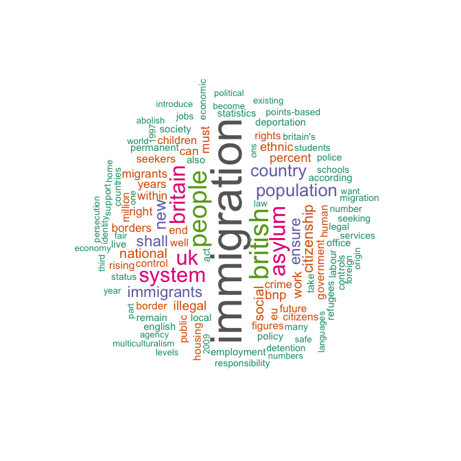

<!-- README.md is generated from README.Rmd. Please edit that file -->


Quantitative Analysis of Textual Data
=====================================

[](https://CRAN.R-project.org/package=quanteda)   [](https://travis-ci.org/kbenoit/quanteda) [](https://ci.appveyor.com/project/kbenoit/quanteda) [](https://codecov.io/gh/kbenoit/quanteda/branch/master)

Quantitative Analysis of Textual Data
=====================================

[](https://CRAN.R-project.org/package=quanteda)   [](https://travis-ci.org/kbenoit/quanteda) [](https://ci.appveyor.com/project/kbenoit/quanteda) [](https://codecov.io/gh/kbenoit/quanteda/branch/master)

**quanteda** v0.9.9 under development
-------------------------------------

See the new, upcoming [major API changes](API.md), to be incorporated into the next minor version 0.9.9 and for CRAN, in a "1.0" release. Thisupcoming release includes some major changes but also many major improvements.

About the package
-----------------

An R package for managing and analyzing text, created by Ken Benoit with an amazing team of core [contributors](https://github.com/kbenoit/quanteda/graphs/contributors) including Paul Nulty, Adam Obeng, Kohei Watanabe, Haiyan Wang, Ben Lauderdale, and Will Lowe. Supported by the European Research Council grant ERC-2011-StG 283794-QUANTESS.

Features
========

Powerful text analytics
-----------------------

**Generalized, flexible corpus management.** **quanteda** provides a comprehensive workflow and ecosystem for the management, processing, and analysis of texts. Documents and associated document- and collection-level metadata are easily loaded and stored as a *corpus* object, although most of **quanteda**'s operations work on simple character objects as well. A corpus is designed to efficiently store all of the texts in a collection, as well as meta-data for documents and for the collection as a whole. This makes it easy to perform natural language processing on the texts in a corpus simply and quickly, such as tokenizing, stemming, or forming ngrams. **quanteda**'s functions for tokenizing texts and forming multiple tokenized documents into a *document-feature matrix* are both extremely fast and extremely simple to use. **quanteda** can segment texts easily by words, paragraphs, sentences, or even user-supplied delimiters and tags.

**Works nicely with UTF-8**. Built on the text processing functions in the **stringi** package, which is in turn built on C++ implementation of the [ICU](http://www.icu-project.org/) libraries for Unicode text handling, **quanteda** pays special attention to fast and correct implementation of Unicode and the handling of text in any character set, following conversion internally to UTF-8.

**Built for efficiency and speed**. All of the functions in **quanteda** are built for maximum performance and scale while still being as R-based as possible. The package makes use of three efficient architectural elements:
the **stringi** package for text processing, the **Matrix** package for sparse matrix objects, and the **data.table** package for indexing large documents efficiently. If you can fit it into memory, **quanteda** will handle it quickly. (And eventually, we will make it possible to process objects even larger than available memory.)

**Super-fast conversion of texts into a document-feature matrix**. **quanteda** is principally designed to allow users a fast and convenient method to go from a corpus of texts to a selected matrix of documents by features, after defining and selecting the documents and features. The package makes it easy to redefine documents, for instance by splitting them into sentences or paragraphs, or by tags, as well as to group them into larger documents by document variables, or to subset them based on logical conditions or combinations of document variables. A special variation of the "dfm", a *feature co-occurrence matrix*, is also implemented, for direct use with embedding and representational models such as **text2vec**.

**Extensive feature selection capabilities**. The package also implements common NLP feature selection functions, such as removing stopwords and stemming in numerous languages, selecting words found in dictionaries, treating words as equivalent based on a user-defined "thesaurus", and trimming and weighting features based on document frequency, feature frequency, and related measures such as *tf-idf*.

**Qualitative exploratory tools**, such as *keywords in context*. Like all of **quanteda**'s pattern matching functions, users have the option of simple "glob" expressions, regular expressions, or fixed pattern matches.

**Dictionaries**. **quanteda** allows fast and flexible implementation of dictionary methods, including the import and conversion of foreign dictionary formats such as those from Provalis's WordStat, the Linguistic Inquiry and Word Count (LIWC), Lexicoder, and Yoshioder.

**Text analytic methods**. Once constructed, a *dfm* can be easily analyzed using either **quanteda**'s built-in tools for scaling document positions (for the "wordfish" and "Wordscores" models, direct use with the **ca** package for correspondence analysis), predictive models using Naive Bayes multinomial and Bernoulli classifiers, computing distance or similarity matrixes of features or documents, or computing readability or lexical diversity indexes. In addition, **quanteda** a document-feature matrix is easily used with or converted for a number of other text analytic tools, such as:

-   *topic models* (including converters for direct use with the **topicmodels**, **LDA**, and **stm** packages);

-   machine learning through a variety of other packages that take matrix or matrix-like inputs.

**Planned features.** Coming soon to **quanteda** are:

-   *Bootstrapping methods* for texts that makes it easy to resample texts from pre-defined units, to facilitate computation of confidence intervals on textual statistics using techniques of non-parametric bootstrapping, but applied to the original texts as data.

-   *Additional predictive and analytic methods* by expanding the `textstat_` and `textmodel_` functions. Current textmodel types include correspondence analysis, "Wordscores", "Wordfish", and Naive Bayes; current textstat statistics are readability, lexical diversity, similarity, and distance.

-   *Expanded settings* for all objects, that will propogate through downstream objects.

-   *Object histories*, that will propogate through downstream objects, to enhance analytic reproducibility and transparency.

How to Install
==============

1.  **From CRAN**: Use your GUI's R package installer, or execute:

    ``` r
    install.packages("quanteda") 
    ```

2.  **From GitHub**, using:

    ``` r
    # devtools packaged required to install quanteda from Github 
    devtools::install_github("kbenoit/quanteda") 
    ```

    Because this compiles some C++ source code, you will need a compiler installed. If you are using a Windows platform, this means you will need also to install the [Rtools](https://CRAN.R-project.org/bin/windows/Rtools/) software available from CRAN. If you are using OS X, you will need to to install XCode, available for free from the App Store, or if you prefer a lighter footprint set of tools, [just the Xcode command line tools](http://osxdaily.com/2014/02/12/install-command-line-tools-mac-os-x/), using the command `xcode-select --install` from the Terminal.

3.  **Additional recommended packages:**

    The following packages work well with **quanteda** and we recommend that you also install them:

    -   **readtext**: For reading text data into R.

        ``` r
        devtools::install_github("kbenoit/readtext")
        ```

    -   **quantedaData**: Additional textual data for use with quanteda.

        ``` r
        r devtools::install_github("kbenoit/quantedaData")
        ```

    -   **spacyr**: NLP using the [spaCy](http://spacy.io) library.

Getting Started
===============

See the [package website](http://kbenoit.github.io/quanteda), which includes the [Getting Started Vignette](http://htmlpreview.github.com/?https://github.com/kbenoit/quanteda/blob/master/vignettes/quickstart.html).

Demonstration
=============

``` r
library(quanteda)
## 
## This data.table install has not detected OpenMP support. It will work but slower in single threaded mode.
## quanteda version 0.9.8.9022
## 
## Attaching package: 'quanteda'
## The following object is masked from 'package:base':
## 
##     sample

# create a corpus from the immigration texts from UK party platforms
uk2010immigCorpus <- 
    corpus(data_char_ukimmig2010,
           docvars = data.frame(party = names(data_char_ukimmig2010)),
           metacorpus = list(notes = "Immigration-related sections of 2010 UK party manifestos"))
uk2010immigCorpus
## Corpus consisting of 9 documents and 1 docvar.
summary(uk2010immigCorpus)
## Corpus consisting of 9 documents.
## 
##          Text Types Tokens Sentences        party
##           BNP  1126   3330        88          BNP
##     Coalition   144    268         4    Coalition
##  Conservative   252    503        15 Conservative
##        Greens   325    687        21       Greens
##        Labour   296    703        29       Labour
##        LibDem   257    499        14       LibDem
##            PC    80    118         5           PC
##           SNP    90    136         4          SNP
##          UKIP   346    739        27         UKIP
## 
## Source:  /Users/kbenoit/Dropbox (Personal)/GitHub/quanteda/* on x86_64 by kbenoit
## Created: Mon Dec  5 10:57:51 2016
## Notes:   Immigration-related sections of 2010 UK party manifestos

# key words in context for "deport", 3 words of context
kwic(uk2010immigCorpus, "deport", 3)
##                        contextPre keyword                contextPost
##  [BNP, 159]        The BNP will [  deport ] all foreigners convicted
## [BNP, 1970]                . 2. [  Deport ] all illegal immigrants  
## [BNP, 1976] immigrants We shall [  deport ] all illegal immigrants  
## [BNP, 2621]  Criminals We shall [  deport ] all criminal entrants

# create a dfm, removing stopwords
mydfm <- dfm(uk2010immigCorpus, remove = c("will", stopwords("english")),
             removePunct = TRUE)
mydfm
## Document-feature matrix of: 9 documents, 1,547 features (83.8% sparse).

topfeatures(mydfm, 20)  # 20 top words
## immigration     british      people      asylum     britain          uk 
##          66          37          35          29          28          27 
##      system  population     country         new  immigrants      ensure 
##          27          21          20          19          17          17 
##       shall citizenship      social    national         bnp     illegal 
##          17          16          14          14          13          13 
##        work     percent 
##          13          12

# plot a word cloud
textplot_wordcloud(mydfm, min.freq = 6, random.order = FALSE,
                   rot.per = .25, 
                   colors = RColorBrewer::brewer.pal(8,"Dark2"))
```



Contributing
============

Describe.
