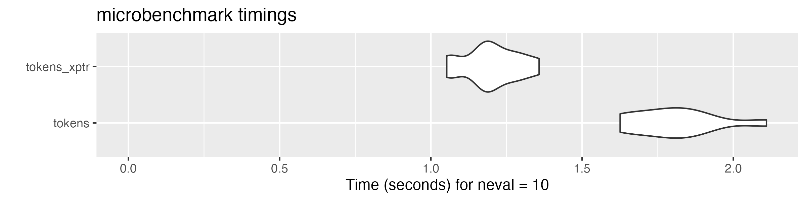
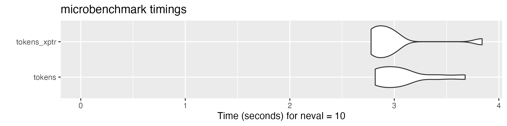
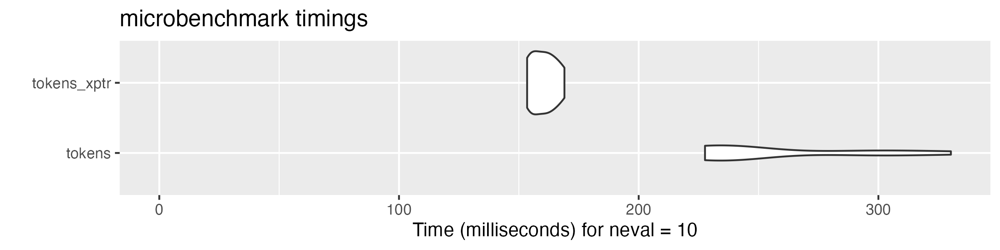
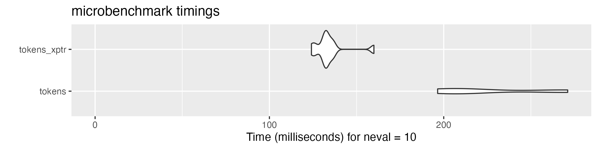
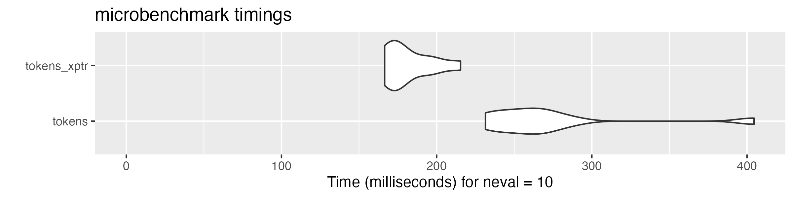
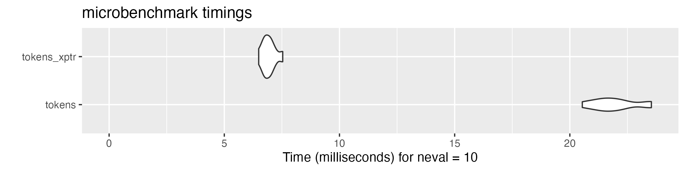
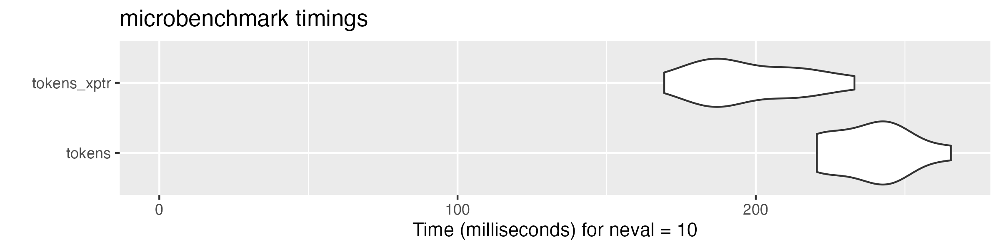
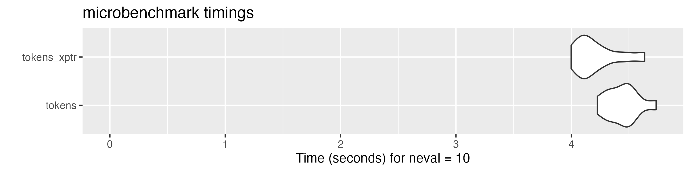

# Performance improvements

## Overview and benchmarking approach

**quanteda** version 4.0 can process textual data significantly faster
than its earlier versions thanks to the `tokens_xptr` object and a new
glob pattern matching mechanism. More information on the features and
advantages of the new xptr object are available in a [separate
vignette](https://quanteda.io/articles/pkgdown/articles/pkgdown/tokens_xptr.md).

How we performed the comparison: we compare the `tokens` and
`tokens_xptr` on a Windows laptop with AMD Ryzen 7 PRO processor (8
cores). We used sentences from 10,000 English-language news articles in
this benchmarking.

We repeated the same operation using different versions of the same
functions to get the distribution of execution time. The result shows
that the execution time of many v4.0 functions is about half of their
version 3.3 counterparts.

``` r

# remotes::install_github("quanteda/quanteda3")
library("quanteda")
library("ggplot2")

# create text corpus
corp <- corpus_reshape(data_corpus_guardian)

# tokenize corpus
toks <- tokens(corp, remove_punct = FALSE, remove_numbers = FALSE, 
               remove_symbols = FALSE)

# transform tokens object to tokens_xptr object
xtoks <- as.tokens_xptr(toks)

ndoc(xtoks) # the number of sentences
## [1] 200254
sum(ntoken(xtoks)) # the total number of tokens
## [1] 5322321
```

## Modifying tokens objects

[`as.tokens_xptr()`](https://quanteda.io/reference/tokens_xptr.md) is
inserted before functions calls to deep-copy the original object. This
is only necessary to repeat the same operation in benchmarking, so the
performance advantage of the `tokens_xptr` object is even greater in
actual pipeline.

``` r

# generate n-grams
microbenchmark::microbenchmark(
    tokens = tokens_ngrams(toks),
    tokens_xptr = as.tokens_xptr(xtoks) |> 
        tokens_ngrams(),
    times = 10
) |> autoplot(log = FALSE)
```



``` r


# lookup dictionary keywords
microbenchmark::microbenchmark(
    tokens = tokens_lookup(toks, dictionary = data_dictionary_LSD2015),
    tokens_xptr = as.tokens_xptr(xtoks) |> 
        tokens_lookup(dictionary = data_dictionary_LSD2015),
    times = 10
) |> autoplot(log = FALSE)
```



``` r


# remove stop words
microbenchmark::microbenchmark(
    tokens = tokens_remove(toks, pattern = stopwords("en"), padding = TRUE),
    tokens_xptr = as.tokens_xptr(xtoks) |> 
        tokens_remove(pattern = stopwords("en"), padding = TRUE),
    times = 10
) |> autoplot(log = FALSE)
```



``` r


# compound tokens
microbenchmark::microbenchmark(
    tokens = tokens_compound(toks,  pattern = "&", window = 1),
    tokens_xptr = as.tokens_xptr(xtoks) |> 
        tokens_compound(pattern = "&", window = 1),
    times = 10
) |> autoplot(log = FALSE)
```



``` r


# group sentences to articles
microbenchmark::microbenchmark(
    tokens = tokens_group(toks),
    tokens_xptr = tokens_group(xtoks),
    times = 10
) |> autoplot(log = FALSE)
```



## Combining tokens objects

Combining tokens objects using [`c()`](https://rdrr.io/r/base/c.html) is
also substantially faster.

``` r

# get first 5000 documents
toks1 <- head(toks, 5000)

# get last 5000 documents
toks2 <- tail(toks, 5000)

# transform both objects to tokens_xptr objects
xtoks1 <- as.tokens_xptr(toks1)
xtoks2 <- as.tokens_xptr(toks2)

# combine tokens objects
microbenchmark::microbenchmark(
    tokens = c(toks1, toks2),
    tokens_xptr = c(xtoks1, xtoks2),
    times = 10
) |> autoplot(log = FALSE)
```



## Constructing a document-feature matrix

We also compare the speed of constructing a document-feature matrix
(DFM) using tokens objects.

``` r

microbenchmark::microbenchmark(
    tokens = dfm(toks),
    tokens_xptr = dfm(xtoks),
    times = 10
) |> autoplot(log = FALSE)
```



## Simple pipeline: tokenising a corpus and creating a document-feature matrix

``` r

microbenchmark::microbenchmark(
    tokens = tokens(corp) |> 
        tokens_remove(stopwords("en"), padding = TRUE) |> 
        dfm(remove_padding = TRUE),
    tokens_xptr = tokens(corp, xptr = TRUE) |> 
        tokens_remove(stopwords("en"), padding = TRUE) |> 
        dfm(remove_padding = TRUE),
    times = 10
) |> autoplot(log = FALSE)
```


