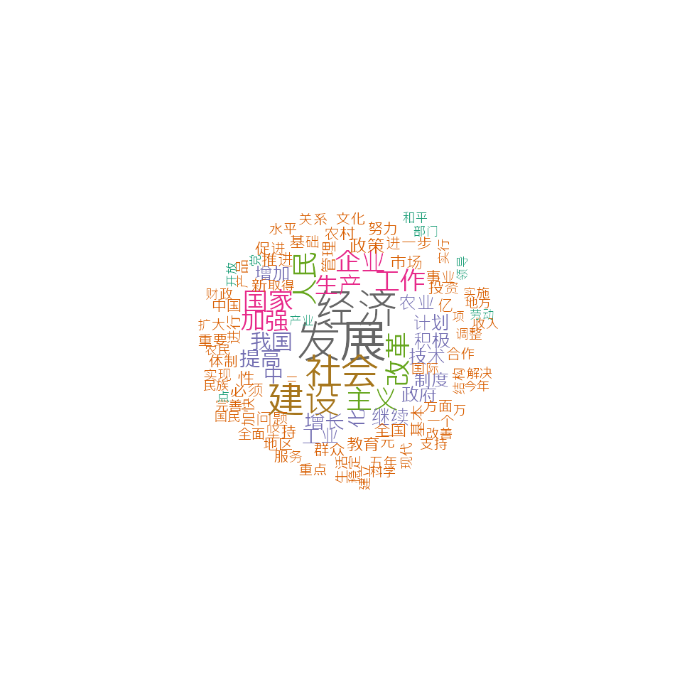

# Example: Chinese text analysis

This vignette demonstrates that **quanteda** can be used for analysis of
Chinese language texts.

``` r

library("quanteda")
```

## Download corpus

Download corpus constructed from *Report on the Work of the Government*
published by Premier of the State Council between 1954 and 2017. You can
download the corpus using the **quanteda.corpora** package.

``` r

# read text files
remotes::install_github("quanteda/quanteda.corpora")
```

``` r

library("quanteda.corpora")
corp <- quanteda.corpora::download(url = "https://www.dropbox.com/s/37ojd5knz1qeyul/data_corpus_chinesegovreport.rds?dl=1")
```

## Tokenization

``` r

# Chinese stopwords
ch_stop <- stopwords("zh", source = "misc")

# tokenize
toks_ch <- corp |> 
    tokens(remove_punct = TRUE) |>
    tokens_remove(pattern = ch_stop)

# Construct a dfm
dfmat_ch <- dfm(toks_ch)

# Get most frequent features
topfeatures(dfmat_ch)
## 发展 经济 社会 建设 改革 人民 主义 工作 企业 国家 
## 5627 5036 4255 4248 2931 2897 2817 2642 2627 2595
```

## Analysis

### Word cloud

``` r

# Plot a word cloud
set.seed(100)

# to set the font correctly for macOS
library("quanteda.textplots")
textplot_wordcloud(dfmat_ch, min_count = 500, random_order = FALSE,
                   rotation = .25, max_words = 100,
                   min_size = 0.5, max_size = 2.8,
                   font = if (Sys.info()['sysname'] == "Darwin") "SimHei" else NULL,
                   color = RColorBrewer::brewer.pal(8, "Dark2"))
```



### Feature co-occurrence matrix

``` r

# fcm within the window size of 5
corp_ch17 <- corpus_subset(corp, Year == "2017")

toks_ch17 <- corp_ch17 |> 
    tokens(remove_punct = TRUE) |> 
    tokens_remove(ch_stop)
    
fcmat_ch <- corp_ch17 |> 
    tokens() |> 
    fcm(context = "window", window = 5)  
```

### Unsupervised document scaling

In this example, we run a Wordfish model to show how to apply an
unspervised document scaling method to Chinese texts.

``` r

library("quanteda.textmodels")

tmod_wf <- textmodel_wordfish(dfmat_ch)

y <- 1954:2017
y <- y[y <= 1964 | y >= 1975]
y <- y[!y %in% c(1963, 1961, 1962, 1976, 1977)]
plot(y, tmod_wf$theta, xlab = "Year", ylab = "Position")
```


### Collocations

``` r

# bigrams cross the whole dataset
library("quanteda.textstats")

tstat_col_ch <- textstat_collocations(toks_ch, size = 2, min_count = 20)
knitr::kable(head(tstat_col_ch, 10))
```

| collocation | count | count_nested | length |   lambda |         z |
|:------------|------:|-------------:|-------:|---------:|----------:|
| 社会 主义   |  1787 |            0 |      2 | 5.667646 | 128.76439 |
| 亿 元       |   689 |            0 |      2 | 7.451647 |  93.09479 |
| 现代 化     |   632 |            0 |      2 | 6.956866 |  83.62882 |
| 体制 改革   |   504 |            0 |      2 | 5.199483 |  77.47483 |
| 五年 计划   |   341 |            0 |      2 | 5.365465 |  71.73289 |
| 各级 政府   |   306 |            0 |      2 | 6.116987 |  66.70430 |
| 增长 百分   |   300 |            0 |      2 | 5.527159 |  65.95692 |
| 万 吨       |   212 |            0 |      2 | 6.596337 |  62.62405 |
| 国民 经济   |   589 |            0 |      2 | 6.021117 |  61.87053 |
| 充分 发挥   |   191 |            0 |      2 | 6.590507 |  61.30822 |

``` r


# bigrams in 2017 report
tstat_col_ch17 <- textstat_collocations(toks_ch17, size = 2)
knitr::kable(head(tstat_col_ch17, 10))
```

| collocation | count | count_nested | length |   lambda |        z |
|:------------|------:|-------------:|-------:|---------:|---------:|
| 人民 群众   |    12 |            0 |      2 | 5.406843 | 12.89491 |
| 亿 元       |    14 |            0 |      2 | 8.302839 | 12.62184 |
| 调 控       |    11 |            0 |      2 | 7.593829 | 12.41301 |
| 政府 工作   |     9 |            0 |      2 | 4.710228 | 11.07990 |
| 深入 实施   |     8 |            0 |      2 | 5.018592 | 10.92455 |
| 党 中央     |     7 |            0 |      2 | 5.747235 | 10.90905 |
| 体制 改革   |    11 |            0 |      2 | 5.317394 | 10.53589 |
| 国内 生产   |     6 |            0 |      2 | 6.166877 | 10.48876 |
| 现代 化     |     8 |            0 |      2 | 5.706046 | 10.43500 |
| 基础 设施   |     7 |            0 |      2 | 7.549629 | 10.42514 |
