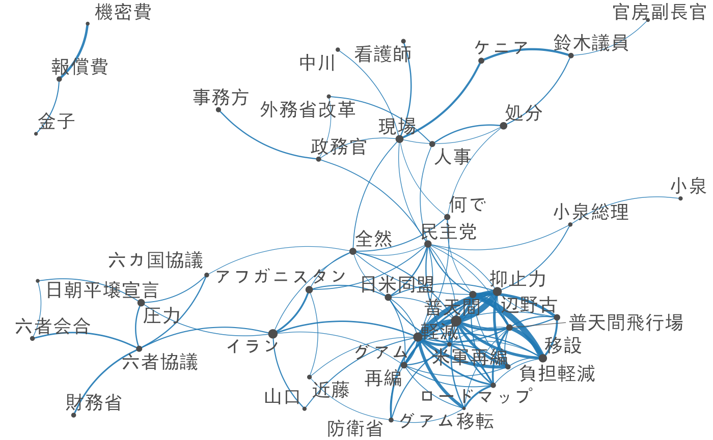
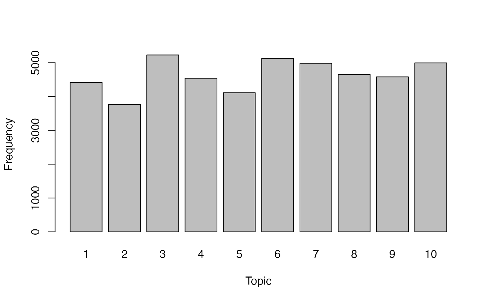

# 事例: 衆議院外務委員会の議事録

``` r

library(quanteda)
library(stringr)
library(dplyr)
library(lubridate)
library(topicmodels)
```

### コーパスのダウンロード

本例で用いる衆議院外務委員会の議事録は，1947年から2017年の間のすべての発言を含んでいる．このコーパスは**quanteda.corpora**を用いてダウンロードできる．

``` r

#devtools::install_github("quanteda/quanteda.corpora")
full_corp <- quanteda.corpora::download("data_corpus_foreignaffairscommittee")
```

#### コーパスの作成手順

読者が独自のコーパスを作成できるように，本例のコーパスを作成した手順を以下に示してある．

##### 議事録をダウンロード

国会会議録のダウンロードには**kaigiroku**パッケージを使う．APIが応答しない場合に途中からダウンロードをやり直す必要がないように，年ごとにファイルに保存し，それらを最後に連結すると良い．

``` r

devtools::install_github("amatsuo/kaigiroku")
library(kaigiroku)

# 年ごとに議事録をダウンロード
folder_download <- "~/temp/download"
committee <- "外務"

for (year in 1947:2017) {
  cat(as.character(Sys.time()), year, committee, "\n")
  temp <- get_meeting(meetingName = committee, year = year)
  if (is.null(temp)) next
  saveRDS(temp, file = sprintf("%s/%s_%s.rds", folder_download, year, committee))
  Sys.sleep(10)
}

# ファイルを結合して保存
file_all <- list.files(folder_download, full = TRUE, pattern = ".rds")
speech <- lapply(as.list(file_all), readRDS) |> bind_rows()
saveRDS(speech, file = paste0(folder_download, "committee_speeches.rds"))
```

##### コーパスの作成

``` r

load("temp/committee_speeches.rda")
full_corp <- corpus(foreign_affairs_committee_speeches, text_field = "speech")
```

### 議事録の数と期間を取得

``` r

ndoc(full_corp)
## [1] 287298
range(docvars(full_corp, "date"))
## [1] "1947-06-30" "2017-11-29"
```

## 前処理

発言者のいないレコード（典型的には各議事録の0番目の出席者，議題等の部分）を取り除く，また，各発言の冒頭は発言者の氏名と役職名なので，その部分から役職名を取り出して新しい`docvar`を作る．

``` r

full_corp <- corpus_subset(full_corp, speaker != "")

## capacity変数の作成
capacity <- full_corp |>
  str_sub(1, 20) |>
  str_replace_all("\\s+.+|\n", "") |> # 冒頭の名前部分の取り出し
  str_replace( "^.+?(参事|政府特別補佐人|内閣官房|会計検査院|最高裁判所長官代理者|主査|議員|副?大臣|副?議長|委員|参考人|分科員|公述人|君(（.+）)?$)", "\\1") |> # 冒頭の○から，名前部分までを消去
  str_replace("（.+）", "")
capacity <- str_replace(capacity, "^○.+", "Other") # マイナーな役職名は一括して"Other"に
knitr::kable(as.data.frame(table(capacity)))
```

| capacity         |   Freq |
|:-----------------|-------:|
| Other            |  17174 |
| 会計検査院当局者 |     47 |
| 会計検査院説明員 |      5 |
| 会計検査院長     |      7 |
| 公述人           |     70 |
| 内閣官房副長官   |    260 |
| 副大臣           |   3020 |
| 参事             |      8 |
| 参考人           |  11600 |
| 参考人（通訳つき |      8 |
| 参考人（通訳なし |      2 |
| 君               |    233 |
| 大臣             |  52850 |
| 大臣政務官       |   1135 |
| 委員             | 172692 |
| 委員外務大臣     |      1 |
| 委員大臣         |      2 |
| 委員長           |  24685 |
| 委員長代理       |   1361 |
| 政府特別補佐人   |     80 |
| 議員             |     27 |

``` r


docvars(full_corp, "capacity") <- capacity
```

### 1991から2010年までの期間の議事録を選択

``` r

docvars(full_corp, "year") <- docvars(full_corp, "date") |> year() |> as.numeric()
corp <- corpus_subset(full_corp, 1991 <= year & year <= 2010)

ndoc(corp)
## [1] 62670
```

### 委員，大臣，副大臣の発言を選択

``` r

corp <- corpus_subset(corp, capacity %in% c("委員", "大臣", "副大臣"))
ndoc(corp)
## [1] 46890
```

### トークン化

日本語の分析では，形態素解析ツールを用いて分かち書きを行うことが多いが，**quanteda**の[`tokens()`](https://quanteda.io/reference/tokens.md)は，[ICU](http://site.icu-project.org/)で定義された規則に従って文を語に分割することができる．さらに，漢字やカタカナの連続的共起を[`textstat_collocations()`](https://quanteda.io/reference/textstat_collocations.html)を用いて抽出し，[`tokens_compound()`](https://quanteda.io/reference/tokens_compound.md)によって統計的に優位な組み合わせを結合すると，より質の高いトークン化を実現できる．[`textstat_collocations()`](https://quanteda.io/reference/textstat_collocations.html)を用いる場合は，事前に[`tokens_select()`](https://quanteda.io/reference/tokens_select.md)と正規表現で，対象とする語だけを選択する．この際，`padding = TRUE`とし，語の間の距離が維持されるように注意する

``` r

toks <- tokens(corp)
toks <- tokens_select(toks, "^[０-９ぁ-んァ-ヶー一-龠]+$", valuetype = "regex", padding = TRUE)
toks <- tokens_remove(toks, c("御", "君"), padding = TRUE)

min_count <- 10

# 漢字
library("quanteda.textstats")
kanji_col <- tokens_select(toks, "^[一-龠]+$", valuetype = "regex", padding = TRUE) |> 
             textstat_collocations(min_count = min_count)
toks <- tokens_compound(toks, kanji_col[kanji_col$z > 3,], concatenator = "")

# カタカナ
kana_col <- tokens_select(toks, "^[ァ-ヶー]+$", valuetype = "regex", padding = TRUE) |> 
            textstat_collocations(min_count = min_count)
toks <- tokens_compound(toks, kana_col[kana_col$z > 3,], concatenator = "")

# 漢字，カタカナおよび数字
any_col <- tokens_select(toks, "^[０-９ァ-ヶー一-龠]+$", valuetype = "regex", padding = TRUE) |> 
           textstat_collocations(min_count = min_count)
toks <- tokens_compound(toks, any_col[any_col$z > 3,], concatenator = "")
```

### 文書行列の作成

[`dfm()`](https://quanteda.io/reference/dfm.md)によって文書行列を作成した後でも，`dfm_*()`と命名された関数を用いると分析に必要な文書の特徴を自由に選択できる．ここでは，平仮名のみもしくは一語のみから構成されたトークンを[`dfm_remove()`](https://quanteda.io/reference/dfm_select.md)によって，頻度が極端に低い語もしくは高い語を[`dfm_trim()`](https://quanteda.io/reference/dfm_trim.md)によって削除している．

``` r

speech_dfm <- dfm(toks) |>
    dfm_remove("") |> 
    dfm_remove("^[ぁ-ん]+$", valuetype = "regex", min_nchar = 2) |> 
    dfm_trim(min_termfreq = 0.50, termfreq_type = "quantile", max_termfreq = 0.99)
```

## 分析

### 相対頻度分析

[`textstat_keyness()`](https://quanteda.io/reference/textstat_keyness.html)は語の頻度を文書のグループ間で比較し，統計的に有意に頻度が高いものを選択する．ここでは，同時多発テロが発生した2001年以降に頻度が高くなった30語を示してある．

``` r

key <- textstat_keyness(speech_dfm, docvars(speech_dfm, "year") >= 2001)
head(key, 20) |> knitr::kable()
```

| feature        |     chi2 |   p | n_target | n_reference |
|:---------------|---------:|----:|---------:|------------:|
| 武正委員       | 462.8233 |   0 |      662 |           0 |
| 東門委員       | 444.2879 |   0 |      647 |           3 |
| 笠井委員       | 428.5473 |   0 |      613 |           0 |
| アフガニスタン | 360.4991 |   0 |      582 |          18 |
| グアム         | 350.8133 |   0 |      561 |          16 |
| 防衛省         | 340.4229 |   0 |      487 |           0 |
| 小泉総理       | 339.0242 |   0 |      485 |           0 |
| 近藤           | 333.5359 |   0 |      481 |           1 |
| 中曽根国務大臣 | 328.5346 |   0 |      470 |           0 |
| 町村国務大臣   | 323.6395 |   0 |      463 |           0 |
| 赤嶺委員       | 318.2806 |   0 |      500 |          12 |
| 民主党         | 298.5617 |   0 |      678 |          77 |
| 岡田国務大臣   | 298.4658 |   0 |      427 |           0 |
| 軽減           | 298.3167 |   0 |      666 |          73 |
| 首藤委員       | 290.7970 |   0 |      435 |           5 |
| 政務官         | 290.2955 |   0 |      438 |           6 |
| 小野寺委員     | 283.7818 |   0 |      406 |           0 |
| 密約           | 268.3716 |   0 |      463 |          22 |
| 麻生大臣       | 260.7082 |   0 |      373 |           0 |
| 財務省         | 219.5688 |   0 |      318 |           1 |

上の表では，委員会出席者の名前が多く含まれるので，それらを取り除くと議論の主題が明確になる．

``` r

key <- key[!str_detect(key$feature, regex("委員|大臣")),]
head(key, 20) |> knitr::kable()
```

|     | feature        |     chi2 |   p | n_target | n_reference |
|:----|:---------------|---------:|----:|---------:|------------:|
| 4   | アフガニスタン | 360.4991 |   0 |      582 |          18 |
| 5   | グアム         | 350.8133 |   0 |      561 |          16 |
| 6   | 防衛省         | 340.4229 |   0 |      487 |           0 |
| 7   | 小泉総理       | 339.0242 |   0 |      485 |           0 |
| 8   | 近藤           | 333.5359 |   0 |      481 |           1 |
| 12  | 民主党         | 298.5617 |   0 |      678 |          77 |
| 14  | 軽減           | 298.3167 |   0 |      666 |          73 |
| 16  | 政務官         | 290.2955 |   0 |      438 |           6 |
| 18  | 密約           | 268.3716 |   0 |      463 |          22 |
| 20  | 財務省         | 219.5688 |   0 |      318 |           1 |
| 23  | ロードマップ   | 207.6848 |   0 |      301 |           1 |
| 27  | 米軍再編       | 199.1851 |   0 |      285 |           0 |
| 28  | 普天間         | 198.0009 |   0 |      514 |          74 |
| 29  | 山口           | 185.5153 |   0 |      439 |          54 |
| 30  | 負担軽減       | 184.2305 |   0 |      275 |           3 |
| 31  | 辺野古         | 183.5319 |   0 |      274 |           3 |
| 32  | 日米同盟       | 182.6724 |   0 |      376 |          34 |
| 33  | 金子           | 180.4233 |   0 |      262 |           1 |
| 34  | 六カ国協議     | 175.5304 |   0 |      255 |           1 |
| 37  | 六者協議       | 161.3439 |   0 |      281 |          14 |

### 共起ネットワーク分析

[`fcm()`](https://quanteda.io/reference/fcm.md)によって作成した共起行列に対して，[`textplot_network()`](https://rdrr.io/pkg/quanteda.textplots/man/textplot_network.html)を用いると語の関係が視覚化でき，文書の内容の全体像を容易に把握できる．

``` r

library("quanteda.textplots")
feat <- head(key$feature, 50)
speech_fcm <- dfm_select(speech_dfm, feat) |> fcm()
size <- sqrt(rowSums(speech_fcm))
textplot_network(speech_fcm, min_freq = 0.85, edge_alpha = 0.9, 
                 vertex_size = size / max(size) * 3,
                 vertex_labelfont = if (Sys.info()["sysname"] == "Darwin") "SimHei" else NULL)
```



### トピックモデル

**quanteda**のdfmを[`convert()`](https://quanteda.io/reference/convert.md)で変換し，**topicmodels**をパッケージを用いて潜在的な話題を推定する．

``` r

set.seed(100)
lda <- LDA(convert(speech_dfm, to = "topicmodels"), k = 10)
get_terms(lda, 10) |> knitr::kable()
```

| Topic 1 | Topic 2 | Topic 3 | Topic 4 | Topic 5 | Topic 6 | Topic 7 | Topic 8 | Topic 9 | Topic 10 |
|:---|:---|:---|:---|:---|:---|:---|:---|:---|:---|
| 密約 | 日本国 | 査察 | コメント | 局長 | 北朝鮮側 | 地雷 | 経費 | 人権 | 軽減 |
| 彼ら | 租税条約 | 基準 | 入る | 撤退 | ミャンマー | 局長 | 計上 | 児童 | インドネシア |
| 採択 | 提案理由 | 大変重要 | 名前 | 外相 | 平和条約 | 対人地雷 | 図る | 被害 | 確立 |
| 漁業 | 土地 | 研究 | 何度 | 利益 | 長い | 場所 | 業務 | 女性 | ルール |
| トン | 防止 | イスラエル | 写真 | 基準 | 首脳会談 | 完全 | 一層 | コメント | 質疑 |
| 与える | 速やか | プロセス | 行政 | 危険 | 記憶 | 指示 | 禁止 | センター | 人権 |
| 行い | 場所 | 期間 | 関与 | 今委員 | 古堅委員 | 経験 | 比較 | に対し | 加盟 |
| ドル | 議題 | 防衛庁 | 国内法 | 攻撃 | 法的 | 二国間 | アフガニスタン | 独立 | 在日米軍 |
| 頑張 | 六年 | 武正委員 | 経過 | イギリス | 配慮 | 管理 | 果たす | 引き渡し | フランス |
| 赤嶺委員 | 国内法 | 経験 | 情勢 | 禁止 | 常任理事国 | 行い | 定員 | 帰国 | 能力 |

``` r

get_topics(lda) |> table() |> barplot(xlab = "Topic", ylab = "Frequency") 
```


