# Example: textual data visualization

This vignette walks through various plot options available in
**quanteda.textplots** through the `textplot_*` functions.

``` r

library("quanteda")
library("quanteda.textplots")
```

## Wordcloud

The frequency of features can be plotted as a wordcloud using
[`textplot_wordcloud()`](https://rdrr.io/pkg/quanteda.textplots/man/textplot_wordcloud.html).

``` r

dfmat_inaug <- corpus_subset(data_corpus_inaugural, Year <= 1826) |> 
    tokens(remove_punct = TRUE) |>
    tokens_remove(pattern = stopwords('english')) |>
    dfm() |>
    dfm_trim(min_termfreq = 10, verbose = FALSE)

set.seed(100)
textplot_wordcloud(dfmat_inaug)
```


You can also plot a “comparison cloud”, but this can only be done with
fewer than eight documents:

``` r

corpus_subset(data_corpus_inaugural, 
              President %in% c("Washington", "Jefferson", "Madison")) |>
    tokens(remove_punct = TRUE) |>
    tokens_remove(stopwords("english")) |>
    dfm() |>
    dfm_group(groups = President) |>
    dfm_trim(min_termfreq = 5, verbose = FALSE) |>
    textplot_wordcloud(comparison = TRUE)
```

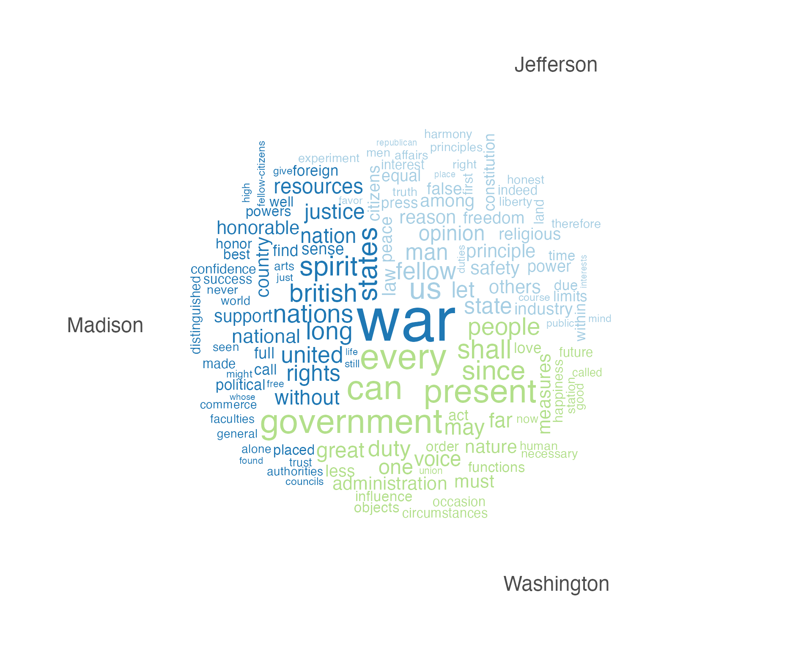

Plot will pass through additional arguments to the underlying call to
`wordcloud`.

``` r

textplot_wordcloud(dfmat_inaug, min_count = 10,
     color = c('red', 'pink', 'green', 'purple', 'orange', 'blue'))
```


## Lexical dispersion plot

Plotting a `kwic` object produces a lexical dispersion plot which allows
us to visualize the occurrences of particular terms throughout the text.
We call these “x-ray” plots due to their similarity to the data produced
by [Amazon’s “x-ray” feature for Kindle
books](https://en.wikipedia.org/wiki/X-Ray_(Amazon_Kindle)).

``` r

toks_corpus_inaugural_subset <- 
    corpus_subset(data_corpus_inaugural, Year > 1949) |>
    tokens()
kwic(toks_corpus_inaugural_subset, pattern = "american") |>
    textplot_xray()
```

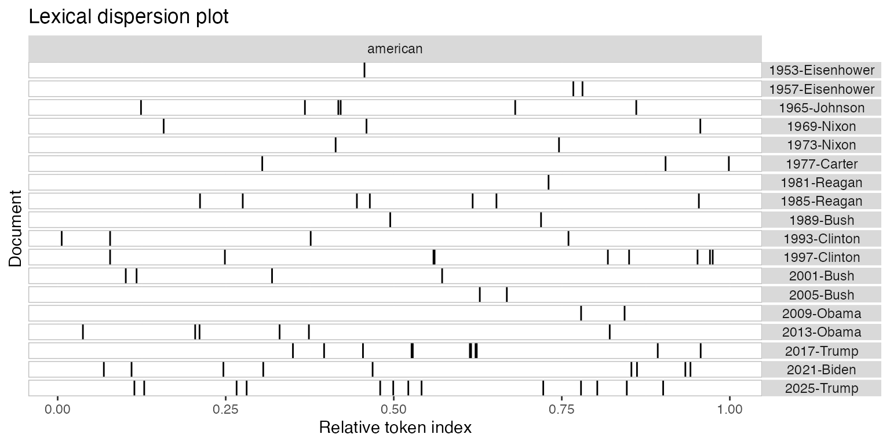

You can also pass multiple kwic objects to `plot` to compare the
dispersion of different terms:

``` r

textplot_xray(
     kwic(toks_corpus_inaugural_subset, pattern = "american"),
     kwic(toks_corpus_inaugural_subset, pattern = "people"),
     kwic(toks_corpus_inaugural_subset, pattern = "communist")
)
```

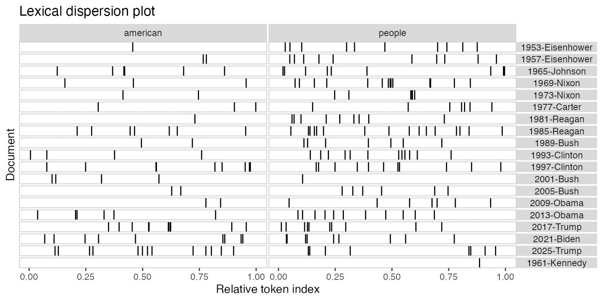

If you’re only plotting a single document, but with multiple keywords,
then the keywords are displayed one below the other rather than
side-by-side.

``` r

require("readtext")
## Loading required package: readtext
## 
## Attaching package: 'readtext'
## The following object is masked from 'package:quanteda':
## 
##     texts
data_char_mobydick <- as.character(readtext("http://www.gutenberg.org/cache/epub/2701/pg2701.txt"))

names(data_char_mobydick) <- "Moby Dick"

textplot_xray(
    kwic(tokens(data_char_mobydick), pattern = "whale"),
    kwic(tokens(data_char_mobydick), pattern = "ahab")
) 
```

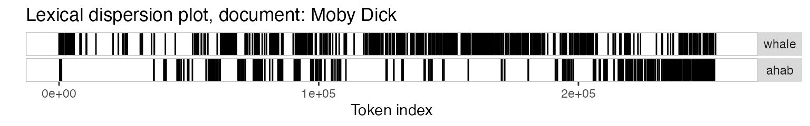

You might also have noticed that the x-axis scale is the absolute token
index for single texts and relative token index when multiple texts are
being compared. If you prefer, you can specify that you want an absolute
scale:

``` r

textplot_xray(
    kwic(toks_corpus_inaugural_subset, pattern = "american"),
    kwic(toks_corpus_inaugural_subset, pattern = "people"),
    kwic(toks_corpus_inaugural_subset, pattern = "communist"),
    scale = "absolute"
)
```

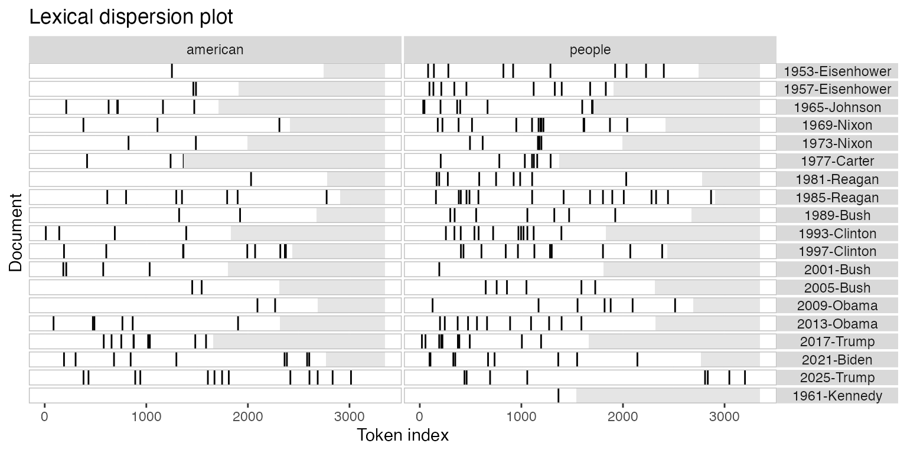

In this case, the texts may not have the same length, so the tokens that
don’t exist in a particular text are shaded in grey.

## Modifying lexical dispersion plots

The object returned is a ggplot object, which can be modified using
ggplot:

``` r

library("ggplot2")
theme_set(theme_bw())
g <- textplot_xray(
    kwic(toks_corpus_inaugural_subset, pattern = "american"),
    kwic(toks_corpus_inaugural_subset, pattern = "people"),
    kwic(toks_corpus_inaugural_subset, pattern = "communist")
)
g + aes(color = keyword) + 
    scale_color_manual(values = c("blue", "red", "green")) +
    theme(legend.position = "none")
```

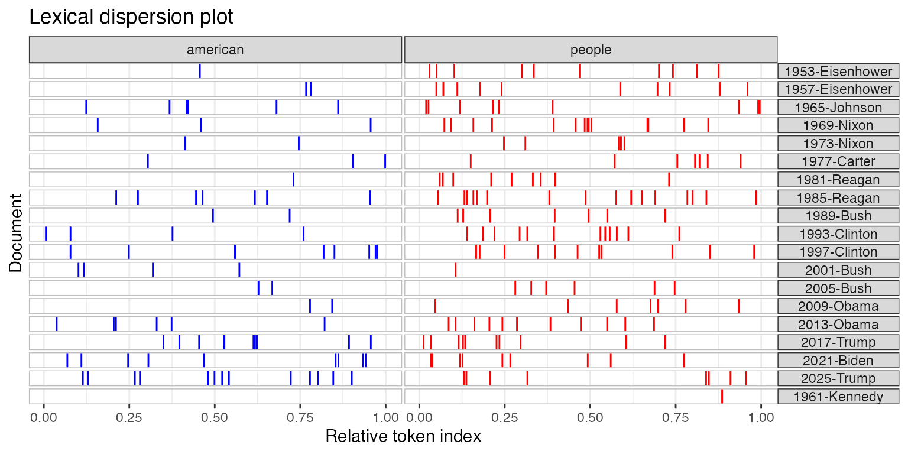

## Frequency plots

You can plot the frequency of the top features in a text using
`topfeatures`.

``` r

library("quanteda.textstats")
tstat_freq_inaug <- textstat_frequency(dfmat_inaug, n = 100)

ggplot(tstat_freq_inaug, aes(x = frequency, y = reorder(feature, frequency))) +
    geom_point() + 
    labs(x = "Frequency", y = "Feature")
```


If you wanted to compare the frequency of a single term across different
texts, you can also use `textstat_frequency`, group the frequency by
speech and extract the term.

``` r

# Create document-level variable with year and president
# Get frequency grouped by president
freq_grouped <- textstat_frequency(dfm(toks_corpus_inaugural_subset), 
                                   groups = President)

# Filter the term "american"
freq_american <- subset(freq_grouped, freq_grouped$feature %in% "american")  

ggplot(freq_american, aes(x = frequency, y = group)) +
    geom_point() + 
    scale_x_continuous(limits = c(0, 14), breaks = c(seq(0, 14, 2))) +
    labs(x = "Frequency", y = NULL,
         title = 'Frequency of "american"')
## Warning: Removed 1 row containing missing values or values outside the scale range
## (`geom_point()`).
```

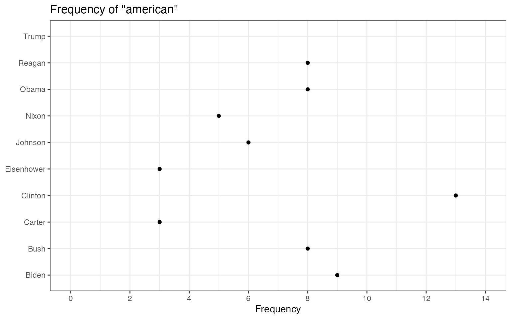

The above plots are raw frequency plots. For relative frequency plots,
(word count divided by the length of the chapter) we need to weight the
document-frequency matrix first. To obtain expected word frequency per
100 words, we multiply by 100.

``` r

dfm_rel_freq <- dfm_weight(dfm(toks_corpus_inaugural_subset), scheme = "prop") * 100
head(dfm_rel_freq)
## Document-feature matrix of: 6 documents, 4,625 features (86.44% sparse) and 4
## docvars.
##                  features
## docs                      my    friends        ,    before          i
##   1953-Eisenhower 0.14582574 0.14582574 4.593511 0.1822822 0.10936930
##   1957-Eisenhower 0.20975354 0.10487677 6.345045 0.1573152 0.05243838
##   1961-Kennedy    0.19467878 0.06489293 5.451006 0.1297859 0.32446463
##   1965-Johnson    0.17543860 0.05847953 5.555556 0.2339181 0.87719298
##   1969-Nixon      0.28973510 0          5.546358 0.1241722 0.86920530
##   1973-Nixon      0.05012531 0.05012531 4.812030 0.2005013 0.60150376
##                  features
## docs                   begin      the expression       of     those
##   1953-Eisenhower 0.03645643 6.234050 0.03645643 5.176814 0.1458257
##   1957-Eisenhower 0          5.977976 0          5.034085 0.1573152
##   1961-Kennedy    0.19467878 5.580792 0          4.218040 0.4542505
##   1965-Johnson    0          4.502924 0          3.333333 0.1754386
##   1969-Nixon      0          5.629139 0          3.890728 0.4552980
##   1973-Nixon      0          4.160401 0          3.408521 0.3007519
## [ reached max_nfeat ... 4,615 more features ]

rel_freq <- textstat_frequency(dfm_rel_freq, groups = dfm_rel_freq$President)

# Filter the term "american"
rel_freq_american <- subset(rel_freq, feature %in% "american")  

ggplot(rel_freq_american, aes(x = group, y = frequency)) +
    geom_point() + 
    scale_y_continuous(limits = c(0, 0.7), breaks = c(seq(0, 0.7, 0.1))) +
    xlab(NULL) + 
    ylab("Relative frequency") +
    theme(axis.text.x = element_text(angle = 90, hjust = 1))
## Warning: Removed 1 row containing missing values or values outside the scale range
## (`geom_point()`).
```

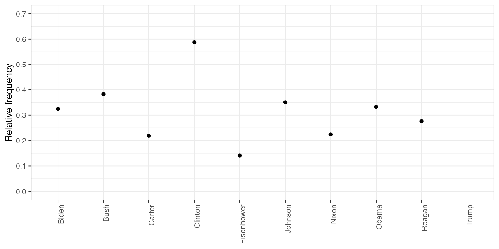

Finally, `texstat_frequency` allows to plot the most frequent words in
terms of relative frequency by group.

``` r

dfmat_weight_pres <- data_corpus_inaugural |>
  corpus_subset(Year > 2000) |>
  tokens(remove_punct = TRUE) |>
  tokens_remove(stopwords("english")) |>
  dfm() |>
  dfm_weight(scheme = "prop")

# Calculate relative frequency by president
dat_freq_weight <- textstat_frequency(dfmat_weight_pres, n = 10, 
                                  groups = President)

ggplot(data = dat_freq_weight, aes(x = nrow(dat_freq_weight):1, y = frequency)) +
     geom_point() +
     facet_wrap(~ group, scales = "free") +
     coord_flip() +
     scale_x_continuous(breaks = nrow(dat_freq_weight):1,
                        labels = dat_freq_weight$feature) +
     labs(x = NULL, y = "Relative frequency")
```

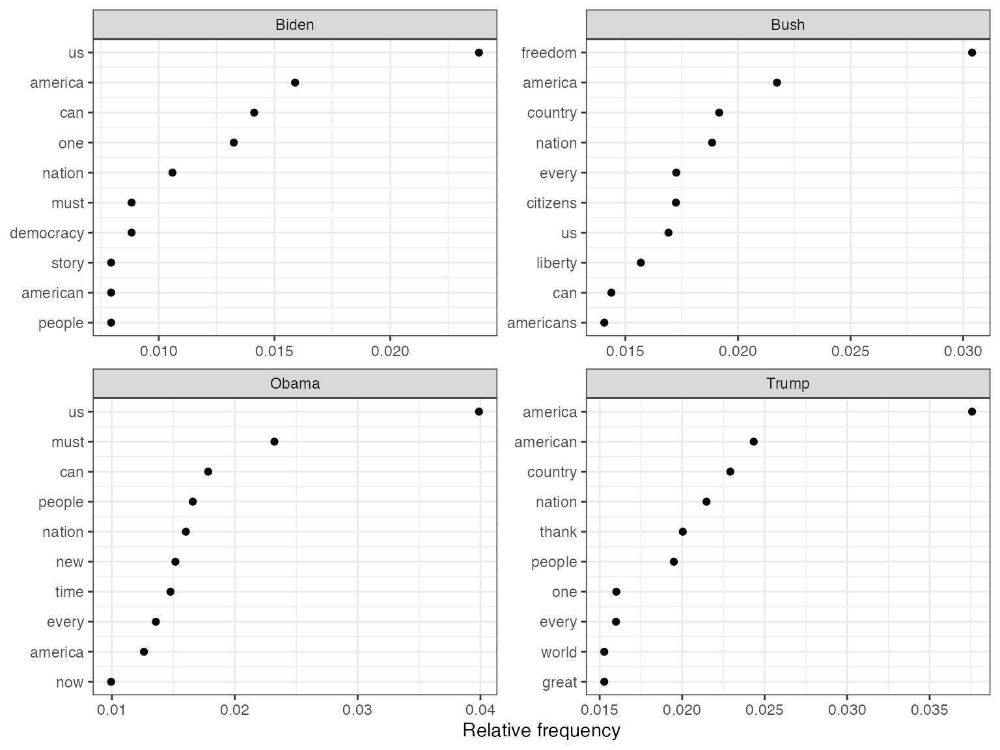

## Plot “keyness” in a target and reference group

If you want to compare the differential associations of keywords in a
target and reference group, you can calculate “keyness” which is based
on `textstat_keyness`. In this example, we compare the inaugural speech
by Donald Trump with the speeches by Barack Obama.

``` r

# Only select speeches by Obama and Trump
corp_pres <- corpus_subset(data_corpus_inaugural, 
                            President %in% c("Obama", "Trump"))

# Create a dfm grouped by president
dfmat_pres <- tokens(corp_pres, remove_punct = TRUE) |>
  tokens_remove(stopwords("english")) |>
  tokens_group(groups = President) |>
  dfm()

# Calculate keyness and determine Trump as target group
tstat_keyness <- textstat_keyness(dfmat_pres, target = "Trump")

# Plot estimated word keyness
textplot_keyness(tstat_keyness) 
```

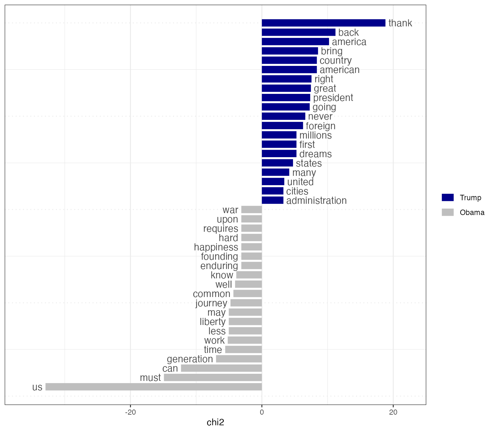

``` r


# Plot without the reference text (in this case Obama)
textplot_keyness(tstat_keyness, show_reference = FALSE)
```

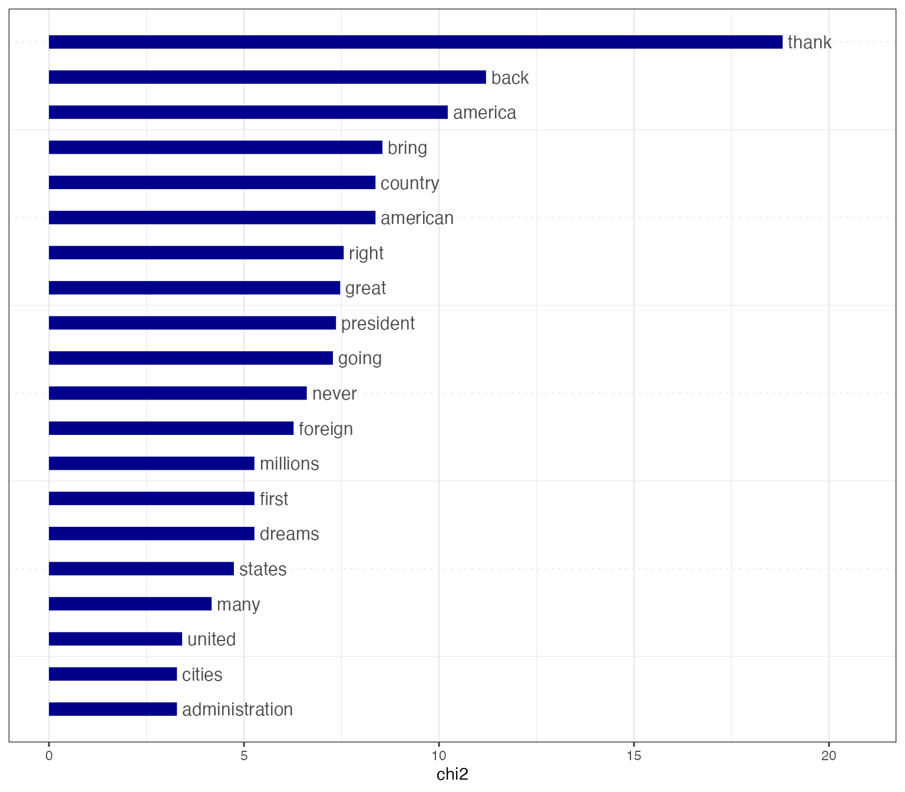

## Plot fitted scaling models

You can also plot fitted Wordscores (Laver et al., 2003) or Wordfish
scaling models (Slapin and Proksch, 2008).

### Wordscores

Wordscores is a scaling procedure for estimating policy positions or
scores (Laver et al., 2003). Known scores are assigned to so called
reference texts in order to infer the positions of new documents
(“virgin texts”). You can plot the position of words (features) against
the logged term frequency, or the position of the documents.

``` r

library("quanteda.textmodels")

# Transform corpus to dfm
dfmat_ie <- data_corpus_irishbudget2010 |> 
    tokens() |> 
    dfm()

# Set reference scores
refscores <- c(rep(NA, 4), 1, -1, rep(NA, 8))

# Predict Wordscores model
tmod_ws <- textmodel_wordscores(dfmat_ie, y = refscores, smooth = 1)

# Plot estimated word positions (highlight words and print them in red)
textplot_scale1d(tmod_ws,
                 highlighted = c("minister", "have", "our", "budget"), 
                 highlighted_color = "red")
```


``` r


# Get predictions
pred_ws <- predict(tmod_ws, se.fit = TRUE)

# Plot estimated document positions and group by "party" variable
textplot_scale1d(pred_ws, margin = "documents",
                 groups = data_corpus_irishbudget2010$party)
```


``` r


# Plot estimated document positions using the LBG transformation and group by "party" variable

pred_lbg <- predict(tmod_ws, se.fit = TRUE, rescaling = "lbg")

textplot_scale1d(pred_lbg, margin = "documents",
                 groups = data_corpus_irishbudget2010$party)
```


### Wordfish

Wordfish is a Poisson scaling model that estimates one-dimension
document positions using maximum likelihood (Slapin and Proksch, 2008).
Both the estimated position of words and the positions of the documents
can be plotted.

``` r

# Estimate Wordfish model
library("quanteda.textmodels")
tmod_wf <- textmodel_wordfish(dfmat_ie, dir = c(6, 5))

# Plot estimated word positions
textplot_scale1d(tmod_wf, margin = "features", 
                 highlighted = c("government", "global", "children", 
                                 "bank", "economy", "the", "citizenship",
                                 "productivity", "deficit"), 
                 highlighted_color = "red")
```

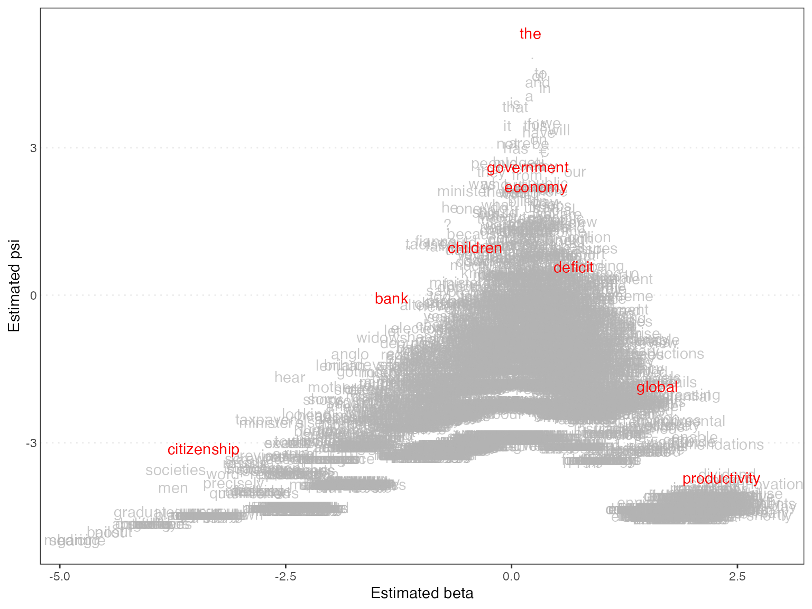

``` r


# Plot estimated document positions
textplot_scale1d(tmod_wf, groups = data_corpus_irishbudget2010$party)
```


### Correspondence Analysis

You can also plot the estimated document positions of a correspodence
analysis (Nenadic and Greenacre 2007).

``` r

# Run correspondence analysis on dfm
tmod_ca <- textmodel_ca(dfmat_ie)

# Plot estimated positions and group by party
textplot_scale1d(tmod_ca, margin = "documents",
                 groups = data_corpus_irishbudget2010$party)
```

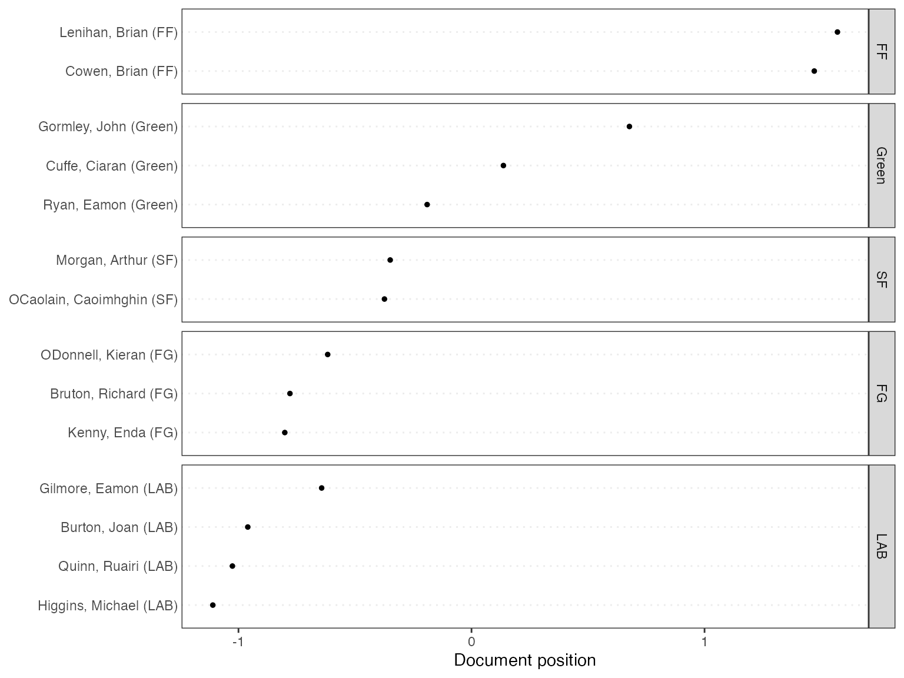

## References

Laver, Michael, Kenneth Benoit, and John Garry. 2003. “[Extracting
Policy Positions from Political Texts Using Words as
Data](http://kenbenoit.net/pdfs/WORDSCORESAPSR.pdf).” *American
Political Science Review* 97(2): 311-331.

Nenadic, Oleg and Michael Greenacre. 2007. “[Correspondence analysis in
R, with two- and three-dimensional graphics: The ca
package](http://www.jstatsoft.org/v20/i03/).” *Journal of Statistical
Software* 20(3): 1–13.

Slapin, Jonathan and Sven-Oliver Proksch. 2008. “[A Scaling Model for
Estimating Time-Series Party Positions from
Texts](https://doi.org/10.1111/j.1540-5907.2008.00338.x).” *American
Journal of Political Science* 52(3): 705–772.
