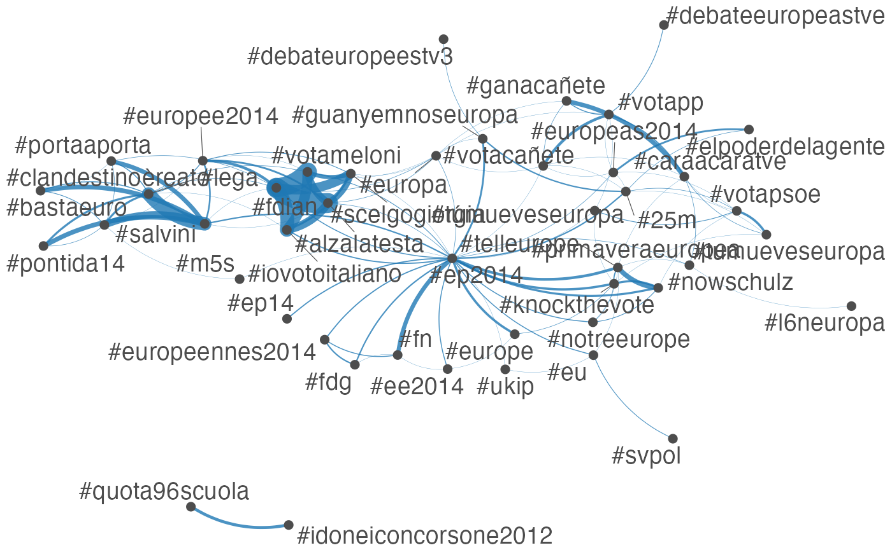
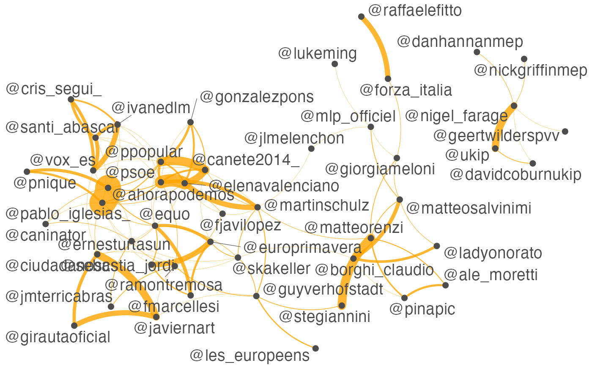

# Example: Social media analysis (X formerly Twitter)

Using **quanteda**’s [`fcm()`](https://quanteda.io/reference/fcm.md) and
[`textplot_network()`](https://rdrr.io/pkg/quanteda.textplots/man/textplot_network.html),
you can perform visual analysis of social media posts in terms of
co-occurrences of hashtags or usernames in a few steps. The dataset for
this example contains only 10,000 Twitter posts, but you can easily
analyse more than one million posts on your laptop computer.

``` r

library(quanteda)
```

## Load sample data

``` r

load("data/data_corpus_tweets.rda")
```

## Construct a document-feature matrix of Twitter posts

``` r

dfmat_tweets <- tokens(data_corpus_tweets, remove_punct = TRUE) |>
    dfm()
head(dfmat_tweets)
## Document-feature matrix of: 6 documents, 42,239 features (99.97% sparse) and 34
## docvars.
##         features
## docs     oggi pomeriggio a partire dalle 18.00 interverrò #pomeriggio5 su
##   tweet1    1          1 2       1     1     1          1            1  1
##   tweet2    0          0 1       0     0     0          0            0  0
##   tweet3    0          0 0       0     0     0          0            0  0
##   tweet4    0          0 0       0     0     0          0            0  0
##   tweet5    0          0 0       0     0     0          0            0  0
##   tweet6    0          0 0       0     0     0          0            0  0
##         features
## docs     #canale5
##   tweet1        1
##   tweet2        0
##   tweet3        0
##   tweet4        0
##   tweet5        0
##   tweet6        0
## [ reached max_nfeat ... 42,229 more features ]
```

## Hashtags

### Extract most common hashtags

``` r

dfmat_tag <- dfm_select(dfmat_tweets, pattern = "#*")
toptag <- names(topfeatures(dfmat_tag, 50))
head(toptag)
## [1] "#ep2014"       "#salvini"      "#fdian"        "#ukip"        
## [5] "#caraacaratve" "#alzalatesta"
```

### Construct feature-occurrence matrix of hashtags

``` r

library("quanteda.textplots")
fcmat_tag <- fcm(dfmat_tag)
head(fcmat_tag)
## Feature co-occurrence matrix of: 6 by 2,781 features.
##                  features
## features          #pomeriggio5 #canale5 #miaou #iovotoitaliano #fdian #pp
##   #pomeriggio5               0        2      0               0      0   0
##   #canale5                   0        0      0               0      1   0
##   #miaou                     0        0      0               0      0   0
##   #iovotoitaliano            0        0      0               0     60   0
##   #fdian                     0        0      0               0      0   0
##   #pp                        0        0      0               0      0   0
##                  features
## features          #espanyaensroba #bravo #primaveraeuropea #dpdabayrou
##   #pomeriggio5                  0      0                 0           0
##   #canale5                      0      0                 0           0
##   #miaou                        0      0                 0           0
##   #iovotoitaliano               0      0                 0           0
##   #fdian                        0      0                 0           0
##   #pp                           1      1                 0           0
## [ reached max_nfeat ... 2,771 more features ]
fcmat_topgat <- fcm_select(fcmat_tag, pattern = toptag)
textplot_network(fcmat_topgat, min_freq = 0.1, edge_alpha = 0.8, edge_size = 5)
```



## Usernames

### Extract most frequently mentioned usernames

``` r

dfmtat_users <- dfm_select(dfmat_tweets, pattern = "@*")
topuser <- names(topfeatures(dfmtat_users, 50))
head(topuser)
## [1] "@pablo_iglesias_" "@elenavalenciano" "@canete2014_"     "@nigel_farage"   
## [5] "@martinschulz"    "@mlp_officiel"
```

### Construct feature-occurrence matrix of usernames

``` r

fcmat_users <- fcm(dfmtat_users)
head(fcmat_users)
## Feature co-occurrence matrix of: 6 by 5,963 features.
##                   features
## features           @pacomarhuenda @pablo_iglesias_ @kopriths @gapatzhs
##   @pacomarhuenda                0                1         0         0
##   @pablo_iglesias_              0                0         0         0
##   @kopriths                     0                0         0         1
##   @gapatzhs                     0                0         0         0
##   @mariaspyraki                 0                0         0         0
##   @ernesturtasun                0                0         0         0
##                   features
## features           @mariaspyraki @ernesturtasun @gabrielamard @nigel_farage
##   @pacomarhuenda               0              0             0             0
##   @pablo_iglesias_             0              1             0             0
##   @kopriths                    1              0             0             0
##   @gapatzhs                    1              0             0             0
##   @mariaspyraki                0              0             0             0
##   @ernesturtasun               0              0             0             0
##                   features
## features           @ukip @youtube
##   @pacomarhuenda       0        0
##   @pablo_iglesias_     0        0
##   @kopriths            0        0
##   @gapatzhs            0        0
##   @mariaspyraki        0        0
##   @ernesturtasun       0        0
## [ reached max_nfeat ... 5,953 more features ]
fcmat_users <- fcm_select(fcmat_users, pattern = topuser)
textplot_network(fcmat_users, min_freq = 0.1, edge_color = "orange", edge_alpha = 0.8, edge_size = 5)
```


