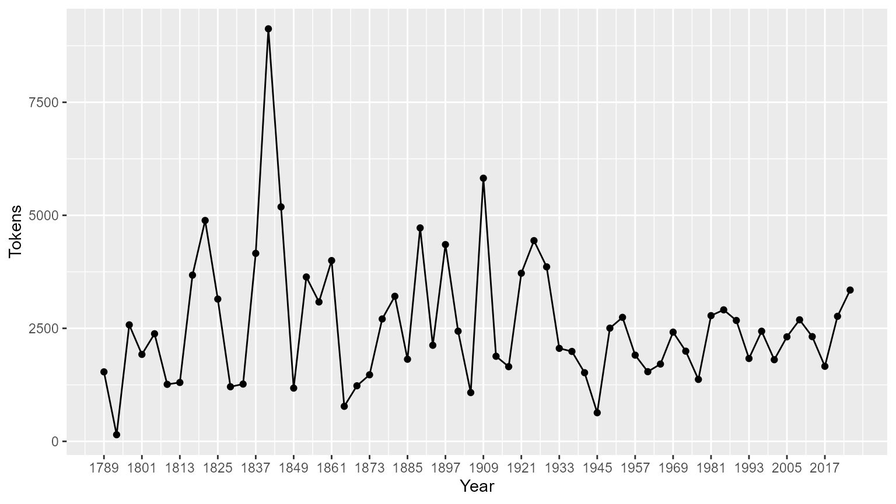
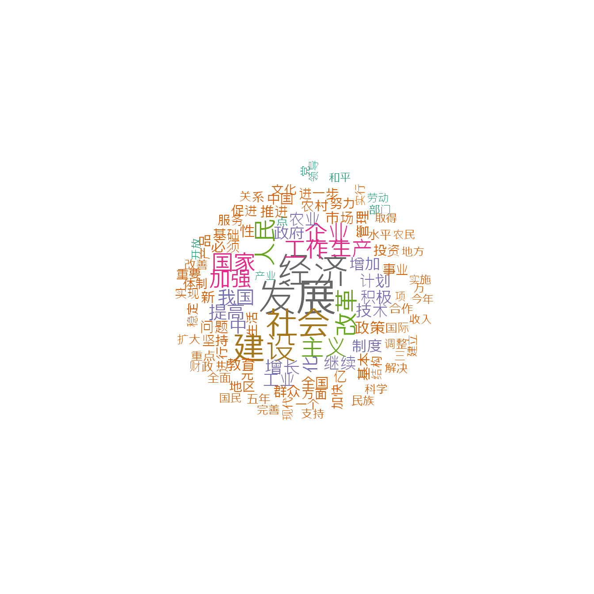

# 快速入门指南

## 软件包安装

**quanteda**已上传在[CRAN](https://CRAN.R-project.org/package=quanteda)上，所以可以使用GUI的R软件包安装程序进行安装，或执行：

``` r

install.packages("quanteda")
```

请参阅https://github.com/quanteda/quanteda上的说明来安装GitHub版本。

### 推荐安装

我们建议安装以下软件包，以便更好地支持和扩展**quanteda**的功能：

- [**readtext**](https://github.com/quanteda/readtext):
  可将几乎任何格式的文本文件读入R
- [**spacyr**](https://github.com/quanteda/spacyr):
  使用[spaCy](http://spacy.io)库的NLP，包括词性标注，命名实体和依存语法
- [**quanteda.corpora**](https://github.com/quanteda/quanteda.corpora):
  用于**quanteda**的附加文本数据

``` r

devtools::install_github("quanteda/quanteda.corpora")
```

- [**quanteda.dictionaries**](https://github.com/kbenoit/quanteda.dictionaries):
  R版[Linguistic Inquiry and Word Count](http://liwc.wpengine.com)
  文本分析软件

``` r

devtools::install_github("kbenoit/quanteda.dictionaries")
```

## 创建语料库

加载**quanteda**以便使用软件包中的数据和功能。

``` r

library(quanteda)
```

### 目前可用的语料库资源

**quanteda**有一个简单而强大的配套软件包用于加载文本文件:
[**readtext**](https://github.com/quanteda/readtext)。
这个软件包的主函数[`readtext()`](https://readtext.quanteda.io/reference/readtext.html)从磁盘或者URL中读取文件或者文件集，并且返回一个可以直接和[`corpus()`](https://quanteda.io/reference/corpus.md)构造函数一起使用的data.frame，可用来创建一个**quanteda**语料库。

[`readtext()`](https://readtext.quanteda.io/reference/readtext.html)可读取：

- 文本文件 (`.txt`)
- 逗号分割的（`.csv`）文本文件
- XML数据
- 取自脸书API的JSON格式的数据
- 取自TwitterAPI的JSON格式的数据
- 常用的JSON数据

语料库创建函数[`corpus()`](https://quanteda.io/reference/corpus.md)可用于：

- 字符类向量，比如你使用其他工具已经加载到R工作空间的
- **tm** 软件包中`VCorpus`语料库对象
- data.frame 包含文本列和其他任何文件级元数据

#### 从字符向量构建语料库

最简单的方式是从R中已经存在的文本向量创建一个语料库。这使得高级R用户可以灵活地选择文本输入，因为R有很多可以读取文本向量的方法。

一旦我们有了这种格式的文本数据，我们就可以直接调用语料库构造函数。以从内置的英国政党2010年选举宣言（`data_char_ukimmig2010`）中提取的有关移民政策的文本为例：

``` r

corp_uk <- corpus(data_char_ukimmig2010)  # 从文本构建语料库
summary(corp_uk)
## Corpus consisting of 9 documents, showing 9 documents:
## 
##          Text Types Tokens Sentences
##           BNP  1125   3280       136
##     Coalition   142    260        12
##  Conservative   251    499        21
##        Greens   322    679        30
##        Labour   298    683        33
##        LibDem   251    483        26
##            PC    77    114         5
##           SNP    88    134         4
##          UKIP   346    723        37
```

我们也可以添加一些文档变量– **quanteda**
称之为此语料库的[`docvars()`](https://quanteda.io/reference/docvars.md)。

我们可以使用R的[`names()`](https://rdrr.io/r/base/names.html)函数来读取字符向量`data_char_ukimmig2010`的名称，并且将其给文档变量赋值。

``` r

docvars(corp_uk, "Party") <- names(data_char_ukimmig2010)
docvars(corp_uk, "Year") <- 2010
summary(corp_uk)
## Corpus consisting of 9 documents, showing 9 documents:
## 
##          Text Types Tokens Sentences        Party Year
##           BNP  1125   3280       136          BNP 2010
##     Coalition   142    260        12    Coalition 2010
##  Conservative   251    499        21 Conservative 2010
##        Greens   322    679        30       Greens 2010
##        Labour   298    683        33       Labour 2010
##        LibDem   251    483        26       LibDem 2010
##            PC    77    114         5           PC 2010
##           SNP    88    134         4          SNP 2010
##          UKIP   346    723        37         UKIP 2010
```

#### readtext软件包加载文件

``` r

require(readtext)

# Twitter json
dat_json <- readtext("~/Dropbox/QUANTESS/social media/zombies/tweets.json")
corp_twitter <- corpus(dat_json)
summary(corp_twitter, 5)
# 通用json - 需要“textfield”说明符
dat_sotu <- readtext("~/Dropbox/QUANTESS/Manuscripts/collocations/Corpora/sotu/sotu.json",
                     textfield = "text")
summary(corpus(dat_sotu), 5)
# 文本文件
dat_txtone <- readtext("~/Dropbox/QUANTESS/corpora/project_gutenberg/pg2701.txt", cache = FALSE)
summary(corpus(dat_txtone), 5)
# 多文本文件
dat_txtmultiple1 <- readtext("~/Dropbox/QUANTESS/corpora/inaugural/*.txt", cache = FALSE)
summary(corpus(dat_txtmultiple1), 5)
# 包含取自文件名的docvars的多个文本文件
dat_txtmultiple2 <- readtext("~/Dropbox/QUANTESS/corpora/inaugural/*.txt",
                             docvarsfrom = "filenames", sep = "-", docvarnames = c("Year", "President"))
summary(corpus(dat_txtmultiple2), 5)
# XML 数据
dat_xml <- readtext("~/Dropbox/QUANTESS/quanteda_working_files/xmlData/plant_catalog.xml",
                    dat_xml = "COMMON")
summary(corpus(dat_xml), 5)
# csv 文件
write.csv(data.frame(inaug_speech = as.character(data_corpus_inaugural),
                     docvars(data_corpus_inaugural)),
          file = "/tmp/inaug_texts.csv", row.names = FALSE)
dat_csv <- readtext("/tmp/inaug_texts.csv", textfield = "inaug_speech")
summary(corpus(dat_csv), 5)
```

### quanteda语料库工作方式

#### 语料库的原则

语料库被设计成原始文档的“库”，该文档被转换为UTF-8编码的纯文本文件，并与元数据一起分别存储于语料库级和文档级。我们给文档级元数据一个特殊的名字：[`docvars()`](https://quanteda.io/reference/docvars.md)。这些变量或特征描述了每个文档的属性。

从处理和分析的角度，语料库被设计成相对静态的文本容器。这意味着语料库中的文本不能从内部通过（例如）清理或预处理改变，比如词干提取或去除标点符号。相反，作为处理过程的一部分文本可以从语料库中提取，并赋值给新的对象，但是设计的思路是将语料库作为原始参考副本保留下来，以便于其他分析 -
例如那些需要词干和标点符号的分析-比如分析阅读难易指数 -
可以在相同的语料库上执行。

为了从语料库中提取文本，我们使用一个名为[`as.character()`](https://rdrr.io/r/base/character.html)的提取器。

``` r

as.character(data_corpus_inaugural)[2]
##                                                                                                                                                                                                                                                                                                                                                                                                                                                                                                                                                                                                                                                                                                                                                                                                              1793-Washington 
## "Fellow citizens, I am again called upon by the voice of my country to execute the functions of its Chief Magistrate. When the occasion proper for it shall arrive, I shall endeavor to express the high sense I entertain of this distinguished honor, and of the confidence which has been reposed in me by the people of united America.\n\nPrevious to the execution of any official act of the President the Constitution requires an oath of office. This oath I am now about to take, and in your presence: That if it shall be found during my administration of the Government I have in any instance violated willingly or knowingly the injunctions thereof, I may (besides incurring constitutional punishment) be subject to the upbraidings of all who are now witnesses of the present solemn ceremony.\n\n "
```

为了总结语料库中的文本，我们可以调用一个为语料库定义的函数[`summary()`](https://rdrr.io/r/base/summary.html)。

``` r

data(data_corpus_irishbudget2010, package = "quanteda.textmodels")
summary(data_corpus_irishbudget2010)
## Corpus consisting of 14 documents, showing 14 documents:
## 
##                       Text Types Tokens Sentences year debate number      foren
##        Lenihan, Brian (FF)  1953   8641       404 2010 BUDGET     01      Brian
##       Bruton, Richard (FG)  1040   4446       217 2010 BUDGET     02    Richard
##         Burton, Joan (LAB)  1624   6393       309 2010 BUDGET     03       Joan
##        Morgan, Arthur (SF)  1595   7107       345 2010 BUDGET     04     Arthur
##          Cowen, Brian (FF)  1629   6599       252 2010 BUDGET     05      Brian
##           Kenny, Enda (FG)  1148   4232       155 2010 BUDGET     06       Enda
##      ODonnell, Kieran (FG)   678   2297       133 2010 BUDGET     07     Kieran
##       Gilmore, Eamon (LAB)  1181   4177       203 2010 BUDGET     08      Eamon
##     Higgins, Michael (LAB)   488   1286        44 2010 BUDGET     09    Michael
##        Quinn, Ruairi (LAB)   439   1284        60 2010 BUDGET     10     Ruairi
##      Gormley, John (Green)   401   1030        50 2010 BUDGET     11       John
##        Ryan, Eamon (Green)   510   1643        90 2010 BUDGET     12      Eamon
##      Cuffe, Ciaran (Green)   442   1240        45 2010 BUDGET     13     Ciaran
##  OCaolain, Caoimhghin (SF)  1188   4044       177 2010 BUDGET     14 Caoimhghin
##      name party
##   Lenihan    FF
##    Bruton    FG
##    Burton   LAB
##    Morgan    SF
##     Cowen    FF
##     Kenny    FG
##  ODonnell    FG
##   Gilmore   LAB
##   Higgins   LAB
##     Quinn   LAB
##   Gormley Green
##      Ryan Green
##     Cuffe Green
##  OCaolain    SF
```

我们可以将汇总命令的输出保存为data.frame，并用这些信息绘制出一些基本的描述性统计信息：

``` r

tokeninfo <- summary(data_corpus_inaugural)
if (require(ggplot2))
    ggplot(data = tokeninfo, aes(x = Year, y = Tokens, group = 1)) +
    geom_line() +
    geom_point() +
    scale_x_continuous(labels = c(seq(1789, 2017, 12)), breaks = seq(1789, 2017, 12))
## Loading required package: ggplot2
```



``` r


# 最长的就职演说: William Henry Harrison
tokeninfo[which.max(tokeninfo$Tokens), ]
##             Text Types Tokens Sentences Year President     FirstName Party
## 14 1841-Harrison  1896   9125       210 1841  Harrison William Henry  Whig
```

### 处理语料库对象的功能

#### 合并两个语料库对象

`+`运算符提供了一个连接两个语料库对象的简单方法。如果它们包含了不同的文档级别的变量，这些也将被合并起来以保证不丢失任何信息。语料库级别的元数据也被连接在一起。

``` r

corp1 <- corpus(data_corpus_inaugural[1:5])
corp2 <- corpus(data_corpus_inaugural[53:58])
corp3 <- corp1 + corp2
summary(corp3)
## Corpus consisting of 11 documents, showing 11 documents:
## 
##             Text Types Tokens Sentences Year  President FirstName
##  1789-Washington   625   1537        24 1789 Washington    George
##  1793-Washington    96    147         5 1793 Washington    George
##       1797-Adams   826   2577        37 1797      Adams      John
##   1801-Jefferson   717   1923        43 1801  Jefferson    Thomas
##   1805-Jefferson   804   2380        45 1805  Jefferson    Thomas
##     1997-Clinton   773   2436       113 1997    Clinton      Bill
##        2001-Bush   621   1806        98 2001       Bush George W.
##        2005-Bush   772   2312        99 2005       Bush George W.
##       2009-Obama   938   2689       112 2009      Obama    Barack
##       2013-Obama   814   2317        90 2013      Obama    Barack
##       2017-Trump   582   1660        89 2017      Trump Donald J.
##                  Party
##                   none
##                   none
##             Federalist
##  Democratic-Republican
##  Democratic-Republican
##             Democratic
##             Republican
##             Republican
##             Democratic
##             Democratic
##             Republican
```

#### 提取语料库的子集

[`corpus_subset()`](https://quanteda.io/reference/corpus_subset.md)是为语料库定义的一个函数，用于根据基于[`docvars()`](https://quanteda.io/reference/docvars.md)的逻辑条件提取语料库子集：

``` r

summary(corpus_subset(data_corpus_inaugural, Year > 1990))
## Corpus consisting of 9 documents, showing 9 documents:
## 
##          Text Types Tokens Sentences Year President FirstName      Party
##  1993-Clinton   642   1833        82 1993   Clinton      Bill Democratic
##  1997-Clinton   773   2436       113 1997   Clinton      Bill Democratic
##     2001-Bush   621   1806        98 2001      Bush George W. Republican
##     2005-Bush   772   2312        99 2005      Bush George W. Republican
##    2009-Obama   938   2689       112 2009     Obama    Barack Democratic
##    2013-Obama   814   2317        90 2013     Obama    Barack Democratic
##    2017-Trump   582   1660        89 2017     Trump Donald J. Republican
##    2021-Biden   812   2766       229 2021     Biden Joseph R. Democratic
##    2025-Trump  1000   3347       177 2025     Trump Donald J. Republican
summary(corpus_subset(data_corpus_inaugural, President == "Adams"))
## Corpus consisting of 2 documents, showing 2 documents:
## 
##        Text Types Tokens Sentences Year President   FirstName
##  1797-Adams   826   2577        37 1797     Adams        John
##  1825-Adams  1003   3147        75 1825     Adams John Quincy
##                  Party
##             Federalist
##  Democratic-Republican
```

### 浏览语料库文本

`kwic`功能（keywords-in-context）可以搜索一个指定的词并显示它的上下文：

``` r

data_tokens_inaugural <- tokens(data_corpus_inaugural)
kwic(data_tokens_inaugural, pattern = "terror")
## Keyword-in-context with 8 matches.
##                                                                     
##     [1797-Adams, 1324]              fraud or violence, by | terror |
##  [1933-Roosevelt, 111] nameless, unreasoning, unjustified | terror |
##  [1941-Roosevelt, 285]      seemed frozen by a fatalistic | terror |
##    [1961-Kennedy, 850]    alter that uncertain balance of | terror |
##     [1981-Reagan, 811]     freeing all Americans from the | terror |
##   [1997-Clinton, 1047]        They fuel the fanaticism of | terror |
##   [1997-Clinton, 1647]  maintain a strong defense against | terror |
##     [2009-Obama, 1619]     advance their aims by inducing | terror |
##                                   
##  , intrigue, or venality          
##  which paralyzes needed efforts to
##  , we proved that this            
##  that stays the hand of           
##  of runaway living costs.         
##  . And they torment the           
##  and destruction. Our children    
##  and slaughtering innocents, we
```

``` r

kwic(data_tokens_inaugural, pattern = "terror", valuetype = "regex")
## Keyword-in-context with 13 matches.
##                                                                             
##     [1797-Adams, 1324]                   fraud or violence, by |  terror   |
##  [1933-Roosevelt, 111]      nameless, unreasoning, unjustified |  terror   |
##  [1941-Roosevelt, 285]           seemed frozen by a fatalistic |  terror   |
##    [1961-Kennedy, 850]         alter that uncertain balance of |  terror   |
##    [1961-Kennedy, 972]               of science instead of its |  terrors  |
##     [1981-Reagan, 811]          freeing all Americans from the |  terror   |
##    [1981-Reagan, 2187]        understood by those who practice | terrorism |
##   [1997-Clinton, 1047]             They fuel the fanaticism of |  terror   |
##   [1997-Clinton, 1647]       maintain a strong defense against |  terror   |
##     [2009-Obama, 1619]          advance their aims by inducing |  terror   |
##     [2017-Trump, 1117] civilized world against radical Islamic | terrorism |
##      [2021-Biden, 544]             , white supremacy, domestic | terrorism |
##     [2025-Trump, 1371]      designating the cartels as foreign | terrorist |
##                                   
##  , intrigue, or venality          
##  which paralyzes needed efforts to
##  , we proved that this            
##  that stays the hand of           
##  . Together let us explore        
##  of runaway living costs.         
##  and prey upon their neighbors    
##  . And they torment the           
##  and destruction. Our children    
##  and slaughtering innocents, we   
##  , which we will eradicate        
##  that we must confront and        
##  organizations. And by invoking
```

``` r

kwic(data_tokens_inaugural, pattern = "communist*")
## Keyword-in-context with 2 matches.
##                                                                   
##   [1949-Truman, 832] the actions resulting from the | Communist  |
##  [1961-Kennedy, 510]     required - not because the | Communists |
##                            
##  philosophy are a threat to
##  may be doing it,
```

在上面的汇总中，`Year`和`President`是与每个文档相关的变量。我们可以用[`docvars()`](https://quanteda.io/reference/docvars.md)函数访问这些变量。

``` r

# 浏览文档变量
head(docvars(data_corpus_inaugural))
##   Year  President FirstName                 Party
## 1 1789 Washington    George                  none
## 2 1793 Washington    George                  none
## 3 1797      Adams      John            Federalist
## 4 1801  Jefferson    Thomas Democratic-Republican
## 5 1805  Jefferson    Thomas Democratic-Republican
## 6 1809    Madison     James Democratic-Republican
```

[**quanteda.corpora**](https://github.com/quanteda/quanteda.corpora)软件包提供更多语料库资源。

## 从语料库中提取特征

为了执行文档缩放等统计分析，我们必须提取一个将某些特征与文档关联起来矩阵。在quanteda中，dfm函数用来生成这样一个矩阵。“dfm”是文档特征矩阵的缩写，矩阵的行总是为文档而列为“特征”。我们这样定义矩阵的行与列是因为在数据分析中标准的做法是将一个分析单元作为行，而将与每个单元有关的特征或变量作为列。我们称之为“特征”而不是“词项”，因为特征比词项更通用：词项可以被定义为原始词项，词干词项，词性词项，停用词去除后的词项，或者词项归属的字典。而特征可以是完全通用的，例如ngram或者句法依存，我们对矩阵的定义持开放式态度。

### 文本分词

为了简单地对文本分词，quanteda提供了一个强大的命令[`tokens()`](https://quanteda.io/reference/tokens.md)。这个命令会产生了一个以字符向量形式存在的分词表，表中的每单元元素
都对应于一个输入文档。

[`tokens()`](https://quanteda.io/reference/tokens.md)有意设计成保守的，意味着除非有指令，它不会从文本中删除任何东西。

``` r

txt <- c(text1 = "This is $10 in 999 different ways,\n up and down; left and right!",
         text2 = "@kenbenoit working: on #quanteda 2day\t4ever, http://textasdata.com?page=123.")
tokens(txt)
## Tokens consisting of 2 documents.
## text1 :
##  [1] "This"      "is"        "$"         "10"        "in"        "999"      
##  [7] "different" "ways"      ","         "up"        "and"       "down"     
## [ ... and 5 more ]
## 
## text2 :
## [1] "@kenbenoit"                      "working"                        
## [3] ":"                               "on"                             
## [5] "#quanteda"                       "2day"                           
## [7] "4ever"                           ","                              
## [9] "http://textasdata.com?page=123."
tokens(txt, remove_numbers = TRUE,  remove_punct = TRUE)
## Tokens consisting of 2 documents.
## text1 :
##  [1] "This"      "is"        "$"         "in"        "different" "ways"     
##  [7] "up"        "and"       "down"      "left"      "and"       "right"    
## 
## text2 :
## [1] "@kenbenoit"                      "working"                        
## [3] "on"                              "#quanteda"                      
## [5] "2day"                            "4ever"                          
## [7] "http://textasdata.com?page=123."
tokens(txt, remove_numbers = FALSE, remove_punct = TRUE)
## Tokens consisting of 2 documents.
## text1 :
##  [1] "This"      "is"        "$"         "10"        "in"        "999"      
##  [7] "different" "ways"      "up"        "and"       "down"      "left"     
## [ ... and 2 more ]
## 
## text2 :
## [1] "@kenbenoit"                      "working"                        
## [3] "on"                              "#quanteda"                      
## [5] "2day"                            "4ever"                          
## [7] "http://textasdata.com?page=123."
tokens(txt, remove_numbers = TRUE,  remove_punct = FALSE)
## Tokens consisting of 2 documents.
## text1 :
##  [1] "This"      "is"        "$"         "in"        "different" "ways"     
##  [7] ","         "up"        "and"       "down"      ";"         "left"     
## [ ... and 3 more ]
## 
## text2 :
## [1] "@kenbenoit"                      "working"                        
## [3] ":"                               "on"                             
## [5] "#quanteda"                       "2day"                           
## [7] "4ever"                           ","                              
## [9] "http://textasdata.com?page=123."
tokens(txt, remove_numbers = FALSE, remove_punct = FALSE)
## Tokens consisting of 2 documents.
## text1 :
##  [1] "This"      "is"        "$"         "10"        "in"        "999"      
##  [7] "different" "ways"      ","         "up"        "and"       "down"     
## [ ... and 5 more ]
## 
## text2 :
## [1] "@kenbenoit"                      "working"                        
## [3] ":"                               "on"                             
## [5] "#quanteda"                       "2day"                           
## [7] "4ever"                           ","                              
## [9] "http://textasdata.com?page=123."
tokens(txt, remove_numbers = FALSE, remove_punct = FALSE, remove_separators = FALSE)
## Tokens consisting of 2 documents.
## text1 :
##  [1] "This"      " "         "is"        " "         "$"         "10"       
##  [7] " "         "in"        " "         "999"       " "         "different"
## [ ... and 18 more ]
## 
## text2 :
##  [1] "@kenbenoit" " "          "working"    ":"          " "         
##  [6] "on"         " "          "#quanteda"  " "          "2day"      
## [11] "\t"         "4ever"     
## [ ... and 3 more ]
```

也可以按字符分词：

``` r

tokens("Great website: http://textasdata.com?page=123.", what = "character")
## Tokens consisting of 1 document.
## text1 :
##  [1] "G" "r" "e" "a" "t" "w" "e" "b" "s" "i" "t" "e"
## [ ... and 32 more ]
tokens("Great website: http://textasdata.com?page=123.", what = "character",
         remove_separators = FALSE)
## Tokens consisting of 1 document.
## text1 :
##  [1] "G" "r" "e" "a" "t" " " "w" "e" "b" "s" "i" "t"
## [ ... and 34 more ]
```

以及按句子分词：

``` r

# sentence level         
tokens(c("Kurt Vongeut said; only assholes use semi-colons.",
         "Today is Thursday in Canberra:  It is yesterday in London.",
         "En el caso de que no puedas ir con ellos, ¿quieres ir con nosotros?"),
       what = "sentence")
## Tokens consisting of 3 documents.
## text1 :
## [1] "Kurt Vongeut said; only assholes use semi-colons."
## 
## text2 :
## [1] "Today is Thursday in Canberra:  It is yesterday in London."
## 
## text3 :
## [1] "En el caso de que no puedas ir con ellos, ¿quieres ir con nosotros?"
```

### 构建文档特征矩阵

分词只是一个中间结果，而大多数用户都希望直接构建一个文档特征矩阵。为此，我们提供一个瑞士军刀功能[`dfm()`](https://quanteda.io/reference/dfm.md)，此项功能执行分词并将所提取的特征归纳成文档特征矩阵。不同于[`tokens()`](https://quanteda.io/reference/tokens.md)所采用的保守方法，[`dfm()`](https://quanteda.io/reference/dfm.md)函数默认某些应用选项，比如`toLower()` -
一个单独的用于转换为小写的函数，以及 -
删除标点符号。不过[`tokens()`](https://quanteda.io/reference/tokens.md)的所有选项都可以传递给[`dfm()`](https://quanteda.io/reference/dfm.md)。

``` r

corp_inaug_post1990 <- corpus_subset(data_corpus_inaugural, Year > 1990)

# 构建dfm
dfmat_inaug_post1990 <- tokens(corp_inaug_post1990) |>
    dfm()
dfmat_inaug_post1990[, 1:5]
## Document-feature matrix of: 9 documents, 5 features (0.00% sparse) and 4
## docvars.
##               features
## docs           my fellow citizens   , today
##   1993-Clinton  7      5        2 139    10
##   1997-Clinton  6      7        7 131     5
##   2001-Bush     3      1        9 110     2
##   2005-Bush     2      3        6 120     3
##   2009-Obama    2      1        1 130     6
##   2013-Obama    3      3        6  99     4
## [ reached max_ndoc ... 3 more documents ]
```

[`dfm()`](https://quanteda.io/reference/dfm.md)的其他选项还包括去除停用词和分词的词干提取。

``` r

# 构建dfm, 去除停用词以及提取词干

dfmat_inaug_post1990_stem <- tokens(corp_inaug_post1990, remove_punct = TRUE) |>
  tokens_remove(stopwords("english")) |>
  tokens_wordstem("en") |>
  dfm()
dfmat_inaug_post1990_stem[, 1:5]
## Document-feature matrix of: 9 documents, 5 features (20.00% sparse) and 4
## docvars.
##               features
## docs           fellow citizen today celebr mysteri
##   1993-Clinton      5       2    10      4       1
##   1997-Clinton      7       8     6      1       0
##   2001-Bush         1      10     2      0       0
##   2005-Bush         3       7     3      2       0
##   2009-Obama        1       1     6      2       0
##   2013-Obama        3       8     6      1       0
## [ reached max_ndoc ... 3 more documents ]
```

`remove`选项提供一个需要被去除的分词的列表。大多数用户会提供一个为多语种预定义的“停用词”的列表，可通过[`stopwords()`](https://rdrr.io/pkg/stopwords/man/stopwords.html)函数获取：

``` r

head(stopwords("en"), 20)
##  [1] "i"          "me"         "my"         "myself"     "we"        
##  [6] "our"        "ours"       "ourselves"  "you"        "your"      
## [11] "yours"      "yourself"   "yourselves" "he"         "him"       
## [16] "his"        "himself"    "she"        "her"        "hers"
head(stopwords("ru"), 10)
##  [1] "и"   "в"   "во"  "не"  "что" "он"  "на"  "я"   "с"   "со"
head(stopwords("ar", source = "misc"), 10)
##  [1] "فى"  "في"  "كل"  "لم"  "لن"  "له"  "من"  "هو"  "هي"  "قوة"
```

#### 查看文档特征矩阵

可以在RStudio 的Enviroment
pane中查看dfm,或者调用R的View功能。调用`plot`dfm将调用[wordcloud软件包](https://cran.r-project.org/web/packages/wordcloud/index.html)绘制词云图。

``` r

dfmat_uk <- tokens(data_char_ukimmig2010, remove_punct = TRUE) |>
  tokens_remove(stopwords("en")) |>
  dfm()
dfmat_uk
## Document-feature matrix of: 9 documents, 1,547 features (83.78% sparse) and 0
## docvars.
##               features
## docs           immigration unparalleled crisis bnp can solve current birth
##   BNP                   21            1      2  13   1     2       4     4
##   Coalition              6            0      0   0   0     0       1     0
##   Conservative           3            0      0   0   2     0       0     0
##   Greens                 8            0      0   0   1     0       0     0
##   Labour                13            0      0   0   1     0       0     0
##   LibDem                 5            0      0   0   2     0       0     0
##               features
## docs           rates indigenous
##   BNP              2          5
##   Coalition        0          0
##   Conservative     0          0
##   Greens           0          0
##   Labour           0          0
##   LibDem           0          0
## [ reached max_ndoc ... 3 more documents, reached max_nfeat ... 1,537 more
## features ]
```

使用[`topfeatures()`](https://quanteda.io/reference/topfeatures.md)可以访问出现频率最高的特征：

``` r

topfeatures(dfmat_uk, 20)  # 20 词频最高的词
## immigration     british      people      asylum     britain          uk 
##          66          37          35          29          28          27 
##      system  population     country         new  immigrants      ensure 
##          27          21          20          19          17          17 
##       shall citizenship      social    national         bnp     illegal 
##          17          16          14          14          13          13 
##        work     percent 
##          13          12
```

使用[`textplot_wordcloud()`](https://rdrr.io/pkg/quanteda.textplots/man/textplot_wordcloud.html)可以绘制`dfm`对象的词云图。这个函数将参数传递给**wordcloud**包的`wordcloud()`函数，并且可以使用相同的参数来对图进行美化：

``` r

set.seed(100)
library("quanteda.textplots")
textplot_wordcloud(dfmat_uk, min_count = 6, random_order = FALSE,
                   rotation = .25,
                   color = RColorBrewer::brewer.pal(8, "Dark2"))
```


#### 按文档变量对文档分组

通常，我们感兴趣的是根据可能存在于文档变量中实质性因素来分析文本是如何不同的，而不仅仅是根据文档文件的边界。创建dfm时，我们可以将具有相同文档变量的文档分成一组：

``` r

dfmat_ire <- tokens(data_corpus_irishbudget2010, remove_punct = TRUE) |>
  tokens_remove(stopwords("en")) |>
  dfm() |>
  dfm_group(groups = party)
```

我们可以对这个dfm进行排序，并查看：

``` r

dfm_sort(dfmat_ire)[, 1:10]
## Document-feature matrix of: 5 documents, 10 features (0.00% sparse) and 3
## docvars.
##        features
## docs      € people budget government public minister tax economy pay jobs
##   FF    113     23     44         47     65       11  60      37  41   41
##   FG     55     78     71         61     47       62  11      20  29   17
##   Green  13     15     26         19      4        4  11      16   4   15
##   LAB    78     69     66         36     32       54  47      37  24   20
##   SF     77     81     53         73     31       39  34      50  24   27
```

请注意，最常出现的特征是“will”，这个词通常出现在英语停用词表中，但是并不包含在quanteda的内置英语停用词表中。

#### 按字典或等价的类别对词汇分组

在某些应用中，关于文本中我们感兴趣的单词集合我们有先验知识。例如，在电影评论中，通用的正面词汇的列表可能表示对电影正面的评价，或者我们可能会有一个与特定的意识形态立场相关的政治词汇的字典。在这些情况下，为了分析的目的，将这些词组等同处理并将其计数归类是有用的。

例如，我们来看看总统在就职演讲的语料库中，与恐怖主义有关的词汇和与经济相关的词语在总统之间是如何变化的。从原语料库中，我们选择自克林顿以来的总统：

``` r

corp_inaug_post1991 <- corpus_subset(data_corpus_inaugural, Year > 1991)
```

现在我们定义一个用于展示的字典：

``` r

dict <- dictionary(list(terror = c("terrorism", "terrorists", "threat"),
                        economy = c("jobs", "business", "grow", "work")))
```

我们也可在构建dfm时使用字典：

``` r

dfmat_inaug_post1991_dict <- tokens(corp_inaug_post1991) |>
  tokens_lookup(dictionary = dict) |>
  dfm()
dfmat_inaug_post1991_dict
## Document-feature matrix of: 9 documents, 2 features (16.67% sparse) and 4
## docvars.
##               features
## docs           terror economy
##   1993-Clinton      0       8
##   1997-Clinton      1       8
##   2001-Bush         0       4
##   2005-Bush         1       6
##   2009-Obama        1      10
##   2013-Obama        1       6
## [ reached max_ndoc ... 3 more documents ]
```

构造函数[`dictionary()`](https://quanteda.io/reference/dictionary.md)也适用于两种常见的“外来”字典格式：LIWC
和 Provalis Research’ Wordstat。例如，我们可以加载 LIWC
并将其应用于总统就职演讲语料库：

``` r

dictliwc <- dictionary(file = "~/Dropbox/QUANTESS/dictionaries/LIWC/LIWC2001_English.dic",
                       format = "LIWC")
dfmat_inaug_subset <- dfm(tokens(data_corpus_inaugural[52:58]), dictionary = dicliwc)
dfmat_inaug_subset[, 1:10]
```

## 更多范例

### 文本之间的相似度

``` r

dfmat_inaug_post1980 <- corpus_subset(data_corpus_inaugural, Year > 1980) |>
  tokens(remove_punct = TRUE) |>
  tokens_remove(stopwords("english")) |>
  tokens_wordstem("en") |>
  dfm()
library("quanteda.textstats")

tstat_obama <- textstat_simil(dfmat_inaug_post1980,
                              dfmat_inaug_post1980[c("2009-Obama", "2013-Obama"), ],
                              margin = "documents", method = "cosine")
tstat_obama
## textstat_simil object; method = "cosine"
##              2009-Obama 2013-Obama
## 1981-Reagan       0.622      0.637
## 1985-Reagan       0.643      0.662
## 1989-Bush         0.625      0.578
## 1993-Clinton      0.628      0.626
## 1997-Clinton      0.660      0.646
## 2001-Bush         0.601      0.617
## 2005-Bush         0.526      0.587
## 2009-Obama        1.000      0.681
## 2013-Obama        0.681      1.000
## 2017-Trump        0.519      0.516
## 2021-Biden        0.661      0.645
## 2025-Trump        0.493      0.477
# dotchart(as.list(obama_simil)$"2009-Obama", xlab = "Cosine similarity")
```

我们可以用这些距离来绘制树状图，聚类分析总统：

``` r

library(quanteda.corpora)

dfmat_sotu <- corpus_subset(data_corpus_sotu, Date > as.Date("1980-01-01")) |>
  tokens(remove_punct = TRUE) |>
  tokens_remove(stopwords("english")) |>
  tokens_wordstem("en") |>
  dfm()
dfmat_sotu <- dfm_trim(dfmat_sotu, min_termfreq = 5, min_docfreq = 3)

#分层聚类 -  在归一化dfm上计算距离
tstat_dist <- textstat_dist(dfm_weight(dfmat_sotu, scheme = "prop"))
# 聚类分析文本距离
pres_cluster <- hclust(as.dist(tstat_dist))
# 按文档名标注
pres_cluster$labels <- docnames(dfmat_sotu)
# 绘制树状图
plot(pres_cluster, xlab = "", sub = "",
     main = "Euclidean Distance on Normalized Token Frequency")
```


我们也可查看特征相似度:

``` r

tstat_sim <- textstat_simil(dfmat_sotu, dfmat_sotu[, c("fair", "health", "terror")],
                      method = "cosine", margin = "features")
lapply(as.list(tstat_sim), head, 10)
## $fair
##    presid    member       pay      home      ever  american   histori      done 
## 0.8496026 0.8268128 0.8188599 0.8129604 0.8123573 0.8111787 0.7919036 0.7917175 
##    restor      look 
## 0.7913313 0.7892033 
## 
## $health
##    system      issu      need    expand    privat   support      year      high 
## 0.9156172 0.9147606 0.9103041 0.9091503 0.9089850 0.9058664 0.9026099 0.8994849 
##    reform       use 
## 0.8990631 0.8988175 
## 
## $terror
## terrorist    coalit    cheney      evil  homeland     regim      11th    sudden 
## 0.8541180 0.8102976 0.8096726 0.7945611 0.7847700 0.7540888 0.7529852 0.7483657 
##   septemb   liberti 
## 0.7430524 0.7399062
```

### 文档位置的缩放分析

我们在[`textmodel_wordfish()`](https://rdrr.io/pkg/quanteda.textmodels/man/textmodel_wordfish.html)功能上做了大量的开发工作，这里仅演示“wordfish”模型的无监督文档缩放分析：

``` r

# make prettier document names
library("quanteda.textmodels")
dfmat_ire <- dfm(tokens(data_corpus_irishbudget2010))
tmod_wf <- textmodel_wordfish(dfmat_ire, dir = c(2, 1))

# plot the Wordfish estimates by party
textplot_scale1d(tmod_wf, groups = docvars(dfmat_ire, "party"))
```


### 主题模型

**quanteda**可以很轻松训练主题模型：

``` r

quant_dfm <- tokens(data_corpus_irishbudget2010, remove_punct = TRUE, remove_numbers = TRUE) |>
  tokens_remove(stopwords("en")) |>
  dfm()
quant_dfm <- dfm_trim(quant_dfm, min_termfreq = 4, max_docfreq = 10)
quant_dfm
## Document-feature matrix of: 14 documents, 1,263 features (64.52% sparse) and 6
## docvars.
##                       features
## docs                   supplementary april said period severe today report
##   Lenihan, Brian (FF)              7     1    1      2      3     9      6
##   Bruton, Richard (FG)             0     1    0      0      0     6      5
##   Burton, Joan (LAB)               0     0    4      2      0    13      1
##   Morgan, Arthur (SF)              1     3    0      3      0     4      0
##   Cowen, Brian (FF)                0     0    0      4      1     3      2
##   Kenny, Enda (FG)                 1     4    4      1      0     2      0
##                       features
## docs                   difficulties months road
##   Lenihan, Brian (FF)             6     11    2
##   Bruton, Richard (FG)            0      0    1
##   Burton, Joan (LAB)              1      3    1
##   Morgan, Arthur (SF)             1      4    2
##   Cowen, Brian (FF)               1      3    2
##   Kenny, Enda (FG)                0      2    5
## [ reached max_ndoc ... 8 more documents, reached max_nfeat ... 1,253 more
## features ]
```

``` r

set.seed(100)
if (require("stm")) {
    my_lda_fit20 <- stm(quant_dfm, K = 20, verbose = FALSE)
    plot(my_lda_fit20)    
}
## Loading required package: stm
## Warning in library(package, lib.loc = lib.loc, character.only = TRUE,
## logical.return = TRUE, : there is no package called 'stm'
```

注：以上这个指南翻译于英文版[quickstart](https://quanteda.io/articles/pkgdown/quickstart.html).

## Quanteda处理中文文档

### 中文停用词：取自百度停用词

``` r

# 读取中文停用词
stopw_zh <- stopwords("zh", source = "misc")

tokens("中华人民共和国成立于1949 年")
## Tokens consisting of 1 document.
## text1 :
## [1] "中华"   "人民"   "共和国" "成立"   "于"     "1949"   "年"

# 除去停用词
tokens("中华人民共和国成立于1949 年") |>
    tokens_remove(stopwords("zh", source = "misc"))
## Tokens consisting of 1 document.
## text1 :
## [1] "中华"   "人民"   "共和国" "成立"   "1949"
```

### 例子：中国总理的“政府工作报告”

四十九份中国总理的“政府工作报告”，1954 - 2017

``` r

# 读取文件
load("examples/data/data_corpus_chinesegovreport.rda")
summary(data_corpus_chinesegovreport, 10)
## Corpus consisting of 49 documents, showing 10 documents:
## 
##    Text Types Tokens Sentences                           doc_id Year Premier
##   text1  2230  14093       458      1954政府工作报告_周恩来.txt 1954  周恩来
##   text2  3053  35127      1035      1955政府工作报告_李富春.txt 1955  李富春
##   text3  1865  10807       356      1956政府工作报告_李先念.txt 1956  李先念
##   text4  2596  21395       713      1957政府工作报告_周恩来.txt 1957  周恩来
##   text5  2185  15163       427      1958政府工作报告_薄一波.txt 1958  薄一波
##   text6  2512  19217       635      1959政府工作报告_周恩来.txt 1959  周恩来
##   text7  1302   6268       173      1960政府工作报告_谭震林.txt 1960  谭震林
##   text8  1891  11670       408 1964政府工作报告_周恩来_摘要.txt 1964  周恩来
##   text9   966   3187       128      1975政府工作报告_周恩来.txt 1975  周恩来
##  text10  2965  19119       669      1978政府工作报告_华国锋.txt 1978  华国锋

# 分词
toks_china <- data_corpus_chinesegovreport |>
    tokens(remove_punct = TRUE) |>
    tokens_remove(stopwords("zh", source = "misc"))

# 创建 dfm
dfmat_china <- dfm(toks_china)
topfeatures(dfmat_china)
## 发展 经济 社会 建设 改革 人民 主义 工作 企业 国家 
## 5627 5036 4255 4248 2931 2897 2817 2642 2627 2595
#发展 经济 社会 建设 改革 人民 主义 工作 企业 国家 
#5627 5036 4255 4248 2931 2897 2817 2642 2627 2595 

# 绘制词云图
set.seed(100)
dfmat_china_trim <- dfm_trim(dfmat_china, min_termfreq = 500)
# 设置适用于MacOS的字体
textplot_wordcloud(dfmat_china_trim, min_count = 6, 
                   rotation = .25, max_words = 100,
                   min_size = .5, max_size = 2.8,
                   font = if (Sys.info()["sysname"] == "Darwin") "SimHei" else NULL,
                   color = RColorBrewer::brewer.pal(8, "Dark2"))
```



### 文本缩放模型

``` r

wfm <- textmodel_wordfish(dfmat_china)
y <- 1954:2017
y <- y[-which(y == 1963 | y == 1961 | y == 1962 | (y > 1964 & y < 1975) | y == 1976 | y == 1977)]
plot(y, wfm$theta, xlab = "Year", ylab = "Position")
```


### 词组 - 双词词组/三词词组等

``` r

# 所有报告中的双词词组
tstat_col <- textstat_collocations(toks_china, size = 2, min_count = 20, tolower = TRUE)
head(tstat_col, 10)
##    collocation count count_nested length   lambda         z
## 1    社会 主义  1787            0      2 5.667646 128.76439
## 2        亿 元   689            0      2 7.451647  93.09479
## 3      现代 化   632            0      2 6.956866  83.62882
## 4    体制 改革   504            0      2 5.199483  77.47483
## 5    五年 计划   341            0      2 5.365465  71.73289
## 6    各级 政府   306            0      2 6.116987  66.70430
## 7    增长 百分   300            0      2 5.527159  65.95692
## 8        万 吨   212            0      2 6.596337  62.62405
## 9    国民 经济   589            0      2 6.021117  61.87053
## 10   充分 发挥   191            0      2 6.590507  61.30822
```

注：以上这部分介绍翻译于[英文版](https://quanteda.io/articles/pkgdown/examples/chinese.html).
