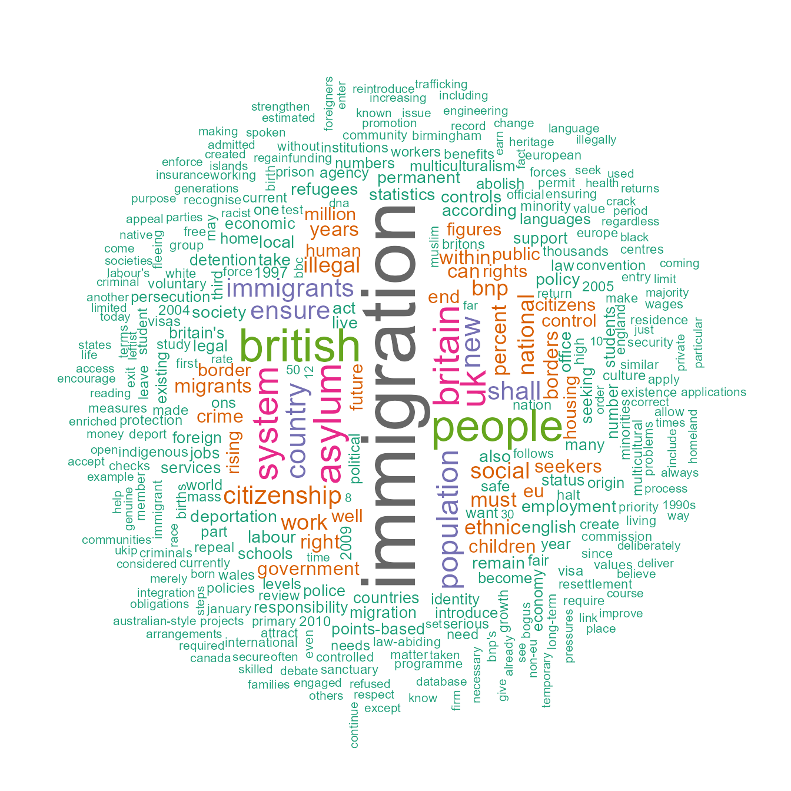
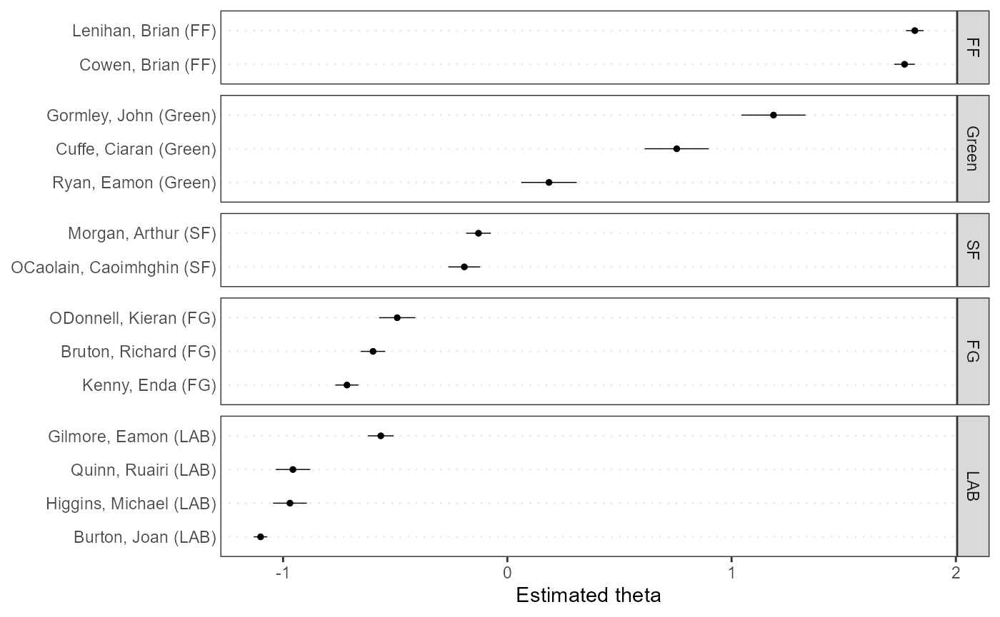

# Guía de Inicio Rápido

## Instalando el paquete

Desde que **quanteda** está disponible en
[CRAN](https://CRAN.R-project.org/package=quanteda), lo puedes instalar
usando tu instalador de paquetes en R GUI’s o ejecutar las siguientes
líneas:

``` r

install.packages("quanteda")
```

Ver instrucciones (en inglés) en <https://github.com/quanteda/quanteda>
para instalar la versión de GitHub.

### Paquetes adicionales recomendados:

Los siguientes paquetes funcionan bien con con **quanteda** o lo
complementan y por eso recomendamos que también los instaleis:

- [**readtext**](https://github.com/quanteda/readtext): una manera
  sencilla de leer data de texto casi con cualquier formato con R,.

- [**spacyr**](https://github.com/kbenoit/spacyr): NLP usando la
  librería [spaCy](https://spacy.io), incluyendo etiquetado
  part-of-speech, entity recognition y dependency parsing.

- [**quanteda.corpora**](https://github.com/quanteda/quanteda.corpora):
  data textual adicional para uso con **quanteda**.

  ``` r

  devtools::install_github("quanteda/quanteda.corpora")
  ```

- [**LIWCalike**](https://github.com/kbenoit/quanteda.dictionaries): una
  implementación en R del abordaje de análisis de texto [Linguistic
  Inquiry and Word Count](http://liwc.wpengine.com).

  ``` r

  devtools::install_github("kbenoit/quanteda.dictionaries")
  ```

## Creando un corpus

Cargas el paquete para acceder a funciones y data en el paquete.

``` r

library(quanteda)
```

### Fuentes disponibles de corpus

**quanteda** tiene un simple y poderoso paquete adicional para cargar
textos: [**readtext**](https://github.com/kbenoit/readtext). La función
principal en este paquete,
[`readtext()`](https://readtext.quanteda.io/reference/readtext.html),
toma un archivo o set de archivos de un disco o una dirección de URL y
devuelve un tipo de data.frame que puede ser usado directamente con la
función de construcción de corpus
([`corpus()`](https://quanteda.io/reference/corpus.md)) para crear un
objeto corpus en **quanteda**.
[`readtext()`](https://readtext.quanteda.io/reference/readtext.html)
funciona con:

- archivos de texto (`.txt`);
- archivos de valores separados por comas (`.csv`);
- data en formato XML;
- data del API de Facebook API, en formato JSON;
- data de la API de Twitter, en formato JSON; y
- data en formato JSON en general.

El comando constructor de corpus llamado
[`corpus()`](https://quanteda.io/reference/corpus.md) funciona
directamente sobre:

- un vector de objetos de tipo character, por ejemplo aquellos que ya
  has cargado al workspace usando otras herramientas;
- un objeto corpus `VCorpus` del paquete **tm**.
- un data.frame que contenga una columna de texto y cualquier otro
  documento de metadata.

#### Construyendo un corpus de un vector de tipo character

El caso más simple sería crear un corpus de un vector de textos que ya
estén en la memoria en R. De esta manera, el usuario avanzado de R
obtiene completa flexibilidad con su elección de textos dado que hay
virtualmente infinitas posibilidades de obtener un vector de textos en
R.

Si ya se disponen de textos en este formato es posible llamar a la
función de constructor de corpus directamente. Es posible demostrarlo en
el objeto de tipo character integrado de los textos sobre políticas de
inmigración extraídos de los manifiestos de partidos políticos
compitiendo en la elección del Reino Unido en 2010 (llamado
`data_char_ukimmig2010`).

``` r

corp_uk <- corpus(data_char_ukimmig2010)  # build a new corpus from the texts
summary(corp_uk)
## Corpus consisting of 9 documents, showing 9 documents:
## 
##          Text Types Tokens Sentences
##           BNP  1125   3280       136
##     Coalition   142    260        12
##  Conservative   251    499        21
##        Greens   322    679        30
##        Labour   298    683        33
##        LibDem   251    483        26
##            PC    77    114         5
##           SNP    88    134         4
##          UKIP   346    723        37
```

Si quisiéramos, también podríamos incorporar también a este corpus
algunas variables a nivel documento – lo que quanteda llama *docvars*.

Esto lo hacemos utilizando la función de R llamada
[`names()`](https://rdrr.io/r/base/names.html) para obtener los nombres
del vector de tipo character de `data_char_ukimmig2010` y asignárselos a
una variable de documento (`docvar`).

``` r

docvars(corp_uk, "Party") <- names(data_char_ukimmig2010)
docvars(corp_uk, "Year") <- 2010
summary(corp_uk)
## Corpus consisting of 9 documents, showing 9 documents:
## 
##          Text Types Tokens Sentences        Party Year
##           BNP  1125   3280       136          BNP 2010
##     Coalition   142    260        12    Coalition 2010
##  Conservative   251    499        21 Conservative 2010
##        Greens   322    679        30       Greens 2010
##        Labour   298    683        33       Labour 2010
##        LibDem   251    483        26       LibDem 2010
##            PC    77    114         5           PC 2010
##           SNP    88    134         4          SNP 2010
##          UKIP   346    723        37         UKIP 2010
```

#### Cargando archivos usando el paquete readtext

``` r

require(readtext)

# Twitter json
dat_json <- readtext("~/Dropbox/QUANTESS/social media/zombies/tweets.json")
corp_twitter <- corpus(dat_json)
summary(corp_twitter, 5)
# generic json - needs a textfield specifier
dat_sotu <- readtext("~/Dropbox/QUANTESS/Manuscripts/collocations/Corpora/sotu/sotu.json",
                  textfield = "text")
summary(corpus(dat_sotu), 5)
# text file
dat_txtone <- readtext("~/Dropbox/QUANTESS/corpora/project_gutenberg/pg2701.txt", cache = FALSE)
summary(corpus(dat_txtone), 5)
# multiple text files
dat_txtmultiple1 <- readtext("~/Dropbox/QUANTESS/corpora/inaugural/*.txt", cache = FALSE)
summary(corpus(dat_txtmultiple1), 5)
# multiple text files with docvars from filenames
dat_txtmultiple2 <- readtext("~/Dropbox/QUANTESS/corpora/inaugural/*.txt",
                             docvarsfrom = "filenames", sep = "-",
                             docvarnames = c("Year", "President"))
summary(corpus(dat_txtmultiple2), 5)
# XML data
dat_xml <- readtext("~/Dropbox/QUANTESS/quanteda_working_files/xmlData/plant_catalog.xml",
                  textfield = "COMMON")
summary(corpus(dat_xml), 5)
# csv file
write.csv(data.frame(inaug_speech = as.character(data_corpus_inaugural),
                     docvars(data_corpus_inaugural)),
          file = "/tmp/inaug_texts.csv", row.names = FALSE)
dat_csv <- readtext("/tmp/inaug_texts.csv", textfield = "inaug_speech")
summary(corpus(dat_csv), 5)
```

### Cómo funciona un corpus de quanteda

#### Principios del Corpus

Un corpus está diseñado para ser una “librería” original de documentos
que han sido convertidos a formato plano, texto codificado en UTF-8, y
guardado junto con meta-data en a nivel de corpus y a nivel de
documento. Tenemos un nombre especial para meta-data a nivel de
documento: *docvars*. Estas son variables o características que
describen atributos de cada documento.

Un corpus está diseñado para ser un contenedor de textos más o menos
estático en lo que respecta a su procesamiento y análisis. Esto
significa que los textos en el corpus no están disenado para ser
cambiados internamente a través de (por ejemplo) limpieza o
preprocesamiento, como stemming o removiendo la puntuación. Más que
nada, los textos pueden ser extraídos del corpus como parte del
procesamiento y asignados a objetos nuevos, pero la idea es que los
corpus se conserven como una copia de referencia original para que otros
análisis, por ejemplo aquellos en que stems y puntuación son necesarios,
como analizar un índice, pueden ser realizados sobre el mismo corpus.

Para extraer texto de un corpus, es posible utilizar el extractor
llamado [`as.character()`](https://rdrr.io/r/base/character.html).

``` r

as.character(data_corpus_inaugural)[2]
##                                                                                                                                                                                                                                                                                                                                                                                                                                                                                                                                                                                                                                                                                                                                                                                                              1793-Washington 
## "Fellow citizens, I am again called upon by the voice of my country to execute the functions of its Chief Magistrate. When the occasion proper for it shall arrive, I shall endeavor to express the high sense I entertain of this distinguished honor, and of the confidence which has been reposed in me by the people of united America.\n\nPrevious to the execution of any official act of the President the Constitution requires an oath of office. This oath I am now about to take, and in your presence: That if it shall be found during my administration of the Government I have in any instance violated willingly or knowingly the injunctions thereof, I may (besides incurring constitutional punishment) be subject to the upbraidings of all who are now witnesses of the present solemn ceremony.\n\n "
```

Para obtener la data resumida de textos de un corpus, se puede llamar al
método [`summary()`](https://rdrr.io/r/base/summary.html) definido para
un corpus.

``` r

data(data_corpus_irishbudget2010, package = "quanteda.textmodels")
summary(data_corpus_irishbudget2010)
## Corpus consisting of 14 documents, showing 14 documents:
## 
##                       Text Types Tokens Sentences year debate number      foren
##        Lenihan, Brian (FF)  1953   8641       404 2010 BUDGET     01      Brian
##       Bruton, Richard (FG)  1040   4446       217 2010 BUDGET     02    Richard
##         Burton, Joan (LAB)  1624   6393       309 2010 BUDGET     03       Joan
##        Morgan, Arthur (SF)  1595   7107       345 2010 BUDGET     04     Arthur
##          Cowen, Brian (FF)  1629   6599       252 2010 BUDGET     05      Brian
##           Kenny, Enda (FG)  1148   4232       155 2010 BUDGET     06       Enda
##      ODonnell, Kieran (FG)   678   2297       133 2010 BUDGET     07     Kieran
##       Gilmore, Eamon (LAB)  1181   4177       203 2010 BUDGET     08      Eamon
##     Higgins, Michael (LAB)   488   1286        44 2010 BUDGET     09    Michael
##        Quinn, Ruairi (LAB)   439   1284        60 2010 BUDGET     10     Ruairi
##      Gormley, John (Green)   401   1030        50 2010 BUDGET     11       John
##        Ryan, Eamon (Green)   510   1643        90 2010 BUDGET     12      Eamon
##      Cuffe, Ciaran (Green)   442   1240        45 2010 BUDGET     13     Ciaran
##  OCaolain, Caoimhghin (SF)  1188   4044       177 2010 BUDGET     14 Caoimhghin
##      name party
##   Lenihan    FF
##    Bruton    FG
##    Burton   LAB
##    Morgan    SF
##     Cowen    FF
##     Kenny    FG
##  ODonnell    FG
##   Gilmore   LAB
##   Higgins   LAB
##     Quinn   LAB
##   Gormley Green
##      Ryan Green
##     Cuffe Green
##  OCaolain    SF
```

Se puede guardar el output del comando summary como un data frame y
graficar algunos estadísticos descriptivos con esta información:

``` r

tokeninfo <- summary(data_corpus_inaugural)
if (require(ggplot2))
    ggplot(data = tokeninfo, aes(x = Year, y = Tokens, group = 1)) +
    geom_line() +
    geom_point() +
    scale_x_continuous(labels = c(seq(1789, 2017, 12)), breaks = seq(1789, 2017, 12)) +
    theme_bw()
## Loading required package: ggplot2
```


``` r


# El discurso inaugural más largo: William Henry Harrison
tokeninfo[which.max(tokeninfo$Tokens), ]
##             Text Types Tokens Sentences Year President     FirstName Party
## 14 1841-Harrison  1896   9125       210 1841  Harrison William Henry  Whig
```

### Herramientas para manejar objetos de corpus

#### Juntando dos objetos de corpus

El operador `+` provee un método simple para concatenar dos objetos
corpus. Si contenían diferentes sets de variables a nivel documento las
unirá de manera que no se pierda nada de información. La meta-data a
nivel corpus también queda concatenada.

``` r

corp1 <- corpus(data_corpus_inaugural[1:5])
corp2 <- corpus(data_corpus_inaugural[53:58])
corp3 <- corp1 + corp2
summary(corp3)
## Corpus consisting of 11 documents, showing 11 documents:
## 
##             Text Types Tokens Sentences Year  President FirstName
##  1789-Washington   625   1537        24 1789 Washington    George
##  1793-Washington    96    147         5 1793 Washington    George
##       1797-Adams   826   2577        37 1797      Adams      John
##   1801-Jefferson   717   1923        43 1801  Jefferson    Thomas
##   1805-Jefferson   804   2380        45 1805  Jefferson    Thomas
##     1997-Clinton   773   2436       113 1997    Clinton      Bill
##        2001-Bush   621   1806        98 2001       Bush George W.
##        2005-Bush   772   2312        99 2005       Bush George W.
##       2009-Obama   938   2689       112 2009      Obama    Barack
##       2013-Obama   814   2317        90 2013      Obama    Barack
##       2017-Trump   582   1660        89 2017      Trump Donald J.
##                  Party
##                   none
##                   none
##             Federalist
##  Democratic-Republican
##  Democratic-Republican
##             Democratic
##             Republican
##             Republican
##             Democratic
##             Democratic
##             Republican
```

#### Armando subsets dentro de objetos corpus

Hay un método de la función
[`corpus_subset()`](https://quanteda.io/reference/corpus_subset.md)
definida por objetos corpus, donde un nuevo corpus puede ser extraído en
base a condiciones lógicas aplicadas a docvars:

``` r

summary(corpus_subset(data_corpus_inaugural, Year > 1990))
## Corpus consisting of 9 documents, showing 9 documents:
## 
##          Text Types Tokens Sentences Year President FirstName      Party
##  1993-Clinton   642   1833        82 1993   Clinton      Bill Democratic
##  1997-Clinton   773   2436       113 1997   Clinton      Bill Democratic
##     2001-Bush   621   1806        98 2001      Bush George W. Republican
##     2005-Bush   772   2312        99 2005      Bush George W. Republican
##    2009-Obama   938   2689       112 2009     Obama    Barack Democratic
##    2013-Obama   814   2317        90 2013     Obama    Barack Democratic
##    2017-Trump   582   1660        89 2017     Trump Donald J. Republican
##    2021-Biden   812   2766       229 2021     Biden Joseph R. Democratic
##    2025-Trump  1000   3347       177 2025     Trump Donald J. Republican
summary(corpus_subset(data_corpus_inaugural, President == "Adams"))
## Corpus consisting of 2 documents, showing 2 documents:
## 
##        Text Types Tokens Sentences Year President   FirstName
##  1797-Adams   826   2577        37 1797     Adams        John
##  1825-Adams  1003   3147        75 1825     Adams John Quincy
##                  Party
##             Federalist
##  Democratic-Republican
```

### Explorando textos de corpus

La función `kwic` (keywords-in-context) realiza una búsqueda de una
palabra y permite visualizar los contextos en los que aparece:

``` r

toks <- tokens(data_corpus_inaugural)
kwic(toks, pattern = "terror")
## Keyword-in-context with 8 matches.
##                                                                     
##     [1797-Adams, 1324]              fraud or violence, by | terror |
##  [1933-Roosevelt, 111] nameless, unreasoning, unjustified | terror |
##  [1941-Roosevelt, 285]      seemed frozen by a fatalistic | terror |
##    [1961-Kennedy, 850]    alter that uncertain balance of | terror |
##     [1981-Reagan, 811]     freeing all Americans from the | terror |
##   [1997-Clinton, 1047]        They fuel the fanaticism of | terror |
##   [1997-Clinton, 1647]  maintain a strong defense against | terror |
##     [2009-Obama, 1619]     advance their aims by inducing | terror |
##                                   
##  , intrigue, or venality          
##  which paralyzes needed efforts to
##  , we proved that this            
##  that stays the hand of           
##  of runaway living costs.         
##  . And they torment the           
##  and destruction. Our children    
##  and slaughtering innocents, we
```

``` r

kwic(toks, pattern = "terror", valuetype = "regex")
## Keyword-in-context with 13 matches.
##                                                                             
##     [1797-Adams, 1324]                   fraud or violence, by |  terror   |
##  [1933-Roosevelt, 111]      nameless, unreasoning, unjustified |  terror   |
##  [1941-Roosevelt, 285]           seemed frozen by a fatalistic |  terror   |
##    [1961-Kennedy, 850]         alter that uncertain balance of |  terror   |
##    [1961-Kennedy, 972]               of science instead of its |  terrors  |
##     [1981-Reagan, 811]          freeing all Americans from the |  terror   |
##    [1981-Reagan, 2187]        understood by those who practice | terrorism |
##   [1997-Clinton, 1047]             They fuel the fanaticism of |  terror   |
##   [1997-Clinton, 1647]       maintain a strong defense against |  terror   |
##     [2009-Obama, 1619]          advance their aims by inducing |  terror   |
##     [2017-Trump, 1117] civilized world against radical Islamic | terrorism |
##      [2021-Biden, 544]             , white supremacy, domestic | terrorism |
##     [2025-Trump, 1371]      designating the cartels as foreign | terrorist |
##                                   
##  , intrigue, or venality          
##  which paralyzes needed efforts to
##  , we proved that this            
##  that stays the hand of           
##  . Together let us explore        
##  of runaway living costs.         
##  and prey upon their neighbors    
##  . And they torment the           
##  and destruction. Our children    
##  and slaughtering innocents, we   
##  , which we will eradicate        
##  that we must confront and        
##  organizations. And by invoking
```

``` r

kwic(toks, pattern = "communist*")
## Keyword-in-context with 2 matches.
##                                                                   
##   [1949-Truman, 832] the actions resulting from the | Communist  |
##  [1961-Kennedy, 510]     required - not because the | Communists |
##                            
##  philosophy are a threat to
##  may be doing it,
```

En el summary de arriba, las variables `Year` (año) y `President`
(presidente) son variables asociadas a cada documento. Es posible
acceder a dichas variables con la función ‘docvars()’

``` r

# inspect the document-level variables
head(docvars(data_corpus_inaugural))
##   Year  President FirstName                 Party
## 1 1789 Washington    George                  none
## 2 1793 Washington    George                  none
## 3 1797      Adams      John            Federalist
## 4 1801  Jefferson    Thomas Democratic-Republican
## 5 1805  Jefferson    Thomas Democratic-Republican
## 6 1809    Madison     James Democratic-Republican
```

Más corpora están disponibles en el repositorio
[quanteda.corpora](https://github.com/quanteda/quanteda.corpora).

## Extrayendo atributos de un corpus

Para realizar análisis estadísticos tales como document scaling, es
necesario extraer una matriz asociando valores de ciertos atributos con
cada documento. En quanteda, se utiliza la función ‘dfm’ para producir
dicha matriz. ‘dfm’, por sus siglas en inglés *document-feature matrix*
o matriz documento-atributo en castellano, siempre se refiere a los
documentos como filas y a los atributos como columnas. Se determinó esta
orientación de las dimensiones dado que es estándar en el campo de
análisis de datos que las unidades de análisis se computen en las filas
y los atributos o variables se computen en las columnas. Se denominan
“atributos” en vez de términos porque los atributos son más generales
que los términos: pueden ser definidos como términos crudos, términos
stemmed, términos de partes de discurso, términos luego de la remoción
de las stopwords o una clase de diccionario al que pertenece un término.
Los atributos pueden ser enteramente generales, como ngrams o
dependencias sintácticas y dejamos esto abierto.

### Convirtiendo textos en tokens

Para convertir un texto en tokens de manera simple, quanteda provee un
poderoso comando
denominado[`tokens()`](https://quanteda.io/reference/tokens.md). Produce
un objeto intermedio que consiste en una lista de tokens en forma de
vectores de caracteres, donde cada elemento de la lista corresponde con
un documento de input.

El comando [`tokens()`](https://quanteda.io/reference/tokens.md) es
deliberadamente conservador, es decir, que no remueve nada del texto
excepto que se le especifique explícitamente que lo haga.

``` r

txt <- c(text1 = "This is $10 in 999 different ways,\n up and down; left and right!",
        text2 = "@kenbenoit working: on #quanteda 2day\t4ever, http://textasdata.com?page=123.")
tokens(txt)
## Tokens consisting of 2 documents.
## text1 :
##  [1] "This"      "is"        "$"         "10"        "in"        "999"      
##  [7] "different" "ways"      ","         "up"        "and"       "down"     
## [ ... and 5 more ]
## 
## text2 :
## [1] "@kenbenoit"                      "working"                        
## [3] ":"                               "on"                             
## [5] "#quanteda"                       "2day"                           
## [7] "4ever"                           ","                              
## [9] "http://textasdata.com?page=123."
tokens(txt, remove_numbers = TRUE,  remove_punct = TRUE)
## Tokens consisting of 2 documents.
## text1 :
##  [1] "This"      "is"        "$"         "in"        "different" "ways"     
##  [7] "up"        "and"       "down"      "left"      "and"       "right"    
## 
## text2 :
## [1] "@kenbenoit"                      "working"                        
## [3] "on"                              "#quanteda"                      
## [5] "2day"                            "4ever"                          
## [7] "http://textasdata.com?page=123."
tokens(txt, remove_numbers = FALSE, remove_punct = TRUE)
## Tokens consisting of 2 documents.
## text1 :
##  [1] "This"      "is"        "$"         "10"        "in"        "999"      
##  [7] "different" "ways"      "up"        "and"       "down"      "left"     
## [ ... and 2 more ]
## 
## text2 :
## [1] "@kenbenoit"                      "working"                        
## [3] "on"                              "#quanteda"                      
## [5] "2day"                            "4ever"                          
## [7] "http://textasdata.com?page=123."
tokens(txt, remove_numbers = TRUE,  remove_punct = FALSE)
## Tokens consisting of 2 documents.
## text1 :
##  [1] "This"      "is"        "$"         "in"        "different" "ways"     
##  [7] ","         "up"        "and"       "down"      ";"         "left"     
## [ ... and 3 more ]
## 
## text2 :
## [1] "@kenbenoit"                      "working"                        
## [3] ":"                               "on"                             
## [5] "#quanteda"                       "2day"                           
## [7] "4ever"                           ","                              
## [9] "http://textasdata.com?page=123."
tokens(txt, remove_numbers = FALSE, remove_punct = FALSE)
## Tokens consisting of 2 documents.
## text1 :
##  [1] "This"      "is"        "$"         "10"        "in"        "999"      
##  [7] "different" "ways"      ","         "up"        "and"       "down"     
## [ ... and 5 more ]
## 
## text2 :
## [1] "@kenbenoit"                      "working"                        
## [3] ":"                               "on"                             
## [5] "#quanteda"                       "2day"                           
## [7] "4ever"                           ","                              
## [9] "http://textasdata.com?page=123."
tokens(txt, remove_numbers = FALSE, remove_punct = FALSE, remove_separators = FALSE)
## Tokens consisting of 2 documents.
## text1 :
##  [1] "This"      " "         "is"        " "         "$"         "10"       
##  [7] " "         "in"        " "         "999"       " "         "different"
## [ ... and 18 more ]
## 
## text2 :
##  [1] "@kenbenoit" " "          "working"    ":"          " "         
##  [6] "on"         " "          "#quanteda"  " "          "2day"      
## [11] "\t"         "4ever"     
## [ ... and 3 more ]
```

También existe la opción de convertir en token los caracteres:

``` r

tokens("Great website: http://textasdata.com?page=123.", what = "character")
## Tokens consisting of 1 document.
## text1 :
##  [1] "G" "r" "e" "a" "t" "w" "e" "b" "s" "i" "t" "e"
## [ ... and 32 more ]
tokens("Great website: http://textasdata.com?page=123.", what = "character",
        remove_separators = FALSE)
## Tokens consisting of 1 document.
## text1 :
##  [1] "G" "r" "e" "a" "t" " " "w" "e" "b" "s" "i" "t"
## [ ... and 34 more ]
```

y las oraciones:

``` r

# sentence level         
tokens(c("Kurt Vongeut said; only assholes use semi-colons.",
          "Today is Thursday in Canberra:  It is yesterday in London.",
          "En el caso de que no puedas ir con ellos, ¿quieres ir con nosotros?"),
         what = "sentence")
## Tokens consisting of 3 documents.
## text1 :
## [1] "Kurt Vongeut said; only assholes use semi-colons."
## 
## text2 :
## [1] "Today is Thursday in Canberra:  It is yesterday in London."
## 
## text3 :
## [1] "En el caso de que no puedas ir con ellos, ¿quieres ir con nosotros?"
```

### Construyendo una matriz de documentos y atributos

Convertir los textos en tokens es una opción intermedia y la mayoría de
los usuarios querrán directamente construir la matriz de documentos y
atributos. Para hacer esto existe la función de navaja suiza llamada
[`dfm()`](https://quanteda.io/reference/dfm.md), que realiza la
tokenización y tabula los atributos extraídos dentro de una matriz de
documentos por atributos. A diferencia del enfoque conservador de
[`tokens()`](https://quanteda.io/reference/tokens.md), la función
[`dfm()`](https://quanteda.io/reference/dfm.md) aplica ciertas opciones
por default, como [`tolower()`](https://rdrr.io/r/base/chartr.html) –
una función separada para transformar textos a minúsculas – y remueve
puntuación. De todos modos, todas las opciones de
[`tokens()`](https://quanteda.io/reference/tokens.md) se pueden pasar a
[`dfm()`](https://quanteda.io/reference/dfm.md).

``` r

corp_inaug_post1990 <- corpus_subset(data_corpus_inaugural, Year > 1990)

# make a dfm
dfmat_inaug_post1990 <- tokens(corp_inaug_post1990) |>
    dfm()
dfmat_inaug_post1990[, 1:5]
## Document-feature matrix of: 9 documents, 5 features (0.00% sparse) and 4
## docvars.
##               features
## docs           my fellow citizens   , today
##   1993-Clinton  7      5        2 139    10
##   1997-Clinton  6      7        7 131     5
##   2001-Bush     3      1        9 110     2
##   2005-Bush     2      3        6 120     3
##   2009-Obama    2      1        1 130     6
##   2013-Obama    3      3        6  99     4
## [ reached max_ndoc ... 3 more documents ]
```

Otras opciones para incluyen remover las stopwords y realizar stemming
de los tokens.

``` r

# make a dfm, removing stopwords and applying stemming
dfmat_inaug_post1990 <- dfm(dfmat_inaug_post1990) |>
    dfm_remove(stopwords("english")) |>
    dfm_wordstem()
dfmat_inaug_post1990[, 1:5]
## Document-feature matrix of: 9 documents, 5 features (4.44% sparse) and 4
## docvars.
##               features
## docs           fellow citizen   , today celebr
##   1993-Clinton      5       2 139    10      4
##   1997-Clinton      7       8 131     6      1
##   2001-Bush         1      10 110     2      0
##   2005-Bush         3       7 120     3      2
##   2009-Obama        1       1 130     6      2
##   2013-Obama        3       8  99     6      1
## [ reached max_ndoc ... 3 more documents ]
```

La opción ‘remove’ provee una lista de tokens a ser ignorados. La
mayoría de los usuarios proveerán una lista de ‘stop words’ predefinidas
para varios idiomas, accediendo a través de la función
[`stopwords()`](https://rdrr.io/pkg/stopwords/man/stopwords.html):

``` r

head(stopwords("en"), 20)
##  [1] "i"          "me"         "my"         "myself"     "we"        
##  [6] "our"        "ours"       "ourselves"  "you"        "your"      
## [11] "yours"      "yourself"   "yourselves" "he"         "him"       
## [16] "his"        "himself"    "she"        "her"        "hers"
head(stopwords("ru"), 10)
##  [1] "и"   "в"   "во"  "не"  "что" "он"  "на"  "я"   "с"   "со"
head(stopwords("ar", source = "misc"), 10)
##  [1] "فى"  "في"  "كل"  "لم"  "لن"  "له"  "من"  "هو"  "هي"  "قوة"
```

#### Visualizando la matriz de documentos y atributos

El dfm puede ser inspeccionado en el panel de ‘Environment’ en Rstudio o
llamando la función `View` en R. Llamando la función `plot` en un dfm se
presentará una nube de palabras usando el paquete [wordcloud
package](https://cran.r-project.org/web/packages/wordcloud)

``` r

dfmat_uk <- data_char_ukimmig2010 |>
    tokens(remove_punct = TRUE) |>
    tokens_remove(stopwords("english")) |>
    dfm()
dfmat_uk
## Document-feature matrix of: 9 documents, 1,547 features (83.78% sparse) and 0
## docvars.
##               features
## docs           immigration unparalleled crisis bnp can solve current birth
##   BNP                   21            1      2  13   1     2       4     4
##   Coalition              6            0      0   0   0     0       1     0
##   Conservative           3            0      0   0   2     0       0     0
##   Greens                 8            0      0   0   1     0       0     0
##   Labour                13            0      0   0   1     0       0     0
##   LibDem                 5            0      0   0   2     0       0     0
##               features
## docs           rates indigenous
##   BNP              2          5
##   Coalition        0          0
##   Conservative     0          0
##   Greens           0          0
##   Labour           0          0
##   LibDem           0          0
## [ reached max_ndoc ... 3 more documents, reached max_nfeat ... 1,537 more
## features ]
```

Para acceder a la lista de los atributos más frecuentes es posible
utilizar
[`topfeatures()`](https://quanteda.io/reference/topfeatures.md):

``` r

topfeatures(dfmat_uk, 20) # 20 most frequent words
## immigration     british      people      asylum     britain          uk 
##          66          37          35          29          28          27 
##      system  population     country         new  immigrants      ensure 
##          27          21          20          19          17          17 
##       shall citizenship      social    national         bnp     illegal 
##          17          16          14          14          13          13 
##        work     percent 
##          13          12
```

Para un objeto `dfm` se puede graficar una nube de palabras usando
[`textplot_wordcloud()`](https://rdrr.io/pkg/quanteda.textplots/man/textplot_wordcloud.html).
Esta función pasa argumentos a `wordcloud()` del paquete **wordcloud** y
puede embellecer el gráfico usando los mismos argumentos:

``` r

set.seed(100)
library("quanteda.textplots")
textplot_wordcloud(dfmat_uk, min_freq = 6, random_order = FALSE,
                  rotation = .25,
                  colors = RColorBrewer::brewer.pal(8, "Dark2"))
```



#### Agrupando documentos por variable

Frecuentemente estamos interesados en analizar cómo textos difieren
según factores sustantivos que pueden estar codificados en las variables
de documento en vez de simplemente por los límites de los archivos. En
esos casos es posible agrupar los documentos que comparten el mismo
valor por variable de documento cuando se crea un dfm:

``` r

dfmat_ire <- tokens(data_corpus_irishbudget2010, remove_punct = TRUE) |>
    tokens_remove(stopwords("en")) |>
    tokens_group(groups = party) |>
    dfm()
```

We can sort this dfm, and inspect it:

``` r

dfm_sort(dfmat_ire)[, 1:10]
## Document-feature matrix of: 5 documents, 10 features (0.00% sparse) and 3
## docvars.
##        features
## docs      € people budget government public minister tax economy pay jobs
##   FF    113     23     44         47     65       11  60      37  41   41
##   FG     55     78     71         61     47       62  11      20  29   17
##   Green  13     15     26         19      4        4  11      16   4   15
##   LAB    78     69     66         36     32       54  47      37  24   20
##   SF     77     81     53         73     31       39  34      50  24   27
```

#### Agrupando palabras por diccionario o clase de equivalencia

Para algunas aplicaciones se tiene conocimiento previo del conjunto de
palabras que son indicativas de rasgos que quisiéramos medir. Por
ejemplo, una lista general de palabras positivas puede indicar
sentimiento positivo en un reseña de una película tal tenemos un
diccionario de términos políticos asociados a una tendencia ideológica
en particular. En estos casos, a veces es útil tratar estos grupos de
palabras como equivalentes para los propósitos del análisis y sumar las
veces en que se utiliza agregándolas por clase.

Por ejemplo, observemos cómo palabras asociadas al terrorismo y palabras
asociadas con la economía varían por presidente en el corpus de
discursos inaugurales de presidentes de Estados Unidos. Del corpus
original seleccionamos los presidentes desde Clinton:

``` r

corp_inaug_post1991 <- corpus_subset(data_corpus_inaugural, Year > 1991)
```

Ahora definimos un diccionario de muestra:

``` r

dict <- dictionary(list(terror = c("terrorism", "terrorists", "threat"),
                        economy = c("jobs", "business", "grow", "work")))
```

Se puede usar el diccionario cuando creamos el dfm:

``` r

dfmat_inaug_post1991_dict <- tokens(corp_inaug_post1991) |>
    tokens_lookup(dictionary = dict) |>
    dfm()
dfmat_inaug_post1991_dict
## Document-feature matrix of: 9 documents, 2 features (16.67% sparse) and 4
## docvars.
##               features
## docs           terror economy
##   1993-Clinton      0       8
##   1997-Clinton      1       8
##   2001-Bush         0       4
##   2005-Bush         1       6
##   2009-Obama        1      10
##   2013-Obama        1       6
## [ reached max_ndoc ... 3 more documents ]
```

El constructor de la función
[`dictionary()`](https://quanteda.io/reference/dictionary.md) también
funciona con el formato de dos diccionarios externos comunes: los
formatos LIWC y Provalis Research’s Wordstat. Por ejemplo, es posible
cargar el LIWC y aplicarlo al corpus de discursos inaugurales de
presidentes:

``` r

dictliwc <- dictionary(file = "~/Dropbox/QUANTESS/dictionaries/LIWC/LIWC2001_English.dic",
                       format = "LIWC")
dfmat_inaug_subset <- dfm(data_corpus_inaugural[52:58], dictionary = dictliwc)
dfmat_inaug_subset[, 1:10]
```

## Más ejemplos

### Similitudes entre textos

``` r

dfmat_inaug_post1980 <- data_corpus_inaugural |>
    corpus_subset(Year > 1980) |>
    tokens(remove_punct = TRUE) |>
    tokens_remove(stopwords("english")) |>
    tokens_wordstem() |>
    dfm()
library("quanteda.textstats")
tstat_obama <- textstat_simil(dfmat_inaug_post1980,
                              dfmat_inaug_post1980[c("2009-Obama", "2013-Obama"), ],
                              margin = "documents", method = "cosine")
tstat_obama
## textstat_simil object; method = "cosine"
##              2009-Obama 2013-Obama
## 1981-Reagan       0.622      0.637
## 1985-Reagan       0.643      0.662
## 1989-Bush         0.625      0.578
## 1993-Clinton      0.628      0.626
## 1997-Clinton      0.660      0.646
## 2001-Bush         0.601      0.617
## 2005-Bush         0.526      0.587
## 2009-Obama        1.000      0.681
## 2013-Obama        0.681      1.000
## 2017-Trump        0.519      0.516
## 2021-Biden        0.661      0.645
## 2025-Trump        0.493      0.477
# dotchart(as.list(tstat_obama)$"2009-Obama", xlab = "Cosine similarity")
```

Se puede utilizar estas distancias para graficar un dendrograma, armando
clusters por presidente:

``` r

library(quanteda.corpora)

dfmat_sotu <- corpus_subset(data_corpus_sotu, Date > as.Date("1980-01-01")) |>
    tokens(remove_punct = TRUE) |>
    tokens_remove(stopwords("english")) |>
    tokens_wordstem() |>
    dfm()
dfmat_sotu <- dfm_trim(dfmat_sotu, min_termfreq = 5, min_docfreq = 3)

# hierarchical clustering - get distances on normalized dfm
tstat_dist <- textstat_dist(dfm_weight(dfmat_sotu, scheme = "prop"))
# hiarchical clustering the distance object
pres_cluster <- hclust(as.dist(tstat_dist))
# label with document names
pres_cluster$labels <- docnames(dfmat_sotu)
# plot as a dendrogram
plot(pres_cluster, xlab = "", sub = "",
     main = "Euclidean Distance on Normalized Token Frequency")
```


También se puede observar similitudes de los términos:

``` r

tstat_sim <- textstat_simil(dfmat_sotu, dfmat_sotu[, c("fair", "health", "terror")],
                          method = "cosine", margin = "features")
lapply(as.list(tstat_sim), head, 10)
## $fair
##    presid    member       pay      home      ever  american   histori      done 
## 0.8496026 0.8268128 0.8188599 0.8129604 0.8123573 0.8111787 0.7919036 0.7917175 
##    restor      look 
## 0.7913313 0.7892033 
## 
## $health
##    system      issu      need    expand    privat   support      year      high 
## 0.9156172 0.9147606 0.9103041 0.9091503 0.9089850 0.9058664 0.9026099 0.8994849 
##    reform       use 
## 0.8990631 0.8988175 
## 
## $terror
## terrorist    coalit    cheney      evil  homeland     regim      11th    sudden 
## 0.8541180 0.8102976 0.8096726 0.7945611 0.7847700 0.7540888 0.7529852 0.7483657 
##   septemb   liberti 
## 0.7430524 0.7399062
```

### Escalamiento de posiciones de documentos

Aquí realizamos una demostración de escalamiento de documentos
unsupervised comparado con el modelo “wordfish”:

``` r

library("quanteda.textmodels")
library("quanteda.textplots")
dfmat_ire <- tokens(data_corpus_irishbudget2010) |>
    dfm()
tmod_wf <- textmodel_wordfish(dfmat_ire, dir = c(2, 1))

# plot the Wordfish estimates by party
textplot_scale1d(tmod_wf, groups = docvars(dfmat_ire, "party"))
```



### Topic models

**quanteda** hace muy sencillo ajustar topic models también. Por
ejemplo:

``` r

dfmat_ire2 <- tokens(data_corpus_irishbudget2010, remove_punct = TRUE, remove_numbers = TRUE) |>
    tokens_remove(stopwords("english")) |>
    dfm()
dfmat_ire2 <- dfm_trim(dfmat_ire2, min_termfreq = 4, max_docfreq = 10)
dfmat_ire2
## Document-feature matrix of: 14 documents, 1,263 features (64.52% sparse) and 6
## docvars.
##                       features
## docs                   supplementary april said period severe today report
##   Lenihan, Brian (FF)              7     1    1      2      3     9      6
##   Bruton, Richard (FG)             0     1    0      0      0     6      5
##   Burton, Joan (LAB)               0     0    4      2      0    13      1
##   Morgan, Arthur (SF)              1     3    0      3      0     4      0
##   Cowen, Brian (FF)                0     0    0      4      1     3      2
##   Kenny, Enda (FG)                 1     4    4      1      0     2      0
##                       features
## docs                   difficulties months road
##   Lenihan, Brian (FF)             6     11    2
##   Bruton, Richard (FG)            0      0    1
##   Burton, Joan (LAB)              1      3    1
##   Morgan, Arthur (SF)             1      4    2
##   Cowen, Brian (FF)               1      3    2
##   Kenny, Enda (FG)                0      2    5
## [ reached max_ndoc ... 8 more documents, reached max_nfeat ... 1,253 more
## features ]

set.seed(100)
if (require(topicmodels)) {
    my_lda_fit20 <- LDA(convert(dfmat_ire2, to = "topicmodels"), k = 20)
    get_terms(my_lda_fit20, 5)
}
## Loading required package: topicmodels
##      Topic 1     Topic 2     Topic 3     Topic 4    Topic 5       
## [1,] "taoiseach" "fáil"      "failed"    "scheme"   "enterprising"
## [2,] "fine"      "fianna"    "strategy"  "spending" "going"       
## [3,] "gael"      "side"      "needed"    "reduced"  "nation"      
## [4,] "may"       "societies" "ministers" "details"  "sense"       
## [5,] "irish"     "level"     "system"    "pension"  "call"        
##      Topic 6       Topic 7    Topic 8    Topic 9     Topic 10   Topic 11  
## [1,] "citizenship" "welfare"  "child"    "taoiseach" "million"  "fianna"  
## [2,] "alternative" "taxation" "nama"     "employees" "measures" "fáil"    
## [3,] "wealth"      "system"   "policies" "rate"      "welfare"  "national"
## [4,] "adjustment"  "recovery" "benefit"  "referred"  "recent"   "irish"   
## [5,] "breaks"      "worst"    "top"      "debate"    "review"   "support" 
##      Topic 12     Topic 13  Topic 14   Topic 15      Topic 16  Topic 17   
## [1,] "million"    "levy"    "system"   "kind"        "child"   "care"     
## [2,] "support"    "million" "fáil"     "imagination" "day"     "per"      
## [3,] "welfare"    "carbon"  "nothing"  "policies"    "bank"    "welfare"  
## [4,] "investment" "change"  "welfare"  "wit"         "benefit" "allowance"
## [5,] "back"       "welfare" "measures" "create"      "fianna"  "million"  
##      Topic 18    Topic 19  Topic 20   
## [1,] "fianna"    "benefit" "equal"    
## [2,] "system"    "banks"   "society"  
## [3,] "fáil"      "person"  "difficult"
## [4,] "proposals" "today"   "sense"    
## [5,] "child"     "hear"    "nation"
```
