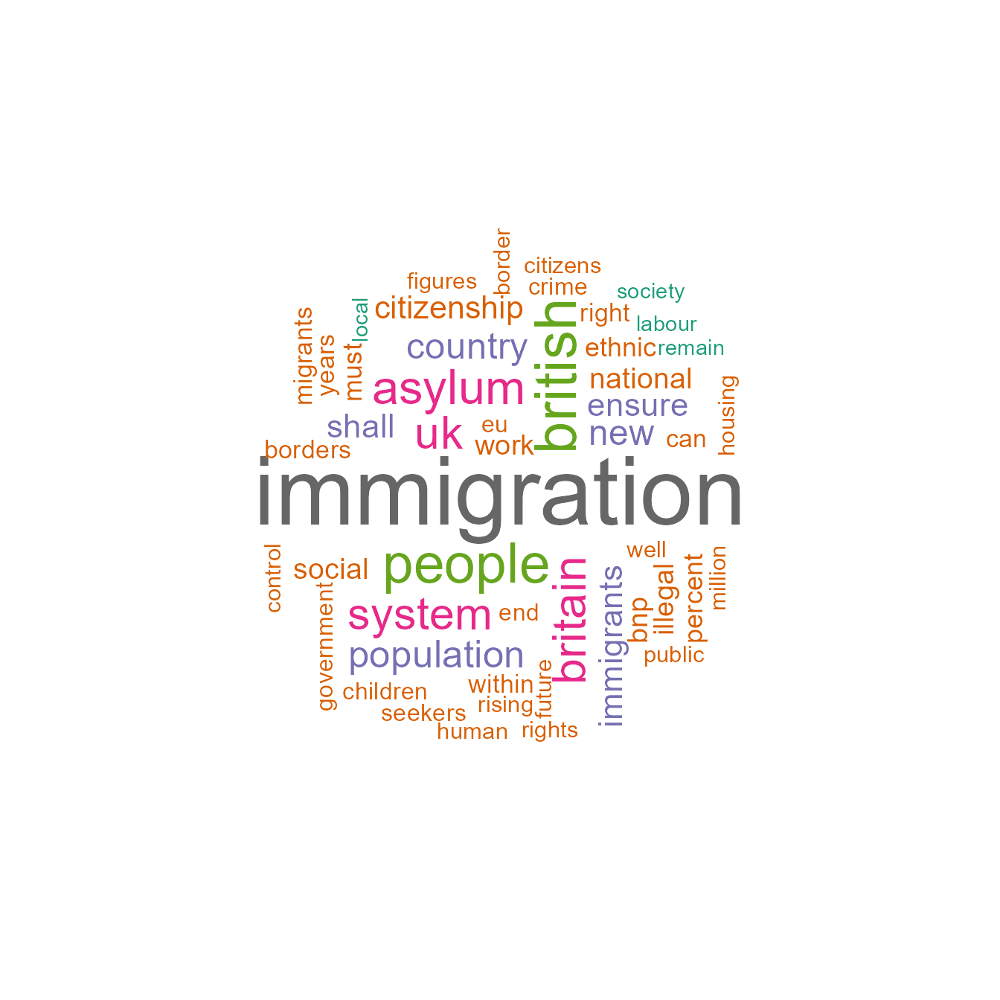
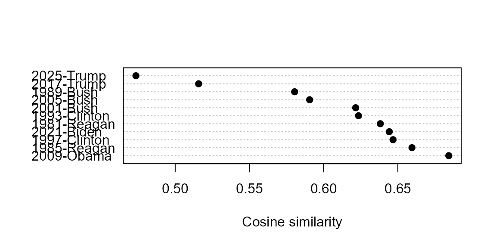
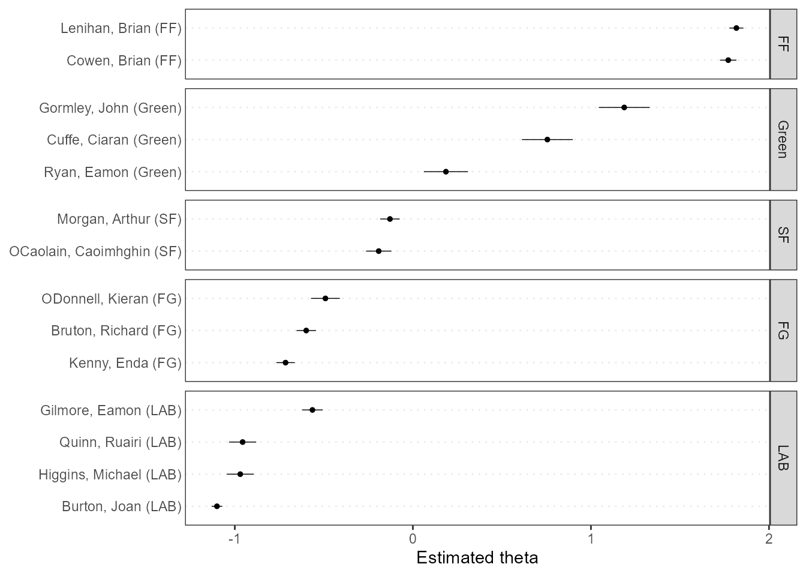

# Quickstart: Further Examples

``` r

library("quanteda")
## Package version: 4.4.1
## Unicode version: 15.1
## ICU version: 74.1
## Parallel computing: 28 of 28 threads used.
## See https://quanteda.io for tutorials and examples.
```

## Plotting a wordcloud

Plotting a word cloud can be done using the **quanteda.textplots**
package, for any `dfm` class object.

``` r

dfmat_uk <- tokens(data_char_ukimmig2010, remove_punct = TRUE) |>
  tokens_remove(stopwords("en")) |>
  dfm()

# 20 most frequent words
topfeatures(dfmat_uk, 50)
## immigration     british      people      asylum     britain          uk 
##          66          37          35          29          28          27 
##      system  population     country         new  immigrants      ensure 
##          27          21          20          19          17          17 
##       shall citizenship      social    national         bnp     illegal 
##          17          16          14          14          13          13 
##        work     percent      ethnic        must         can      within 
##          13          12          12          12          11          11 
##       years       right     borders    migrants  government    children 
##          11          11          11          11          10          10 
##       crime     seekers         end          eu        well       human 
##          10          10          10          10           9           9 
##      rights     control      border      public     figures     million 
##           9           9           9           9           9           9 
##      rising      future     housing    citizens        take deportation 
##           9           9           9           9           8           8 
##      remain      labour 
##           8           8
```

``` r

set.seed(100)
library("quanteda.textplots")
textplot_wordcloud(dfmat_uk, min_count = 6, random_order = FALSE,
                   rotation = .25, max_words = 50,
                   color = RColorBrewer::brewer.pal(8, "Dark2"))
```



## Further examples

### Similarities between texts

``` r

library("quanteda.textstats")
dfmat_inaug_post1980 <- corpus_subset(data_corpus_inaugural, Year > 1980) |>
  tokens(remove_punct = TRUE) |>
  tokens_wordstem(language = "en") |>
  tokens_remove(stopwords("en")) |>
  dfm()
tstat_obama <- textstat_simil(dfmat_inaug_post1980,
                              dfmat_inaug_post1980[c("2009-Obama", "2013-Obama"), ],
                              margin = "documents", method = "cosine")
as.list(tstat_obama)
## $`2009-Obama`
##   2013-Obama 1997-Clinton   2021-Biden  1985-Reagan    1989-Bush 1993-Clinton 
##    0.6842927    0.6569810    0.6559086    0.6402519    0.6294509    0.6242125 
##  1981-Reagan    2001-Bush    2005-Bush   2017-Trump   2025-Trump 
##    0.6231864    0.6060299    0.5362962    0.5213239    0.4911659 
## 
## $`2013-Obama`
##   2009-Obama  1985-Reagan 1997-Clinton   2021-Biden  1981-Reagan 1993-Clinton 
##    0.6842927    0.6595027    0.6467600    0.6442203    0.6381810    0.6234969 
##    2001-Bush    2005-Bush    1989-Bush   2017-Trump   2025-Trump 
##    0.6215870    0.5905799    0.5804661    0.5157923    0.4735381
dotchart(as.list(tstat_obama)$"2013-Obama", xlab = "Cosine similarity", pch = 19)
```



We can use these distances to plot a dendrogram, clustering presidents.

``` r

library(quanteda.corpora)

dfmat_sotu <- corpus_subset(data_corpus_sotu, Date > as.Date("1980-01-01")) |>
  tokens(remove_punct = TRUE) |>
  tokens_wordstem(language = "en") |>
  tokens_remove(stopwords("en")) |>
  dfm()
dfmat_sotu <- dfm_trim(dfmat_sotu, min_termfreq = 5, min_docfreq = 3)
```

Now we compute clusters and plot the dendrogram:

``` r

# hierarchical clustering - get distances on normalized dfm
tstat_dist <- dfmat_sotu |>
    dfm_weight(scheme = "prop") |>
    textstat_dist()
# hiarchical clustering the distance object
pres_cluster <- hclust(as.dist(tstat_dist))
# label with document names
pres_cluster$labels <- docnames(dfmat_sotu)
# plot as a dendrogram
plot(pres_cluster, xlab = "", sub = "",
     main = "Euclidean Distance on Normalized Token Frequency")
```


We can also look at term similarities:

``` r

tstat_sim <- textstat_simil(dfmat_sotu, dfmat_sotu[, c("fair", "health", "terror")],
                          method = "cosine", margin = "features")
lapply(as.list(tstat_sim), head, 10)
```

    ## $fair
    ##      time    better       far  strategi        us     lower      long       one   practic      onli 
    ## 0.8266617 0.8135324 0.8036487 0.8002557 0.8000581 0.7995066 0.7977770 0.7949795 0.7944127 0.7899963 
    ## 
    ## $health
    ##    system      issu    privat      need    expand    reform   support      hous    dramat      mani 
    ## 0.9232094 0.9229859 0.9175231 0.9145142 0.9118901 0.9072380 0.9072374 0.9063870 0.9051588 0.9045851 
    ## 
    ## $terror
    ## terrorist    coalit    cheney      evil  homeland   liberti      11th    sudden     regim   septemb 
    ## 0.8539894 0.8179609 0.8175618 0.7949619 0.7878223 0.7697739 0.7603221 0.7556575 0.7533021 0.7502925 

### Scaling document positions

Here is a demonstration of unsupervised document scaling comparing the
“Wordfish” model:

``` r

if (require("quanteda.textmodels") && require("quanteda.textplots")) {
  dfmat_ire <- tokens(data_corpus_irishbudget2010) |> 
      dfm()
  tmod_wf <- textmodel_wordfish(dfmat_ire, dir = c(2, 1))
  
  # plot the Wordfish estimates by party
  textplot_scale1d(tmod_wf, groups = docvars(dfmat_ire, "party"))
}
## Loading required package: quanteda.textmodels
```



### Topic models

**quanteda** makes it very easy to fit topic models as well, e.g.:

``` r

if (require("quanteda.textmodels")) {
    quant_dfm <- tokens(data_corpus_irishbudget2010, remove_punct = TRUE, remove_numbers = TRUE) |>
        tokens_remove(stopwords("en")) |>
        dfm()
    quant_dfm <- dfm_trim(quant_dfm, min_termfreq = 4, max_docfreq = 10)
    quant_dfm 
}
## Document-feature matrix of: 14 documents, 1,263 features (64.52% sparse) and 6
## docvars.
##                       features
## docs                   supplementary april said period severe today report
##   Lenihan, Brian (FF)              7     1    1      2      3     9      6
##   Bruton, Richard (FG)             0     1    0      0      0     6      5
##   Burton, Joan (LAB)               0     0    4      2      0    13      1
##   Morgan, Arthur (SF)              1     3    0      3      0     4      0
##   Cowen, Brian (FF)                0     0    0      4      1     3      2
##   Kenny, Enda (FG)                 1     4    4      1      0     2      0
##                       features
## docs                   difficulties months road
##   Lenihan, Brian (FF)             6     11    2
##   Bruton, Richard (FG)            0      0    1
##   Burton, Joan (LAB)              1      3    1
##   Morgan, Arthur (SF)             1      4    2
##   Cowen, Brian (FF)               1      3    2
##   Kenny, Enda (FG)                0      2    5
## [ reached max_ndoc ... 8 more documents, reached max_nfeat ... 1,253 more
## features ]
```

Now we can fit the topic model and plot it:

``` r

if (require("stm") && require("quanteda.textmodels")) {
    set.seed(100)
    my_lda_fit20 <- stm(quant_dfm, K = 20, verbose = FALSE)
    plot(my_lda_fit20)    
}
## Loading required package: stm
## Warning in library(package, lib.loc = lib.loc, character.only = TRUE,
## logical.return = TRUE, : there is no package called 'stm'
```
