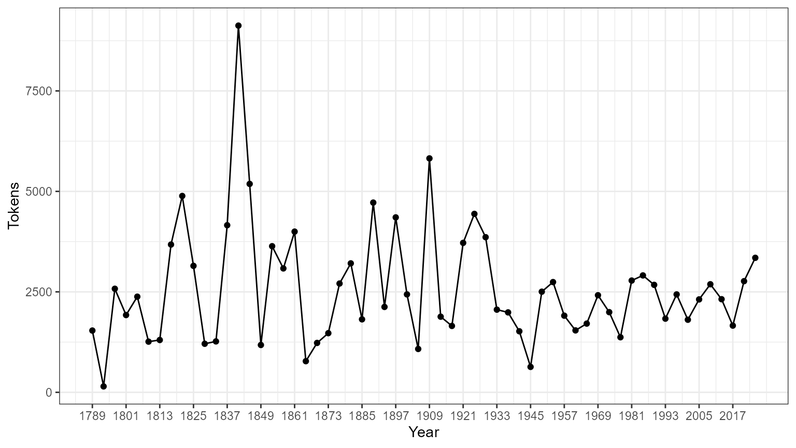

# क्विक आरंभ गाइड

## पैकेज इंस्टॉल करने के निर्देश

क्यूँकि **quanteda** [CRAN](https://CRAN.R-project.org/package=quanteda) पर
उपलब्ध है, आप अपने GUI के R package installer से सीधा इंस्टॉल कर सकते हैं, या इसे
इस तरह से भी इंस्टॉल कर सकते है:

``` r

install.packages("quanteda")
```

GitHub का वर्ज़न इंस्टॉल करने के लिए <https://github.com/quanteda/quanteda> पर
निर्देश देखें,

### और आवश्यक पैकिजेज़!

निम्नलिखित पैकिजेज़ **quanteda** के साथ अच्छी तरह से काम करते हैं आप उन्हें भी इंस्टॉल
करलीजिए

- [**readtext**](https://github.com/quanteda/readtext): लगभग किसी भी
  इनपुट टाइप में , आर के अन्दर टेक्स्ट डेटा को पढ़ने के लिए एक आसान तरीका।
- [**spacyr**](https://github.com/quanteda/spacyr):[spaCy](https://spacy.io)
  लाइब्रेरी का उपयोग करते हुए NLP, जिसमें पार्ट-ऑफ-स्पीच टैगिंग, इकाई पहचान और
  निर्भरता पार्सिंग शामिल है।
- [**quanteda.corpora**](https://github.com/quanteda/quanteda.corpora):
  **quanteda** के साथ उपयोग करने के लिए अतिरिक्त टेक्स्ट डेटा।

``` r

devtools::install_github("quanteda/quanteda.corpora")
```

- [**quanteda.dictionaries**](https://github.com/kbenoit/quanteda.dictionaries):
  **quanteda** के साथ उपयोग करने के लिए विभिन्न शब्दकोश, `liwcalike()`- पाठ
  विश्लेषण के लिए [Linguistic Inquiry and Word
  Cosunt](http://liwc.wpengine.com) दृष्टिकोण के एक कार्यान्वयन - के सहित।

``` r

devtools::install_github("kbenoit/quanteda.dictionaries")
```

## कॉर्पस बनाने के निर्देश

आप पैकेज को लोड करने के बाद, फ़ंक्शन और डेटा पैकेज का उपयोग कर सकते हैं।

``` r

library(quanteda)
```

### वर्तमान में उपलब्ध कॉर्पस स्रोतें

**quanteda** में टेक्स्ट को लोड करने के लिए एक सरल और शक्तिशाली साथी पैकेज है:
[**readtext**](https://github.com/quanteda/readtext) इस पैकेज में मुख्य फ़ंक्शन,
[`readtext()`](https://readtext.quanteda.io/reference/readtext.html),
डिस्क या URL से एक फ़ाइल या फाइलसेट लेकर, एक प्रकार का डेटाफ्रेम लौटाता है जिसका
उपयोग सीधे [`corpus()`](https://quanteda.io/reference/corpus.md) कंस्ट्रक्टर
फ़ंक्शन के साथ किया जा सकता है, ताकि एक **quanteda** कॉर्पस ऑब्जेक्ट बनाया जा सके।

[`readtext()`](https://readtext.quanteda.io/reference/readtext.html)
निम्नलिखित में से सभी पर काम करता है:

- टेक्स्ट (`.txt`) फ़ाइल;
- कॉमा-सेपरेटेड-वैल्यू (`.csv`) फ़ाइल;
- XML फॉर्मटेड डेटा;
- JSON टाइप में Facebook API से लिया हुआ डेटा;
- JSON टाइप में Twitter API से लिया हुआ डेटा; और
- सामान्य JSON डेटा

कॉर्पस कंस्ट्रक्टर कमांड [`corpus()`](https://quanteda.io/reference/corpus.md)
निम्नलिखित में से सभी पर सीधा काम करता है:

- करैक्टर ऑब्जेक्ट्स का एक वेक्टर जिसे आप, उदाहरण के लिए, पहले से ही अन्य सधनों का
  उपयोग करके कार्यक्षेत्र में लोड कर चुके हैं।
- **tm** पैकेज से एक `VCorpus` कॉर्पस ऑब्जेक्ट।
- एक डेटाफ़्रेम जिसमें एक टेक्स्ट कॉलम और कोई अन्य डॉक्युमेंटेड मेटाडेटा है।

#### एक करैक्टर वेक्टर से एक कार्पस का निर्माण करने के निर्देश

सबसे सरल है आर की मेमरी में रखे हुए टेक्स्ट के वेक्टर से कॉर्पस बनाना। यह R के उन्नत
उपयोगकर्ता को टेक्स्ट इनपुट्स चुनाव करने की पूरी आज़ादी देता है, क्योंकि इसमें टेक्स्ट के
वेक्टर को प्राप्त करने के लगभग अंतहीन तरीके हैं।

यदि हमारे पास पहले से ही इस रूप में टेक्स्ट हैं, तो हम सीधे कॉरपस कंस्ट्रक्टर फ़ंक्शन को
कॉल कर सकते हैं। हम ब्रिटेन के राजनीतिक दलों के 2010 के चुनाव के घोषणापत्रं
(`data_char_ukimmig2010`) से निकाला किया गया आव्रजन नीति के बारे में टेक्स्ट के
बिल्ट इन करैक्टर ऑब्जेक्ट पर इसका प्रदर्शन कर सकते है।

``` r

corp_uk <- corpus(data_char_ukimmig2010)  # build a new corpus from the texts
summary(corp_uk)
## Corpus consisting of 9 documents, showing 9 documents:
## 
##          Text Types Tokens Sentences
##           BNP  1125   3280       136
##     Coalition   142    260        12
##  Conservative   251    499        21
##        Greens   322    679        30
##        Labour   298    683        33
##        LibDem   251    483        26
##            PC    77    114         5
##           SNP    88    134         4
##          UKIP   346    723        37
```

हम कुछ डॉक्युमेंट लेवल वेरीअबल्ज़ - जिसे क्वांटेडा में *docvars* कहा गया है - इस कार्पस के
साथ जोड़ सकते हैं

हम इसे ऐसे कर सकते हैं: R के [`names()`](https://rdrr.io/r/base/names.html)
फ़ंक्शन का उपयोग करके, हम `data_char_ukimmig2010` के कैरक्टर वेक्टर के नामों को पा
सकते हैं और उन नामों को डॉक्युमेंट वेरीअबल (*docvar*) में रख सकते हैं।

``` r

docvars(corp_uk, "Party") <- names(data_char_ukimmig2010)
docvars(corp_uk, "Year") <- 2010
summary(corp_uk)
## Corpus consisting of 9 documents, showing 9 documents:
## 
##          Text Types Tokens Sentences        Party Year
##           BNP  1125   3280       136          BNP 2010
##     Coalition   142    260        12    Coalition 2010
##  Conservative   251    499        21 Conservative 2010
##        Greens   322    679        30       Greens 2010
##        Labour   298    683        33       Labour 2010
##        LibDem   251    483        26       LibDem 2010
##            PC    77    114         5           PC 2010
##           SNP    88    134         4          SNP 2010
##          UKIP   346    723        37         UKIP 2010
```

#### रीडटेक्सट पैकेज का उपयोग करके फ़ाइलों को लोड करने के लिए निर्देश

``` r

require(readtext)

# Twitter json
dat_json <- readtext("~/Dropbox/QUANTESS/social media/zombies/tweets.json")
corp_twitter <- corpus(dat_json)
summary(corp_twitter, 5)
# generic json - needs a textfield specifier
dat_sotu <- readtext("~/Dropbox/QUANTESS/Manuscripts/collocations/Corpora/sotu/sotu.json",
                     textfield = "text")
summary(corpus(dat_sotu), 5)
# text file
dat_txtone <- readtext("~/Dropbox/QUANTESS/corpora/project_gutenberg/pg2701.txt", cache = FALSE)
summary(corpus(dat_txtone), 5)
# multiple text files
dat_txtmultiple1 <- readtext("~/Dropbox/QUANTESS/corpora/inaugural/*.txt", cache = FALSE)
summary(corpus(dat_txtmultiple1), 5)
# multiple text files with docvars from filenames
dat_txtmultiple2 <- readtext("~/Dropbox/QUANTESS/corpora/inaugural/*.txt",
                             docvarsfrom = "filenames", sep = "-",
                             docvarnames = c("Year", "President"))
summary(corpus(dat_txtmultiple2), 5)
# XML data
dat_xml <- readtext("~/Dropbox/QUANTESS/quanteda_working_files/xmlData/plant_catalog.xml",
                    textfield = "COMMON")
summary(corpus(dat_xml), 5)
# csv file
write.csv(data.frame(inaug_speech = texts(data_corpus_inaugural),
                     docvars(data_corpus_inaugural)),
          file = "/tmp/inaug_texts.csv", row.names = FALSE)
dat_csv <- readtext("/tmp/inaug_texts.csv", textfield = "inaug_speech")
summary(corpus(dat_csv), 5)
```

### क्वांटेड़ा कॉर्पस कैसे काम करता है :

#### कॉर्पस के नियम

एक कॉर्पस को ओरिज़िनल डॉक्युमेंट्स का “पुस्तकालय” बनाया गया है जिसे सादे, UTF-8
एन्कोडेड पाठ में बदल दिया गया है, और इसे कॉर्पस स्तर पर और डॉक्युमेंट लेवल पर मेटा-डेटा
के साथ संग्रहीत किया गया है। हमारे पास डॉक्युमेंट लेवल मेटा-डेटा के लिए एक विशेष नाम
है: *docvars*। ये वेरीअबल या फ़ीचर्ज़ हैं जो प्रत्येक डॉक्युमेंट की विशेषताओं का वर्णन करते
हैं।

कॉर्पस टेक्स्ट का लगभग स्थिर कंटेनर है, प्रॉसेसिंग और विश्लेषण के संबंध में। इस कंटेनर में
टेक्स्ट को आंतरिक रूप से बदला नहीं जा सकता किसी पूर्व प्रॉसेसिंग के लिए जैसे की `,` जैसे
चिन्हों को हटाने के लिए। बल्कि, टेक्स्ट को कॉर्पस से निकाला जा सकता है प्रॉसेसिंग के
लिए और नए ऑब्जेक्ट में रखा जा सकता है। कॉर्पस के टेक्स्ट पे , बिना बदलाव किए, विश्लेषण
किए सकते हैं - जैसे की वो पढ़ने में कितना आसान है।

एक कार्पस से टेक्स्ट को निकालने के लिए, हम
[`as.character()`](https://rdrr.io/r/base/character.html) का उपयोग करते
हैं।

``` r

as.character(data_corpus_inaugural)[2]
##                                                                                                                                                                                                                                                                                                                                                                                                                                                                                                                                                                                                                                                                                                                                                                                                              1793-Washington 
## "Fellow citizens, I am again called upon by the voice of my country to execute the functions of its Chief Magistrate. When the occasion proper for it shall arrive, I shall endeavor to express the high sense I entertain of this distinguished honor, and of the confidence which has been reposed in me by the people of united America.\n\nPrevious to the execution of any official act of the President the Constitution requires an oath of office. This oath I am now about to take, and in your presence: That if it shall be found during my administration of the Government I have in any instance violated willingly or knowingly the injunctions thereof, I may (besides incurring constitutional punishment) be subject to the upbraidings of all who are now witnesses of the present solemn ceremony.\n\n "
```

एक कार्पस से टेक्स्ट को संक्षेप में प्रस्तुत करने के लिए, हम एक कार्पस के लिए परिभाषित
[`summary()`](https://rdrr.io/r/base/summary.html) मेथड का प्रयोग कर सकते
हैं।

``` r

summary(data_corpus_inaugural, n = 5)
## Corpus consisting of 60 documents, showing 5 documents:
## 
##             Text Types Tokens Sentences Year  President FirstName
##  1789-Washington   625   1537        24 1789 Washington    George
##  1793-Washington    96    147         5 1793 Washington    George
##       1797-Adams   826   2577        37 1797      Adams      John
##   1801-Jefferson   717   1923        43 1801  Jefferson    Thomas
##   1805-Jefferson   804   2380        45 1805  Jefferson    Thomas
##                  Party
##                   none
##                   none
##             Federalist
##  Democratic-Republican
##  Democratic-Republican
```

हम समरी कमांड से डेटा फ्रेम के रूप में आउटपुट को सेव कर सकते हैं, और इस सूचना के साथ कुछ
बुनियादी वर्णनात्मक आँकड़े प्लॉट कर सकते हैं:

``` r

tokeninfo <- summary(data_corpus_inaugural)
if (require(ggplot2))
    ggplot(data = tokeninfo, aes(x = Year, y = Tokens, group = 1)) +
    geom_line() +
    geom_point() +
    scale_x_continuous(labels = c(seq(1789, 2017, 12)), breaks = seq(1789, 2017, 12)) +
    theme_bw()
## Loading required package: ggplot2
```



``` r


# Longest inaugural address: William Henry Harrison
tokeninfo[which.max(tokeninfo$Tokens), ]
##             Text Types Tokens Sentences Year President     FirstName Party
## 14 1841-Harrison  1896   9125       210 1841  Harrison William Henry  Whig
```

### कॉर्पस के ऑब्जेक्ट्स को हैंडल करने के तरीक़े

#### दो कॉर्पस ऑब्जेक्ट्स को योग करने के लिए निर्देश

`+` ऑपरेटर दो कॉर्पस ऑब्जेक्ट्स को सरलता से जोड़ सकता है। यदि उन कॉर्पस आब्जेक्ट के
पास डॉक्युमेंट-लेवल वेरिएबल के अलग-अलग सेट हैं, तो उन्हें एक साथ इस तरह से जोड़ जाएगा
कि कोई भी जानकारी ना खो जाए। कॉर्पस-स्तर मेटा-डेटा भी जोड़ा जाता है।

``` r

corp1 <- corpus(data_corpus_inaugural[1:5])
corp2 <- corpus(data_corpus_inaugural[53:58])
corp3 <- corp1 + corp2
summary(corp3)
## Corpus consisting of 11 documents, showing 11 documents:
## 
##             Text Types Tokens Sentences Year  President FirstName
##  1789-Washington   625   1537        24 1789 Washington    George
##  1793-Washington    96    147         5 1793 Washington    George
##       1797-Adams   826   2577        37 1797      Adams      John
##   1801-Jefferson   717   1923        43 1801  Jefferson    Thomas
##   1805-Jefferson   804   2380        45 1805  Jefferson    Thomas
##     1997-Clinton   773   2436       113 1997    Clinton      Bill
##        2001-Bush   621   1806        98 2001       Bush George W.
##        2005-Bush   772   2312        99 2005       Bush George W.
##       2009-Obama   938   2689       112 2009      Obama    Barack
##       2013-Obama   814   2317        90 2013      Obama    Barack
##       2017-Trump   582   1660        89 2017      Trump Donald J.
##                  Party
##                   none
##                   none
##             Federalist
##  Democratic-Republican
##  Democratic-Republican
##             Democratic
##             Republican
##             Republican
##             Democratic
##             Democratic
##             Republican
```

#### कॉर्पस ऑब्जेक्ट का सबसेट करना

कॉर्पस ऑब्जेक्ट के लिए परिभाषित
[`corpus_subset()`](https://quanteda.io/reference/corpus_subset.md) फ़ंक्शन
में एक विधि है, जिससे एक नए कॉर्पस को *docvars* पर तार्किक स्थितियों को लागू करके
निकाला जा सकता है:

``` r

summary(corpus_subset(data_corpus_inaugural, Year > 1990))
## Corpus consisting of 9 documents, showing 9 documents:
## 
##          Text Types Tokens Sentences Year President FirstName      Party
##  1993-Clinton   642   1833        82 1993   Clinton      Bill Democratic
##  1997-Clinton   773   2436       113 1997   Clinton      Bill Democratic
##     2001-Bush   621   1806        98 2001      Bush George W. Republican
##     2005-Bush   772   2312        99 2005      Bush George W. Republican
##    2009-Obama   938   2689       112 2009     Obama    Barack Democratic
##    2013-Obama   814   2317        90 2013     Obama    Barack Democratic
##    2017-Trump   582   1660        89 2017     Trump Donald J. Republican
##    2021-Biden   812   2766       229 2021     Biden Joseph R. Democratic
##    2025-Trump  1000   3347       177 2025     Trump Donald J. Republican
summary(corpus_subset(data_corpus_inaugural, President == "Adams"))
## Corpus consisting of 2 documents, showing 2 documents:
## 
##        Text Types Tokens Sentences Year President   FirstName
##  1797-Adams   826   2577        37 1797     Adams        John
##  1825-Adams  1003   3147        75 1825     Adams John Quincy
##                  Party
##             Federalist
##  Democratic-Republican
```

### कॉर्पस टेक्स्ट का अन्वेषण करना

`kwic` फ़ंक्शन (कीवर्ड-इन-कॉन्टेक्स्ट) शब्दों को ढूँडता है और उन्हें उनके उचित संदर्भों में
दिखाता है।

``` r

toks <- tokens(data_corpus_inaugural)
kwic(toks, pattern = "terror")
## Keyword-in-context with 8 matches.
##                                                                     
##     [1797-Adams, 1324]              fraud or violence, by | terror |
##  [1933-Roosevelt, 111] nameless, unreasoning, unjustified | terror |
##  [1941-Roosevelt, 285]      seemed frozen by a fatalistic | terror |
##    [1961-Kennedy, 850]    alter that uncertain balance of | terror |
##     [1981-Reagan, 811]     freeing all Americans from the | terror |
##   [1997-Clinton, 1047]        They fuel the fanaticism of | terror |
##   [1997-Clinton, 1647]  maintain a strong defense against | terror |
##     [2009-Obama, 1619]     advance their aims by inducing | terror |
##                                   
##  , intrigue, or venality          
##  which paralyzes needed efforts to
##  , we proved that this            
##  that stays the hand of           
##  of runaway living costs.         
##  . And they torment the           
##  and destruction. Our children    
##  and slaughtering innocents, we
```

``` r

kwic(toks, pattern = "terror", valuetype = "regex")
## Keyword-in-context with 13 matches.
##                                                                             
##     [1797-Adams, 1324]                   fraud or violence, by |  terror   |
##  [1933-Roosevelt, 111]      nameless, unreasoning, unjustified |  terror   |
##  [1941-Roosevelt, 285]           seemed frozen by a fatalistic |  terror   |
##    [1961-Kennedy, 850]         alter that uncertain balance of |  terror   |
##    [1961-Kennedy, 972]               of science instead of its |  terrors  |
##     [1981-Reagan, 811]          freeing all Americans from the |  terror   |
##    [1981-Reagan, 2187]        understood by those who practice | terrorism |
##   [1997-Clinton, 1047]             They fuel the fanaticism of |  terror   |
##   [1997-Clinton, 1647]       maintain a strong defense against |  terror   |
##     [2009-Obama, 1619]          advance their aims by inducing |  terror   |
##     [2017-Trump, 1117] civilized world against radical Islamic | terrorism |
##      [2021-Biden, 544]             , white supremacy, domestic | terrorism |
##     [2025-Trump, 1371]      designating the cartels as foreign | terrorist |
##                                   
##  , intrigue, or venality          
##  which paralyzes needed efforts to
##  , we proved that this            
##  that stays the hand of           
##  . Together let us explore        
##  of runaway living costs.         
##  and prey upon their neighbors    
##  . And they torment the           
##  and destruction. Our children    
##  and slaughtering innocents, we   
##  , which we will eradicate        
##  that we must confront and        
##  organizations. And by invoking
```

``` r

kwic(toks, pattern = "communist*")
## Keyword-in-context with 2 matches.
##                                                                   
##   [1949-Truman, 832] the actions resulting from the | Communist  |
##  [1961-Kennedy, 510]     required - not because the | Communists |
##                            
##  philosophy are a threat to
##  may be doing it,
```

[`phrase()`](https://quanteda.io/reference/phrase.md) का उपयोग करके हम
बहु-शब्द इक्स्प्रेशन भी देख सकते हैं।

``` r

kwic(toks, pattern = phrase("United States")) |>
    head() # show context of the first six occurrences of "United States"
## Keyword-in-context with 6 matches.
##                                                                              
##  [1789-Washington, 433:434]            of the people of the | United States |
##  [1789-Washington, 529:530]          more than those of the | United States |
##       [1797-Adams, 524:525]     saw the Constitution of the | United States |
##     [1797-Adams, 1716:1717]      to the Constitution of the | United States |
##     [1797-Adams, 2480:2481] support the Constitution of the | United States |
##   [1805-Jefferson, 441:442]       sees a taxgatherer of the | United States |
##                                       
##  a Government instituted by themselves
##  . Every step by which                
##  in a foreign country.                
##  , and a conscientious determination  
##  , I entertain no doubt               
##  ? These contributions enable us
```

उपरोक्त सारांश में,`Year` और `President` प्रत्येक डॉक्युमेंट में हैं। हम
[`docvars()`](https://quanteda.io/reference/docvars.md) फंक्शन के साथ ऐसे
वेरिएबल को एक्सेस कर सकते हैं।

``` r

# inspect the document-level variables
head(docvars(data_corpus_inaugural))
##   Year  President FirstName                 Party
## 1 1789 Washington    George                  none
## 2 1793 Washington    George                  none
## 3 1797      Adams      John            Federalist
## 4 1801  Jefferson    Thomas Democratic-Republican
## 5 1805  Jefferson    Thomas Democratic-Republican
## 6 1809    Madison     James Democratic-Republican

# inspect the corpus-level metadata
meta(data_corpus_inaugural)
## $description
## [1] "Transcripts of all inaugural addresses delivered by United States Presidents, from Washington 1789 onward.  Data compiled by Gerhard Peters."
## 
## $source
## [1] "Gerhard Peters and John T. Woolley. The American Presidency Project."
## 
## $url
## [1] "https://www.presidency.ucsb.edu/documents/presidential-documents-archive-guidebook/inaugural-addresses"
## 
## $author
## [1] "(various US Presidents)"
## 
## $keywords
## [1] "political"     "US politics"   "United States" "presidents"   
## [5] "presidency"   
## 
## $title
## [1] "US presidential inaugural address speeches"
```

अधिक कॉर्पोरा
[quanteda.corpora](https://github.com/quanteda/quanteda.corpora) पैकेज से
उपलब्ध हैं।

## कॉर्पस से फ़ीचर्ज़ निकालना

डॉक्युमेंट स्केलिंग जैसे सांख्यिकीय विश्लेषण करने के लिए, हमें प्रत्येक डॉक्युमेंट के साथ कुछ
विशेषताओं के लिए एक मैट्रिक्स से जुड़ी हुई वैल्यूज़ को निकालना होगा। क्वांटेडा में, हम ऐसे
मैट्रिक्स का उत्पादन करने के लिए
[`dfm()`](https://quanteda.io/reference/dfm.md) फ़ंक्शन का उपयोग करते हैं।
“dfm” *document-feature matrix* के संक्षिप्त रूप है, और यह हमेशा डॉक्युमेंट को
पंक्तियों के रूप में और “फ़ीचर्ज़” को कॉलम के रूप में संदर्भित करता है। हम इस आयामी
अभिविन्यास को ठीक करते हैं क्योंकि यह डेटा विश्लेषण में मानक है कि विश्लेषण एक सिंगल रो
के रूप में हो और प्रत्येक इकाई से संबंधित फ़ीचर्ज़ या वेरीअबल्ज़ कॉलम के रूप में हो। हम उन्हें
टर्म्स के बजाय “फीचर्स” कहते हैं, क्योंकि फीचर्स टर्म्स की तुलना में अधिक व्यापक हैं: उन्हें
रॉ वर्ड्स के रूप में परिभाषित किया जा सकता है, स्टेम वर्ड्स, स्पीच ऑफ़ टर्म्स के कुछ
हिस्सों, स्टॉपवोर्ड्स को हटाने के बाद की टर्म्स, या टर्म्स जो शब्दकोश वर्ग से संबंधित है।
फीचर्स पूरी तरह से व्यापक हो सकते हैं, जैसे कि एनग्राम या सिंटैक्टिक डिपेंडेन्सीज़ और हम
इसे खुले-अंत से छोड़ देते हैं।

### टेक्स्ट का टोकनैसेशन

केवल एक टेक्स्ट को टोकनैस करने के लिए, क्वांटेडा एक शक्तिशाली कमांड प्रदान करता है जिसे
[`tokens()`](https://quanteda.io/reference/tokens.md) कहा जाता है। यह एक
मध्यवर्ती वस्तु का उत्पादन करता है, जिसमें करैक्टर वैक्टर के रूप में टोकन की एक सूची
शामिल है, जहां सूची का प्रत्येक तत्व एक इनपुट दस्तावेज़ से मेल खाता है।

[`tokens()`](https://quanteda.io/reference/tokens.md) टेक्स्ट से कुछ भी नहीं
हटाता है जब तक ऐसा करने के लिए कहा नहीं जाता है।

``` r

txt <- c(text1 = "This is $10 in 999 different ways,\n up and down; left and right!",
         text2 = "@kenbenoit working: on #quanteda 2day\t4ever, http://textasdata.com?page=123.")
tokens(txt)
## Tokens consisting of 2 documents.
## text1 :
##  [1] "This"      "is"        "$"         "10"        "in"        "999"      
##  [7] "different" "ways"      ","         "up"        "and"       "down"     
## [ ... and 5 more ]
## 
## text2 :
## [1] "@kenbenoit"                      "working"                        
## [3] ":"                               "on"                             
## [5] "#quanteda"                       "2day"                           
## [7] "4ever"                           ","                              
## [9] "http://textasdata.com?page=123."
tokens(txt, remove_numbers = TRUE,  remove_punct = TRUE)
## Tokens consisting of 2 documents.
## text1 :
##  [1] "This"      "is"        "$"         "in"        "different" "ways"     
##  [7] "up"        "and"       "down"      "left"      "and"       "right"    
## 
## text2 :
## [1] "@kenbenoit"                      "working"                        
## [3] "on"                              "#quanteda"                      
## [5] "2day"                            "4ever"                          
## [7] "http://textasdata.com?page=123."
tokens(txt, remove_numbers = FALSE, remove_punct = TRUE)
## Tokens consisting of 2 documents.
## text1 :
##  [1] "This"      "is"        "$"         "10"        "in"        "999"      
##  [7] "different" "ways"      "up"        "and"       "down"      "left"     
## [ ... and 2 more ]
## 
## text2 :
## [1] "@kenbenoit"                      "working"                        
## [3] "on"                              "#quanteda"                      
## [5] "2day"                            "4ever"                          
## [7] "http://textasdata.com?page=123."
tokens(txt, remove_numbers = TRUE,  remove_punct = FALSE)
## Tokens consisting of 2 documents.
## text1 :
##  [1] "This"      "is"        "$"         "in"        "different" "ways"     
##  [7] ","         "up"        "and"       "down"      ";"         "left"     
## [ ... and 3 more ]
## 
## text2 :
## [1] "@kenbenoit"                      "working"                        
## [3] ":"                               "on"                             
## [5] "#quanteda"                       "2day"                           
## [7] "4ever"                           ","                              
## [9] "http://textasdata.com?page=123."
tokens(txt, remove_numbers = FALSE, remove_punct = FALSE)
## Tokens consisting of 2 documents.
## text1 :
##  [1] "This"      "is"        "$"         "10"        "in"        "999"      
##  [7] "different" "ways"      ","         "up"        "and"       "down"     
## [ ... and 5 more ]
## 
## text2 :
## [1] "@kenbenoit"                      "working"                        
## [3] ":"                               "on"                             
## [5] "#quanteda"                       "2day"                           
## [7] "4ever"                           ","                              
## [9] "http://textasdata.com?page=123."
tokens(txt, remove_numbers = FALSE, remove_punct = FALSE, remove_separators = FALSE)
## Tokens consisting of 2 documents.
## text1 :
##  [1] "This"      " "         "is"        " "         "$"         "10"       
##  [7] " "         "in"        " "         "999"       " "         "different"
## [ ... and 18 more ]
## 
## text2 :
##  [1] "@kenbenoit" " "          "working"    ":"          " "         
##  [6] "on"         " "          "#quanteda"  " "          "2day"      
## [11] "\t"         "4ever"     
## [ ... and 3 more ]
```

हमारे पास करैक्टरों को tokenize करने का विकल्प भी है:

``` r

tokens("Great website: http://textasdata.com?page=123.", what = "character")
## Tokens consisting of 1 document.
## text1 :
##  [1] "G" "r" "e" "a" "t" "w" "e" "b" "s" "i" "t" "e"
## [ ... and 32 more ]
tokens("Great website: http://textasdata.com?page=123.", what = "character",
       remove_separators = FALSE)
## Tokens consisting of 1 document.
## text1 :
##  [1] "G" "r" "e" "a" "t" " " "w" "e" "b" "s" "i" "t"
## [ ... and 34 more ]
```

और वाक्यों का भी:

``` r

# sentence level         
tokens(c("Kurt Vongeut said; only assholes use semi-colons.",
         "Today is Thursday in Canberra:  It is yesterday in London.",
         "En el caso de que no puedas ir con ellos, ¿quieres ir con nosotros?"),
       what = "sentence")
## Tokens consisting of 3 documents.
## text1 :
## [1] "Kurt Vongeut said; only assholes use semi-colons."
## 
## text2 :
## [1] "Today is Thursday in Canberra:  It is yesterday in London."
## 
## text3 :
## [1] "En el caso de que no puedas ir con ellos, ¿quieres ir con nosotros?"
```

[`tokens_compound()`](https://quanteda.io/reference/tokens_compound.md)
के साथ, हम कई शब्दों से बने हुए इक्स्प्रेशन या वाक्य को सिंगल फ़ीचर के रूप में रख सकते हैं
बाद के विश्लेषण के लिए।

``` r

tokens("New York City is located in the United States.") |>
    tokens_compound(pattern = phrase(c("New York City", "United States")))
## Tokens consisting of 1 document.
## text1 :
## [1] "New_York_City" "is"            "located"       "in"           
## [5] "the"           "United_States" "."
```

### डॉक्युमेंट-फ़ीचर मेट्रिक्स का निर्माण करना :

टेक्स्ट को tokenize करना एक मध्यवर्ती स्टेप है , और ज़्यादातर users सीधे एक
डॉक्युमेंट-फ़ीचर मेट्रिक्स का निर्माण करना चाहेंगे। इसके लिए हमारे पास एक फ़ंक्शन है -
[`dfm()`](https://quanteda.io/reference/dfm.md)। यह फ़ंक्शन टेक्स्ट का
tokenization करता है और उसमें से मिले हुए फ़ीचर्ज़ को डॉक्युमेंट्स के मेट्रिक्स में पंक्तियों
और कॉलम में डाल देता है ।
[`tokens()`](https://quanteda.io/reference/tokens.md) फ़ंक्शन के तुलना में
[`dfm()`](https://quanteda.io/reference/dfm.md) फ़ंक्शन कुछ विकल्प पहले से ही
लागू कर देता है, जैसे की [`tolower()`](https://rdrr.io/r/base/chartr.html)
फ़ंक्शन, जो बड़े अंग्रेज़ी अक्षरों को छोटे अक्षरों में परिवर्तित कर देता है।
[`tokens()`](https://quanteda.io/reference/tokens.md) फ़ंक्शन के सभी विकल्पों
को [`dfm()`](https://quanteda.io/reference/dfm.md) फ़ंक्शन में पारित किया जा
सकता है।

``` r

corp_inaug_post1990 <- corpus_subset(data_corpus_inaugural, Year > 1990)

# make a dfm
dfmat_inaug_post1990 <- dfm(tokens(corp_inaug_post1990))
dfmat_inaug_post1990[, 1:5]
## Document-feature matrix of: 9 documents, 5 features (0.00% sparse) and 4
## docvars.
##               features
## docs           my fellow citizens   , today
##   1993-Clinton  7      5        2 139    10
##   1997-Clinton  6      7        7 131     5
##   2001-Bush     3      1        9 110     2
##   2005-Bush     2      3        6 120     3
##   2009-Obama    2      1        1 130     6
##   2013-Obama    3      3        6  99     4
## [ reached max_ndoc ... 3 more documents ]
```

[`dfm()`](https://quanteda.io/reference/dfm.md) के अन्य विकल्पों में स्टॉपवर्ड्स
को हटाना और टोकन को स्टेम करना शामिल है।

``` r

# make a dfm, removing stopwords and applying stemming
dfmat_inaug_post1990 <- tokens(corp_inaug_post1990, remove_punct = TRUE) |>
    tokens_remove(stopwords("english")) |>
    tokens_wordstem() |>
    dfm()
dfmat_inaug_post1990[, 1:5]
## Document-feature matrix of: 9 documents, 5 features (20.00% sparse) and 4
## docvars.
##               features
## docs           fellow citizen today celebr mysteri
##   1993-Clinton      5       2    10      4       1
##   1997-Clinton      7       8     6      1       0
##   2001-Bush         1      10     2      0       0
##   2005-Bush         3       7     3      2       0
##   2009-Obama        1       1     6      2       0
##   2013-Obama        3       8     6      1       0
## [ reached max_ndoc ... 3 more documents ]
```

`remove` नामक विकल्प, ऐसे टोकंज़ की सूची प्रदान करता है जिन्हें अनदेखा किया जा सकता
है। काफ़ी users पूर्व-परिभाषित”स्टॉप वर्ड्स” की एक सूची देंगे, जो कई भाषाओं मे
परिभाषित होंगे, और इन्हे हम
[`stopwords()`](https://rdrr.io/pkg/stopwords/man/stopwords.html) फ़ंक्शन के
माध्यम से अभिगम कर सकते है:

``` r

head(stopwords("en"), 20)
##  [1] "i"          "me"         "my"         "myself"     "we"        
##  [6] "our"        "ours"       "ourselves"  "you"        "your"      
## [11] "yours"      "yourself"   "yourselves" "he"         "him"       
## [16] "his"        "himself"    "she"        "her"        "hers"
head(stopwords("ru"), 10)
##  [1] "и"   "в"   "во"  "не"  "что" "он"  "на"  "я"   "с"   "со"
head(stopwords("ar", source = "misc"), 10)
##  [1] "فى"  "في"  "كل"  "لم"  "لن"  "له"  "من"  "هو"  "هي"  "قوة"
```

#### डॉक्युमेंट-फ़ीचर मेट्रिक्स (dfm) को देखने के लिए:

Dfm को RStudio के एनवायरनमेंट पेन में या R के
[`View()`](https://rdrr.io/r/utils/View.html) फ़ंक्शन को कॉल करके निरीक्षण
किया जा सकता है। Dfm पर
[`textplot_wordcloud()`](https://rdrr.io/pkg/quanteda.textplots/man/textplot_wordcloud.html)
को कॉल करने से वर्डक्लाउड प्रदर्शित होगा।

``` r

dfmat_uk <- tokens(data_char_ukimmig2010, remove_punct = TRUE) |>
    tokens_remove(stopwords("english")) |>
    dfm()
dfmat_uk
## Document-feature matrix of: 9 documents, 1,547 features (83.78% sparse) and 0
## docvars.
##               features
## docs           immigration unparalleled crisis bnp can solve current birth
##   BNP                   21            1      2  13   1     2       4     4
##   Coalition              6            0      0   0   0     0       1     0
##   Conservative           3            0      0   0   2     0       0     0
##   Greens                 8            0      0   0   1     0       0     0
##   Labour                13            0      0   0   1     0       0     0
##   LibDem                 5            0      0   0   2     0       0     0
##               features
## docs           rates indigenous
##   BNP              2          5
##   Coalition        0          0
##   Conservative     0          0
##   Greens           0          0
##   Labour           0          0
##   LibDem           0          0
## [ reached max_ndoc ... 3 more documents, reached max_nfeat ... 1,537 more
## features ]
```

अक्सर आने वाले फीचर्स की एक सूची को ऐक्सेस करने के लिए, हम
[`topfeatures()`](https://quanteda.io/reference/topfeatures.md) का उपयोग
कर सकते हैं:

``` r

topfeatures(dfmat_uk, 20) # 20 most frequent words
## immigration     british      people      asylum     britain          uk 
##          66          37          35          29          28          27 
##      system  population     country         new  immigrants      ensure 
##          27          21          20          19          17          17 
##       shall citizenship      social    national         bnp     illegal 
##          17          16          14          14          13          13 
##        work     percent 
##          13          12
```

`dfm` क्लास ऑब्जेक्ट के लिए
[`textplot_wordcloud()`](https://rdrr.io/pkg/quanteda.textplots/man/textplot_wordcloud.html)
का उपयोग करके एक शब्द क्लाउड को प्लॉट किया जा सकता है। यह फ़ंक्शन **wordcloud**
पैकेज से `wordcloud()` में अरग्यूमेंट्स पास करता है और उन्ही अरग्यूमेंट्स का उपयोग करके
प्लॉट को सँवारता भी है।

``` r

set.seed(100)
library("quanteda.textplots")
textplot_wordcloud(dfmat_uk, min_count = 6, random_order = FALSE,
                   rotation = .25,
                   color = RColorBrewer::brewer.pal(8, "Dark2"))
```


#### डॉक्युमेंट्स को ग्रूप करना डॉक्युमेंट वेरीअबल द्वारा

अक्सर, हम सिर्फ दस्तावेज़ फ़ाइलों की बौंडरीस के बजाय यह विश्लेषण करने में रुचि रखते हैं कि
टेक्स्ट्स सब्सटांटिव कारकों - जो दस्तावेज़ चर में एन्कोड किया हुआ सकता है - के अनुसार कैसे
अलग हो सकता है। dfm बनाते समय हम जिन दस्तावेज़ को समूह कर सकते है जो दस्तावेज़ चर के
लिए समान मूल्य साझा करते हैं:

``` r

dfmat_pres <- tail(data_corpus_inaugural, 20) |>
  tokens(remove_punct = TRUE) |>
  tokens_remove(stopwords("en")) |>
  tokens_group(groups = Party) |>
  dfm()
```

हम इस dfm को सॉर्ट कर सकते हैं, और इसका निरीक्षण कर सकते हैं:

``` r

dfm_sort(dfmat_pres)
## Document-feature matrix of: 2 documents, 4,614 features (32.47% sparse) and 1
## docvar.
##             features
## docs          us world can people america must new nation freedom time
##   Democratic 148    87  93     79      65   91  87     73      36   51
##   Republican 142   117  86     97     101   69  72     81      87   61
## [ reached max_nfeat ... 4,604 more features ]
```

#### शब्दों का समूहन शब्दकोश या समतुल्य क्लास द्वारा

कुछ ऐप्लिकेशनों के लिए हमारे पास उन शब्दों के सेट का पूर्व ज्ञान होता है जो हमें ऐसी
विशेषताएँ को जानने में मदद करते हैं जिनको हम मापना चाहते हैं अपने टेक्स्ट में। उदाहरण के
लिए, सकारात्मक शब्दों की एक सामान्य सूची एक फिल्म समीक्षा में सकारात्मक भावना का
संकेत दे सकती है, या हमारे पास राजनीतिक शब्दों का एक शब्दकोष हो सकता है जो एक
विशेष वैचारिक रुख से जुड़े हों। इन मामलों में, कभी-कभी विश्लेषण के लिए शब्दों के इन समूहो
कोे समान समझना उपयोगी होता है, और इसलिए यहाँ क्लासेस में ऐसे शब्दों की गिनती को
जोड़ दें।

उदाहरण के लिए आइए देखें कि उद्घाटन भाषण कॉर्पस में, आतंकवाद से जुड़े शब्द और अर्थव्यवस्था
से जुड़े शब्द, अलग अलग राष्ट्रपति द्वारा भाषणों में कैसे भिन्न हैं। मूल कॉर्पस से, हमने
क्लिंटन और उनके बाद हुए राष्ट्रपतियों का ही चयन किया है।

``` r

corp_inaug_post1991 <- corpus_subset(data_corpus_inaugural, Year > 1991)
```

अब हम एक डेमोंस्ट्रेशन शब्दकोश को बनाते हैं :

``` r

dict <- dictionary(list(terror = c("terrorism", "terrorists", "threat"),
                        economy = c("jobs", "business", "grow", "work")))
```

हम dfm बनाते समय शब्दकोश का उपयोग कर सकते हैं:

``` r

dfmat_inaug_post1991_dict <- tokens(corp_inaug_post1991) |>
    tokens_lookup(dict) |>
    dfm()
dfmat_inaug_post1991_dict
## Document-feature matrix of: 9 documents, 2 features (16.67% sparse) and 4
## docvars.
##               features
## docs           terror economy
##   1993-Clinton      0       8
##   1997-Clinton      1       8
##   2001-Bush         0       4
##   2005-Bush         1       6
##   2009-Obama        1      10
##   2013-Obama        1       6
## [ reached max_ndoc ... 3 more documents ]
```

कंस्ट्रक्टर फ़ंक्शन
[`dictionary()`](https://quanteda.io/reference/dictionary.md) भी दो
सामान्य “विदेशी” शब्दकोश प्रारूपों के साथ काम करता है: LIWC और प्रोवलिस रिसर्च
वर्डस्टेट फॉर्मेट। उदाहरण के लिए, हम LIWC को लोड कर सकते हैं और इसे राष्ट्रपति के
उद्घाटन भाषण पर लागू कर सकते हैं:

``` r

dictliwc <- dictionary(file = "~/Dropbox/QUANTESS/dictionaries/LIWC/LIWC2001_English.dic",
                       format = "LIWC")
dfmat_inaug_subset <- dfm(data_corpus_inaugural[52:58], dictionary = dictliwc)
dfmat_inaug_subset[, 1:10]
```

## अन्य उदाहरण

### टेक्स्ट के बीच समानताएं

``` r

dfmat_inaug_post1980 <- data_corpus_inaugural |>
    corpus_subset(Year > 1980) |>
    tokens(remove_punct = TRUE) |>
    tokens_remove(stopwords("english")) |>
    tokens_wordstem() |>
    dfm()

library("quanteda.textstats")
tstat_obama <- textstat_simil(dfmat_inaug_post1980, 
                              dfmat_inaug_post1980[c("2009-Obama", "2013-Obama"), ], 
                              margin = "documents", method = "cosine")
tstat_obama
## textstat_simil object; method = "cosine"
##              2009-Obama 2013-Obama
## 1981-Reagan       0.622      0.637
## 1985-Reagan       0.643      0.662
## 1989-Bush         0.625      0.578
## 1993-Clinton      0.628      0.626
## 1997-Clinton      0.660      0.646
## 2001-Bush         0.601      0.617
## 2005-Bush         0.526      0.587
## 2009-Obama        1.000      0.681
## 2013-Obama        0.681      1.000
## 2017-Trump        0.519      0.516
## 2021-Biden        0.661      0.645
## 2025-Trump        0.493      0.477
# dotchart(as.list(tstat_obama)$"2009-Obama", xlab = "Cosine similarity")
```

हम इन दूरियों का उपयोग करके एक डेंड्रोग्राम की प्लाटिंग कर सकते हैं, और राष्ट्रपतियों
का क्लस्टर बना सकते हैं:

``` r

library(quanteda.corpora)

dfmat_sotu <- data_corpus_sotu |>
    corpus_subset(Date > as.Date("1980-01-01")) |>
    tokens(remove_punct = TRUE) |>
    tokens_remove(stopwords("english")) |>
    tokens_wordstem() |>
    dfm()
dfmat_sotu <- dfm_trim(dfmat_sotu, min_termfreq = 5, min_docfreq = 3)

# hierarchical clustering - get distances on normalized dfm
tstat_dist <- textstat_dist(dfm_weight(dfmat_sotu, scheme = "prop"))
# hiarchical clustering the distance object
pres_cluster <- hclust(as.dist(tstat_dist))
# label with document names
pres_cluster$labels <- docnames(dfmat_sotu)
# plot as a dendrogram
plot(pres_cluster, xlab = "", sub = "",
     main = "Euclidean Distance on Normalized Token Frequency")
```


हम टर्म समानताओं को भी देख सकते हैं:

``` r

tstat_sim <- textstat_simil(dfmat_sotu, dfmat_sotu[, c("fair", "health", "terror")],
                            method = "cosine", margin = "features")
lapply(as.list(tstat_sim), head, 10)
## $fair
##    presid    member       pay      home      ever  american   histori      done 
## 0.8496026 0.8268128 0.8188599 0.8129604 0.8123573 0.8111787 0.7919036 0.7917175 
##    restor      look 
## 0.7913313 0.7892033 
## 
## $health
##    system      issu      need    expand    privat   support      year      high 
## 0.9156172 0.9147606 0.9103041 0.9091503 0.9089850 0.9058664 0.9026099 0.8994849 
##    reform       use 
## 0.8990631 0.8988175 
## 
## $terror
## terrorist    coalit    cheney      evil  homeland     regim      11th    sudden 
## 0.8541180 0.8102976 0.8096726 0.7945611 0.7847700 0.7540888 0.7529852 0.7483657 
##   septemb   liberti 
## 0.7430524 0.7399062
```

\##डॉक्युमेंट पोज़िशन को स्केल करना

यहाँ ‘अन्सूपर्वायज़्ड डॉक्युमेंट स्केलिंग’ की तुलना की गयी है “वोर्डफ़िश” मॉडल से:

``` r

if (require("quanteda.textmodels")) {
    dfmat_ire <- dfm(tokens(data_corpus_irishbudget2010))
    tmod_wf <- textmodel_wordfish(dfmat_ire, dir = c(2, 1))
    
    # plot the Wordfish estimates by party
    textplot_scale1d(tmod_wf, groups = docvars(dfmat_ire, "party"))
}
## Loading required package: quanteda.textmodels
```


### टॉपिक मॉडल्स

**quanteda** विषय मॉडल को भी फिट करना बहुत आसान बनाता है, e.g.:

``` r

quant_dfm <- data_corpus_irishbudget2010 |>
    tokens(remove_punct = TRUE, remove_numbers = TRUE) |>
    tokens_remove(stopwords("english")) |>
    tokens_wordstem() |>
    dfm()
quant_dfm <- dfm_trim(quant_dfm, min_termfreq = 4, max_docfreq = 10)
quant_dfm
## Document-feature matrix of: 14 documents, 1,066 features (62.01% sparse) and 6
## docvars.
##                       features
## docs                   present supplementari april said period sever today
##   Lenihan, Brian (FF)        4             7     2    1      2     3    13
##   Bruton, Richard (FG)       0             0     1    0      0     0     7
##   Burton, Joan (LAB)         0             0     0    4      2     2    18
##   Morgan, Arthur (SF)        1             1     3    0      3     0     4
##   Cowen, Brian (FF)          3             0     1    0      5     4     4
##   Kenny, Enda (FG)           1             1     4    4      1     0     2
##                       features
## docs                   report difficulti month
##   Lenihan, Brian (FF)       7         10    14
##   Bruton, Richard (FG)      5          0     2
##   Burton, Joan (LAB)        4          1     7
##   Morgan, Arthur (SF)       0          1     6
##   Cowen, Brian (FF)         2          2     3
##   Kenny, Enda (FG)          2          0     2
## [ reached max_ndoc ... 8 more documents, reached max_nfeat ... 1,056 more
## features ]

set.seed(100)
if (require("stm")) {
    my_lda_fit20 <- stm(quant_dfm, K = 20, verbose = FALSE)
    plot(my_lda_fit20)    
}
## Loading required package: stm
## Warning in library(package, lib.loc = lib.loc, character.only = TRUE,
## logical.return = TRUE, : there is no package called 'stm'
```
