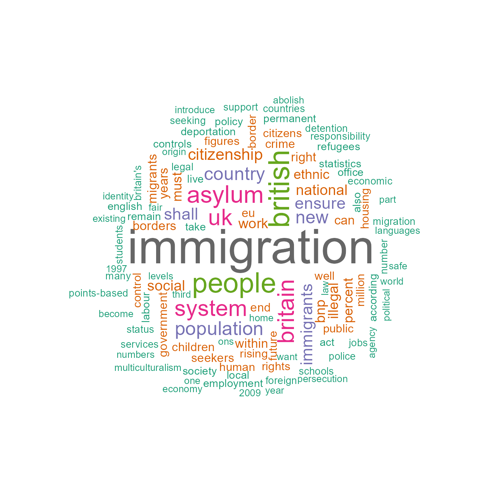

# クイック・スタートガイド

本ページは[Quick Start
Guide](https://quanteda.io/articles/quickstart.md)の日本語訳であり，英語のテキスト分析を通じて**quanteda**の基本的な使い方を説明する．日本語の分析法に関しては，以下のページを参照．

- [事例:
  衆議院外務委員会の議事録](https://quanteda.io/articles/pkgdown/examples/japanese_speech_ja.md)
- [事例:
  2017年総選挙に関するツイート](https://quanteda.io/articles/pkgdown/examples/japanese_twitter_ja.md)

## パッケージのインストール

**quanteda**は[CRAN](https://CRAN.R-project.org/package=quanteda)からインストールできる．GUIのRパッケージインストーラを使用してインストールするか，次のコマンドを実行する．

``` r

install.packages("quanteda")
```

GitHubから最新の開発バージョンをインストールする方法については，<https://github.com/quanteda/quanteda>
を参照．

### インストールが推奨されるパッケージ

**quanteda**には連携して機能を拡張する一連のパッケージがあり，それらをインストールすることが推奨される．

- [**readtext**](https://github.com/quanteda/readtext)：多くの入力形式からテキストデータをRに簡単に読み込むパッケージ

- [**spacyr**](https://github.com/kbenoit/spacyr)：Pythonの[spaCy](https://spacy.io)ライブラリを使用した自然言語解析のためのパッケージで，品詞タグ付け，固有表現抽出，および係り受け関係の解析などができる

- [**quanteda.corpora**](https://github.com/quanteda/quanteda.corpora)：**quanteda**の本記事内の説明で使用する追加のテキストデータ

  ``` r

  devtools::install_github("quanteda/quanteda.corpora")
  ```

- [**LIWCalike**](https://github.com/kbenoit/quanteda.dictionaries):
  [Linguistic Inquiry and Word Count](http://liwc.wpengine.com) (LIWC)
  アプローチによるテキスト分析のR実装

  ``` r

  devtools::install_github("kbenoit/quanteda.dictionaries")
  ```

## コーパスの作成

まず，**quanteda**を読み込んで，パッケージの関数とデータにアクセスできるようにする．

``` r

library(quanteda)
```

### 利用可能なコーパス

**quanteda**にはテキストを読み込むためのシンプルで強力なパッケージ，[**readtext**](https://github.com/kbenoit/readtext)があります．このパッケージの[`readtext()`](https://readtext.quanteda.io/reference/readtext.html)は，ローカス・ストレージやインターネットからファイル読み込み，[`corpus()`](https://quanteda.io/reference/corpus.md)にデータ・フレームを返す．

[`readtext()`](https://readtext.quanteda.io/reference/readtext.html)で利用可能なファイルやデータの形式:

- テキスト（`.txt`）ファイル
- コンマ区切り値（`.csv`）ファイル
- XML形式のデータ
- JSON形式のFacebook APIのデータ
- JSON形式のTwitter APIのデータ
- 一般的なJSONデータ

**quanteda**のコーパスを生成する関数である
[`corpus()`](https://quanteda.io/reference/corpus.md)は，以下の種類のデータを読み込むことができる．

- 文字列ベクトル（例：**readtext**以外のツールを使用して読み込んだテキスト）
- **tm**パッケージの `VCorpus`コーパスオブジェクト
- テキスト列と他の文書に対応したメタデータを含むデータ・フレーム

#### 文字列からコーパスを作成

コーパスを作成する最も簡単な方法は，[`corpus()`](https://quanteda.io/reference/corpus.md)を用いて，すでにRに読み込まれた文字列ベクトル作成することである．文字列ベクトルをRに取り込む方法はさまざまなので，高度なRユーザーは，コーパスをいろいろな方法で作り出せる．

次の例では，**quanteda**パッケージに含まれているイギリスの政党が2010年の総選挙のために発行したマニフェストのテキストデータ（`data_char_ukimmig2010`）からコーパスを作成している．

``` r

corp_uk <- corpus(data_char_ukimmig2010)  # テキストからコーパスを作成
summary(corp_uk)
## Corpus consisting of 9 documents, showing 9 documents:
## 
##          Text Types Tokens Sentences
##           BNP  1125   3280       136
##     Coalition   142    260        12
##  Conservative   251    499        21
##        Greens   322    679        30
##        Labour   298    683        33
##        LibDem   251    483        26
##            PC    77    114         5
##           SNP    88    134         4
##          UKIP   346    723        37
```

コーパスを作成したあとでも，`docvars`を用いると，必要に応じて文書に対応した変数をこのコーパスに追加することができる．

たとえば，Rの[`names()`](https://rdrr.io/r/base/names.html)関数を使って文字ベクトル（`data_char_ukimmig2010`）の名前を取得し，これを文書変数（`docvar()`）に追加することができる．

``` r

docvars(corp_uk, "Party") <- names(data_char_ukimmig2010)
docvars(corp_uk, "Year") <- 2010
summary(corp_uk)
## Corpus consisting of 9 documents, showing 9 documents:
## 
##          Text Types Tokens Sentences        Party Year
##           BNP  1125   3280       136          BNP 2010
##     Coalition   142    260        12    Coalition 2010
##  Conservative   251    499        21 Conservative 2010
##        Greens   322    679        30       Greens 2010
##        Labour   298    683        33       Labour 2010
##        LibDem   251    483        26       LibDem 2010
##            PC    77    114         5           PC 2010
##           SNP    88    134         4          SNP 2010
##          UKIP   346    723        37         UKIP 2010
```

#### readtextパッケージを用いたファイルの読み込み

``` r

require(readtext)

# Twitter json
dat_json <- readtext("~/Dropbox/QUANTESS/social media/zombies/tweets.json")
corp_twitter <- corpus(dat_json)
summary(corp_twitter, 5)
# generic json - needs a textfield specifier
dat_sotu <- readtext("~/Dropbox/QUANTESS/Manuscripts/collocations/Corpora/sotu/sotu.json",
                  textfield = "text")
summary(corpus(dat_sotu), 5)
# text file
dat_txtone <- readtext("~/Dropbox/QUANTESS/corpora/project_gutenberg/pg2701.txt", cache = FALSE)
summary(corpus(dat_txtone), 5)
# multiple text files
dat_txtmultiple1 <- readtext("~/Dropbox/QUANTESS/corpora/inaugural/*.txt", cache = FALSE)
summary(corpus(dat_txtmultiple1), 5)
# multiple text files with docvars from filenames
dat_txtmultiple2 <- readtext("~/Dropbox/QUANTESS/corpora/inaugural/*.txt",
                             docvarsfrom = "filenames", sep = "-",
                             docvarnames = c("Year", "President"))
summary(corpus(dat_txtmultiple2), 5)
# XML data
dat_xml <- readtext("~/Dropbox/QUANTESS/quanteda_working_files/xmlData/plant_catalog.xml",
                  textfield = "COMMON")
summary(corpus(dat_xml), 5)
# csv file
write.csv(data.frame(inaug_speech = texts(data_corpus_inaugural),
                     docvars(data_corpus_inaugural)),
          file = "/tmp/inaug_texts.csv", row.names = FALSE)
dat_csv <- readtext("/tmp/inaug_texts.csv", textfield = "inaug_speech")
summary(corpus(dat_csv), 5)
```

### コーパスオブジェクトの使い方

#### コーパスの原理

**quanteda**のコーパスは，元の文書をユニコード（UTF-8）に変換し，文書に対するメタデータと一緒に格納しすることで、ステミングや句読点の削除などの処理よって変更されないテキストデータの静的な保管庫になるように設計されている．これによって，コーパスから文書を抽出して新しいオブジェクトを作成した後でも，コーパスには元のデータが残り，別の分析を，同じコーパスを用いて行うことができる．

コーパスから文書を取り出すためには，[`as.character()`](https://rdrr.io/r/base/character.html)と呼ばれる関数を使用する．

``` r

as.character(data_corpus_inaugural)[2]
##                                                                                                                                                                                                                                                                                                                                                                                                                                                                                                                                                                                                                                                                                                                                                                                                              1793-Washington 
## "Fellow citizens, I am again called upon by the voice of my country to execute the functions of its Chief Magistrate. When the occasion proper for it shall arrive, I shall endeavor to express the high sense I entertain of this distinguished honor, and of the confidence which has been reposed in me by the people of united America.\n\nPrevious to the execution of any official act of the President the Constitution requires an oath of office. This oath I am now about to take, and in your presence: That if it shall be found during my administration of the Government I have in any instance violated willingly or knowingly the injunctions thereof, I may (besides incurring constitutional punishment) be subject to the upbraidings of all who are now witnesses of the present solemn ceremony.\n\n "
```

[`summary()`](https://rdrr.io/r/base/summary.html)により，コーパス内のテキストの要約を行うことができる．

``` r

data(data_corpus_irishbudget2010, package = "quanteda.textmodels")
summary(data_corpus_irishbudget2010)
## Corpus consisting of 14 documents, showing 14 documents:
## 
##                       Text Types Tokens Sentences year debate number      foren
##        Lenihan, Brian (FF)  1953   8641       404 2010 BUDGET     01      Brian
##       Bruton, Richard (FG)  1040   4446       217 2010 BUDGET     02    Richard
##         Burton, Joan (LAB)  1624   6393       309 2010 BUDGET     03       Joan
##        Morgan, Arthur (SF)  1595   7107       345 2010 BUDGET     04     Arthur
##          Cowen, Brian (FF)  1629   6599       252 2010 BUDGET     05      Brian
##           Kenny, Enda (FG)  1148   4232       155 2010 BUDGET     06       Enda
##      ODonnell, Kieran (FG)   678   2297       133 2010 BUDGET     07     Kieran
##       Gilmore, Eamon (LAB)  1181   4177       203 2010 BUDGET     08      Eamon
##     Higgins, Michael (LAB)   488   1286        44 2010 BUDGET     09    Michael
##        Quinn, Ruairi (LAB)   439   1284        60 2010 BUDGET     10     Ruairi
##      Gormley, John (Green)   401   1030        50 2010 BUDGET     11       John
##        Ryan, Eamon (Green)   510   1643        90 2010 BUDGET     12      Eamon
##      Cuffe, Ciaran (Green)   442   1240        45 2010 BUDGET     13     Ciaran
##  OCaolain, Caoimhghin (SF)  1188   4044       177 2010 BUDGET     14 Caoimhghin
##      name party
##   Lenihan    FF
##    Bruton    FG
##    Burton   LAB
##    Morgan    SF
##     Cowen    FF
##     Kenny    FG
##  ODonnell    FG
##   Gilmore   LAB
##   Higgins   LAB
##     Quinn   LAB
##   Gormley Green
##      Ryan Green
##     Cuffe Green
##  OCaolain    SF
```

[`summary()`](https://rdrr.io/r/base/summary.html)の出力をデータ・フレームとして保存し，基本的な記述統計を描画することができる．

``` r

tokeninfo <- summary(data_corpus_inaugural)
if (require(ggplot2))
    ggplot(data = tokeninfo, aes(x = Year, y = Tokens, group = 1)) +
    geom_line() +
    geom_point() +
    scale_x_continuous(labels = c(seq(1789, 2017, 12)), breaks = seq(1789, 2017, 12)) +
    theme_bw()
## Loading required package: ggplot2
```


``` r


# Longest inaugural address: William Henry Harrison
tokeninfo[which.max(tokeninfo$Tokens), ]
##             Text Types Tokens Sentences Year President     FirstName Party
## 14 1841-Harrison  1896   9125       210 1841  Harrison William Henry  Whig
```

### コーパスに対する操作

#### コーパスの結合

`+`演算子を用いると，簡単に二個のコーパスを連結できます．コーパスが異なる構造を持つ場合でも，文書変数が失われることはなく，コーパスのメタデータも引き継がれる．

``` r

corp1 <- corpus(data_corpus_inaugural[1:5])
corp2 <- corpus(data_corpus_inaugural[53:58])
corp3 <- corp1 + corp2
summary(corp3)
## Corpus consisting of 11 documents, showing 11 documents:
## 
##             Text Types Tokens Sentences Year  President FirstName
##  1789-Washington   625   1537        24 1789 Washington    George
##  1793-Washington    96    147         5 1793 Washington    George
##       1797-Adams   826   2577        37 1797      Adams      John
##   1801-Jefferson   717   1923        43 1801  Jefferson    Thomas
##   1805-Jefferson   804   2380        45 1805  Jefferson    Thomas
##     1997-Clinton   773   2436       113 1997    Clinton      Bill
##        2001-Bush   621   1806        98 2001       Bush George W.
##        2005-Bush   772   2312        99 2005       Bush George W.
##       2009-Obama   938   2689       112 2009      Obama    Barack
##       2013-Obama   814   2317        90 2013      Obama    Barack
##       2017-Trump   582   1660        89 2017      Trump Donald J.
##                  Party
##                   none
##                   none
##             Federalist
##  Democratic-Republican
##  Democratic-Republican
##             Democratic
##             Republican
##             Republican
##             Democratic
##             Democratic
##             Republican
```

#### コーパスから文書を抽出

[`corpus_subset()`](https://quanteda.io/reference/corpus_subset.md)により，文書変数に適用される論理条件に基づいて文書を抽出することができる．

``` r

summary(corpus_subset(data_corpus_inaugural, Year > 1990))
## Corpus consisting of 9 documents, showing 9 documents:
## 
##          Text Types Tokens Sentences Year President FirstName      Party
##  1993-Clinton   642   1833        82 1993   Clinton      Bill Democratic
##  1997-Clinton   773   2436       113 1997   Clinton      Bill Democratic
##     2001-Bush   621   1806        98 2001      Bush George W. Republican
##     2005-Bush   772   2312        99 2005      Bush George W. Republican
##    2009-Obama   938   2689       112 2009     Obama    Barack Democratic
##    2013-Obama   814   2317        90 2013     Obama    Barack Democratic
##    2017-Trump   582   1660        89 2017     Trump Donald J. Republican
##    2021-Biden   812   2766       229 2021     Biden Joseph R. Democratic
##    2025-Trump  1000   3347       177 2025     Trump Donald J. Republican
summary(corpus_subset(data_corpus_inaugural, President == "Adams"))
## Corpus consisting of 2 documents, showing 2 documents:
## 
##        Text Types Tokens Sentences Year President   FirstName
##  1797-Adams   826   2577        37 1797     Adams        John
##  1825-Adams  1003   3147        75 1825     Adams John Quincy
##                  Party
##             Federalist
##  Democratic-Republican
```

### コーパス内の文書の探索

[`kwic()`](https://quanteda.io/reference/kwic.md)（keywords-in-context）は単語の検索を行い，その単語が現れる文脈を表示する．

``` r

toks <- tokens(data_corpus_inaugural)
kwic(toks, pattern = "terror")
## Keyword-in-context with 8 matches.
##                                                                     
##     [1797-Adams, 1324]              fraud or violence, by | terror |
##  [1933-Roosevelt, 111] nameless, unreasoning, unjustified | terror |
##  [1941-Roosevelt, 285]      seemed frozen by a fatalistic | terror |
##    [1961-Kennedy, 850]    alter that uncertain balance of | terror |
##     [1981-Reagan, 811]     freeing all Americans from the | terror |
##   [1997-Clinton, 1047]        They fuel the fanaticism of | terror |
##   [1997-Clinton, 1647]  maintain a strong defense against | terror |
##     [2009-Obama, 1619]     advance their aims by inducing | terror |
##                                   
##  , intrigue, or venality          
##  which paralyzes needed efforts to
##  , we proved that this            
##  that stays the hand of           
##  of runaway living costs.         
##  . And they torment the           
##  and destruction. Our children    
##  and slaughtering innocents, we
```

``` r

kwic(toks, pattern = "terror", valuetype = "regex")
## Keyword-in-context with 13 matches.
##                                                                             
##     [1797-Adams, 1324]                   fraud or violence, by |  terror   |
##  [1933-Roosevelt, 111]      nameless, unreasoning, unjustified |  terror   |
##  [1941-Roosevelt, 285]           seemed frozen by a fatalistic |  terror   |
##    [1961-Kennedy, 850]         alter that uncertain balance of |  terror   |
##    [1961-Kennedy, 972]               of science instead of its |  terrors  |
##     [1981-Reagan, 811]          freeing all Americans from the |  terror   |
##    [1981-Reagan, 2187]        understood by those who practice | terrorism |
##   [1997-Clinton, 1047]             They fuel the fanaticism of |  terror   |
##   [1997-Clinton, 1647]       maintain a strong defense against |  terror   |
##     [2009-Obama, 1619]          advance their aims by inducing |  terror   |
##     [2017-Trump, 1117] civilized world against radical Islamic | terrorism |
##      [2021-Biden, 544]             , white supremacy, domestic | terrorism |
##     [2025-Trump, 1371]      designating the cartels as foreign | terrorist |
##                                   
##  , intrigue, or venality          
##  which paralyzes needed efforts to
##  , we proved that this            
##  that stays the hand of           
##  . Together let us explore        
##  of runaway living costs.         
##  and prey upon their neighbors    
##  . And they torment the           
##  and destruction. Our children    
##  and slaughtering innocents, we   
##  , which we will eradicate        
##  that we must confront and        
##  organizations. And by invoking
```

``` r

kwic(toks, pattern = "communist*")
## Keyword-in-context with 2 matches.
##                                                                   
##   [1949-Truman, 832] the actions resulting from the | Communist  |
##  [1961-Kennedy, 510]     required - not because the | Communists |
##                            
##  philosophy are a threat to
##  may be doing it,
```

上記の要約では，“Year”と”President”は各文書に結び付けられた変数であり，[`docvars()`](https://quanteda.io/reference/docvars.md)によってそれらにアクセスできる．

``` r

head(docvars(data_corpus_inaugural))
##   Year  President FirstName                 Party
## 1 1789 Washington    George                  none
## 2 1793 Washington    George                  none
## 3 1797      Adams      John            Federalist
## 4 1801  Jefferson    Thomas Democratic-Republican
## 5 1805  Jefferson    Thomas Democratic-Republican
## 6 1809    Madison     James Democratic-Republican
```

[**quanteda.corpora**](https://github.com/quanteda/quanteda.corpora)をインストールすることで，より多くのコーパスを試すことができる．

## コーパスから特長を抽出

文書のスケーリングなどの統計分析を行うためには，それぞれの文書の特長をまとめた行列を作成する必要があり，**quanteda**では，このような行列を生成するために
[`dfm()`](https://quanteda.io/reference/dfm.md)を使いる．
dfmは*document-feature
matrix*の略で，行が文書（document），列が特長（feature）となる行列である．行と列をこのように定義する理由は，データ分析では行が分析単位になり，各列が分析対象になる変数となるのが一般的だからである．多くのソフトウェアでは，この行列を*document-term
matrix*と呼ぶが，**quanteda**が語（term）でなはく特長（feature）という用語を使うのは，特長のほうが一般性を持つからで，テキスト分析では，単語，語幹，単語の集合，Nグラム，品詞など様々なものが文書の特長となる．

### 文書のトークン化

テキストを簡単にトークン化するために，**quanteda**は
[`tokens()`](https://quanteda.io/reference/tokens.md)と呼ばれる強力なコマンドを提供する．この関数は，文字ベクトルのトークンのリストからなるオブジェクトを生成する．このオブジェクトでは，リストの一つ一つの要素は入力された文書に対応している．

[`tokens()`](https://quanteda.io/reference/tokens.md)は保守的に設計されており、ユーザーが明示的に指示を与えないかぎりは，要素を削除しない．

``` r

txt <- c(text1 = "This is $10 in 999 different ways,\n up and down; left and right!",
         text2 = "@kenbenoit working: on #quanteda 2day\t4ever, http://textasdata.com?page=123.")
tokens(txt)
## Tokens consisting of 2 documents.
## text1 :
##  [1] "This"      "is"        "$"         "10"        "in"        "999"      
##  [7] "different" "ways"      ","         "up"        "and"       "down"     
## [ ... and 5 more ]
## 
## text2 :
## [1] "@kenbenoit"                      "working"                        
## [3] ":"                               "on"                             
## [5] "#quanteda"                       "2day"                           
## [7] "4ever"                           ","                              
## [9] "http://textasdata.com?page=123."
tokens(txt, remove_numbers = TRUE,  remove_punct = TRUE)
## Tokens consisting of 2 documents.
## text1 :
##  [1] "This"      "is"        "$"         "in"        "different" "ways"     
##  [7] "up"        "and"       "down"      "left"      "and"       "right"    
## 
## text2 :
## [1] "@kenbenoit"                      "working"                        
## [3] "on"                              "#quanteda"                      
## [5] "2day"                            "4ever"                          
## [7] "http://textasdata.com?page=123."
tokens(txt, remove_numbers = FALSE, remove_punct = TRUE)
## Tokens consisting of 2 documents.
## text1 :
##  [1] "This"      "is"        "$"         "10"        "in"        "999"      
##  [7] "different" "ways"      "up"        "and"       "down"      "left"     
## [ ... and 2 more ]
## 
## text2 :
## [1] "@kenbenoit"                      "working"                        
## [3] "on"                              "#quanteda"                      
## [5] "2day"                            "4ever"                          
## [7] "http://textasdata.com?page=123."
tokens(txt, remove_numbers = TRUE,  remove_punct = FALSE)
## Tokens consisting of 2 documents.
## text1 :
##  [1] "This"      "is"        "$"         "in"        "different" "ways"     
##  [7] ","         "up"        "and"       "down"      ";"         "left"     
## [ ... and 3 more ]
## 
## text2 :
## [1] "@kenbenoit"                      "working"                        
## [3] ":"                               "on"                             
## [5] "#quanteda"                       "2day"                           
## [7] "4ever"                           ","                              
## [9] "http://textasdata.com?page=123."
tokens(txt, remove_numbers = FALSE, remove_punct = FALSE)
## Tokens consisting of 2 documents.
## text1 :
##  [1] "This"      "is"        "$"         "10"        "in"        "999"      
##  [7] "different" "ways"      ","         "up"        "and"       "down"     
## [ ... and 5 more ]
## 
## text2 :
## [1] "@kenbenoit"                      "working"                        
## [3] ":"                               "on"                             
## [5] "#quanteda"                       "2day"                           
## [7] "4ever"                           ","                              
## [9] "http://textasdata.com?page=123."
tokens(txt, remove_numbers = FALSE, remove_punct = FALSE, remove_separators = FALSE)
## Tokens consisting of 2 documents.
## text1 :
##  [1] "This"      " "         "is"        " "         "$"         "10"       
##  [7] " "         "in"        " "         "999"       " "         "different"
## [ ... and 18 more ]
## 
## text2 :
##  [1] "@kenbenoit" " "          "working"    ":"          " "         
##  [6] "on"         " "          "#quanteda"  " "          "2day"      
## [11] "\t"         "4ever"     
## [ ... and 3 more ]
```

また，[`tokens()`](https://quanteda.io/reference/tokens.md)には個々の文字をトークン化するオプションもある．

``` r

tokens("Great website: http://textasdata.com?page=123.", what = "character")
## Tokens consisting of 1 document.
## text1 :
##  [1] "G" "r" "e" "a" "t" "w" "e" "b" "s" "i" "t" "e"
## [ ... and 32 more ]
tokens("Great website: http://textasdata.com?page=123.", what = "character",
         remove_separators = FALSE)
## Tokens consisting of 1 document.
## text1 :
##  [1] "G" "r" "e" "a" "t" " " "w" "e" "b" "s" "i" "t"
## [ ... and 34 more ]
```

もしくは，一文ごとにトークン化するオプションもある．

``` r

# sentence level         
tokens(c("Kurt Vongeut said; only assholes use semi-colons.",
         "Today is Thursday in Canberra:  It is yesterday in London.",
         "En el caso de que no puedas ir con ellos, ¿quieres ir con nosotros?"),
         what = "sentence")
## Tokens consisting of 3 documents.
## text1 :
## [1] "Kurt Vongeut said; only assholes use semi-colons."
## 
## text2 :
## [1] "Today is Thursday in Canberra:  It is yesterday in London."
## 
## text3 :
## [1] "En el caso de que no puedas ir con ellos, ¿quieres ir con nosotros?"
```

### 文書行列の作成

データからすぐに文書行列を作成したい場合は、[`dfm()`](https://quanteda.io/reference/dfm.md)に直接文字列ベクトルもしくはコーパスを渡すと、自動的にトークン化が行われ。[`dfm()`](https://quanteda.io/reference/dfm.md)は、デフォルトで大文字から小文字への置換や，句読点を除去などの操作を適用する．また，[`dfm()`](https://quanteda.io/reference/dfm.md)から[`tokens()`](https://quanteda.io/reference/tokens.md)の全てのオプションを利用できる．

``` r

corp_inaug_post1990 <- corpus_subset(data_corpus_inaugural, Year > 1990)

# make a dfm
dfmat_inaug_post1990 <- dfm(tokens(corp_inaug_post1990))
dfmat_inaug_post1990[, 1:5]
## Document-feature matrix of: 9 documents, 5 features (0.00% sparse) and 4
## docvars.
##               features
## docs           my fellow citizens   , today
##   1993-Clinton  7      5        2 139    10
##   1997-Clinton  6      7        7 131     5
##   2001-Bush     3      1        9 110     2
##   2005-Bush     2      3        6 120     3
##   2009-Obama    2      1        1 130     6
##   2013-Obama    3      3        6  99     4
## [ reached max_ndoc ... 3 more documents ]
```

以下の例では[`dfm()`](https://quanteda.io/reference/dfm.md)の追加のオプションを用いて、ストップワードの削除（`remove`）と語のステミング（`stem`）を行っている．

``` r

# make a dfm, removing stopwords and applying stemming
dfmat_inaug_post1990 <- tokens(corp_inaug_post1990, remove_punct = TRUE) |>
    tokens_remove(stopwords("english")) |>
    tokens_wordstem() |>
    dfm()
dfmat_inaug_post1990[, 1:5]
## Document-feature matrix of: 9 documents, 5 features (20.00% sparse) and 4
## docvars.
##               features
## docs           fellow citizen today celebr mysteri
##   1993-Clinton      5       2    10      4       1
##   1997-Clinton      7       8     6      1       0
##   2001-Bush         1      10     2      0       0
##   2005-Bush         3       7     3      2       0
##   2009-Obama        1       1     6      2       0
##   2013-Obama        3       8     6      1       0
## [ reached max_ndoc ... 3 more documents ]
```

`remove`によって，文書行列から除外するトークンを指定する．[`stopwords()`](https://rdrr.io/pkg/stopwords/man/stopwords.html)は，幾つかの言語で定義されたストップワードのリストを返す．

``` r

head(stopwords("en"), 20)
##  [1] "i"          "me"         "my"         "myself"     "we"        
##  [6] "our"        "ours"       "ourselves"  "you"        "your"      
## [11] "yours"      "yourself"   "yourselves" "he"         "him"       
## [16] "his"        "himself"    "she"        "her"        "hers"
head(stopwords("ru"), 10)
##  [1] "и"   "в"   "во"  "не"  "что" "он"  "на"  "я"   "с"   "со"
head(stopwords("ar", source = "misc"), 10)
##  [1] "فى"  "في"  "كل"  "لم"  "لن"  "له"  "من"  "هو"  "هي"  "قوة"
```

#### 文書行列の表示

RStudioの”Environment”パネル，またはRの[`View()`](https://rdrr.io/r/utils/View.html)を用いることで，dfmに格納された値を見ることができる．

``` r

dfmat_uk <- data_char_ukimmig2010 |>
    tokens(remove_punct = TRUE) |>
    tokens_remove(stopwords("english")) |>
    dfm()
dfmat_uk
## Document-feature matrix of: 9 documents, 1,547 features (83.78% sparse) and 0
## docvars.
##               features
## docs           immigration unparalleled crisis bnp can solve current birth
##   BNP                   21            1      2  13   1     2       4     4
##   Coalition              6            0      0   0   0     0       1     0
##   Conservative           3            0      0   0   2     0       0     0
##   Greens                 8            0      0   0   1     0       0     0
##   Labour                13            0      0   0   1     0       0     0
##   LibDem                 5            0      0   0   2     0       0     0
##               features
## docs           rates indigenous
##   BNP              2          5
##   Coalition        0          0
##   Conservative     0          0
##   Greens           0          0
##   Labour           0          0
##   LibDem           0          0
## [ reached max_ndoc ... 3 more documents, reached max_nfeat ... 1,537 more
## features ]
```

頻度が最も高い特長を見るには，[`topfeatures()`](https://quanteda.io/reference/topfeatures.md)を用いる．

``` r

topfeatures(dfmat_uk, 20)  # 20 most frequent words
## immigration     british      people      asylum     britain          uk 
##          66          37          35          29          28          27 
##      system  population     country         new  immigrants      ensure 
##          27          21          20          19          17          17 
##       shall citizenship      social    national         bnp     illegal 
##          17          16          14          14          13          13 
##        work     percent 
##          13          12
```

dfmを[`textplot_wordcloud()`](https://rdrr.io/pkg/quanteda.textplots/man/textplot_wordcloud.html)に渡すことで，ワードクラウドを描画できる．この関数は，オブジェクトや引数を**wordcloud**パッケージの`wordcloud()`に渡すので，ワードクラウドの表示を変更できる．

``` r

set.seed(100)
library("quanteda.textplots")
textplot_wordcloud(dfmat_uk, min_count = 6, random_order = FALSE,
                   rotation = .25,
                   color = RColorBrewer::brewer.pal(8, "Dark2"))
```



#### 変数による文書のグループ化

**quanteda**では，dfmを作成する際に，文書変数の値によって文書をグループ化するすることができる．

``` r

dfmat_ire <- tokens(data_corpus_irishbudget2010, remove_punct = TRUE) |>
    tokens_remove(stopwords("en")) |>
    tokens_group(groups = party) |>
    dfm()
```

また、以下のように，dfmを語の頻度順に並べ替えて，中身を確かめられる．

``` r

dfm_sort(dfmat_ire)[, 1:10]
## Document-feature matrix of: 5 documents, 10 features (0.00% sparse) and 3
## docvars.
##        features
## docs      € people budget government public minister tax economy pay jobs
##   FF    113     23     44         47     65       11  60      37  41   41
##   FG     55     78     71         61     47       62  11      20  29   17
##   Green  13     15     26         19      4        4  11      16   4   15
##   LAB    78     69     66         36     32       54  47      37  24   20
##   SF     77     81     53         73     31       39  34      50  24   27
```

#### 辞書による語のグループ化

キーワードがあらかじめ分かっている場合，[`dictionary()`](https://quanteda.io/reference/dictionary.md)によって辞書を作成し、語の出現回数を測定できる。次の例では，テロリズムに関連する言葉や経済に関連する言葉が，クリントン以降の大統領演説でどのように異なるかを示している．

``` r

corp_inaug_post1991 <- corpus_subset(data_corpus_inaugural, Year > 1991)
```

テロリズムと経済という2つのリストからなる辞書を作成する．

``` r

dict <- dictionary(list(terror = c("terrorism", "terrorists", "threat"),
                        economy = c("jobs", "business", "grow", "work")))
```

文書行列を作成するときに，この辞書を[`dfm()`](https://quanteda.io/reference/dfm.md)の`dictionary`に渡す．

``` r

dfmat_inaug_post1991_dict <- tokens(corp_inaug_post1991) |>
    tokens_lookup(dict) |>
    dfm()
dfmat_inaug_post1991_dict
## Document-feature matrix of: 9 documents, 2 features (16.67% sparse) and 4
## docvars.
##               features
## docs           terror economy
##   1993-Clinton      0       8
##   1997-Clinton      1       8
##   2001-Bush         0       4
##   2005-Bush         1       6
##   2009-Obama        1      10
##   2013-Obama        1       6
## [ reached max_ndoc ... 3 more documents ]
```

[`dictionary()`](https://quanteda.io/reference/dictionary.md)は，LIWCやWordstatなどの一般的な辞書ファイルを読み込むことができる．以下では，LIWCの辞書を大統領就任演説に適用している．

``` r

dictliwc <- dictionary(file = "~/Dropbox/QUANTESS/dictionaries/LIWC/LIWC2001_English.dic",
                       format = "LIWC")
dfmat_inaug_subset <- dfm(data_corpus_inaugural[52:58], dictionary = dictliwc)
dfmat_inaug_subset[, 1:10]
```

## 追加の事例

### 文書の類似性

``` r

dfmat_inaug_post1980 <- data_corpus_inaugural |>
    corpus_subset(Year > 1980) |>
    tokens(remove_punct = TRUE) |>
    tokens_remove(stopwords("english")) |>
    tokens_wordstem() |>
    dfm()

library("quanteda.textstats")
tstat_obama <- textstat_simil(dfmat_inaug_post1980,
                              dfmat_inaug_post1980[c("2009-Obama", "2013-Obama"), ],
                              margin = "documents", method = "cosine")
tstat_obama
## textstat_simil object; method = "cosine"
##              2009-Obama 2013-Obama
## 1981-Reagan       0.622      0.637
## 1985-Reagan       0.643      0.662
## 1989-Bush         0.625      0.578
## 1993-Clinton      0.628      0.626
## 1997-Clinton      0.660      0.646
## 2001-Bush         0.601      0.617
## 2005-Bush         0.526      0.587
## 2009-Obama        1.000      0.681
## 2013-Obama        0.681      1.000
## 2017-Trump        0.519      0.516
## 2021-Biden        0.661      0.645
## 2025-Trump        0.493      0.477
# dotchart(as.list(tstat_obama)$"2009-Obama", xlab = "Cosine similarity")
```

上記の文書間の類似性から樹形図を作成して，大統領を階層的に分類することができる．

``` r

library(quanteda.corpora)

dfmat_sotu <- data_corpus_sotu |>
    corpus_subset(Date > as.Date("1980-01-01")) |>
    tokens(remove_punct = TRUE) |>
    tokens_remove(stopwords("english")) |>
    tokens_wordstem() |>
    dfm()
dfmat_sotu <- dfm_trim(dfmat_sotu, min_termfreq = 5, min_docfreq = 3)

# hierarchical clustering - get distances on normalized dfm
library("quanteda.textstats")
tstat_dist <- textstat_dist(dfm_weight(dfmat_sotu, scheme = "prop"))
# hiarchical clustering the distance object
pres_cluster <- hclust(as.dist(tstat_dist))
# label with document names
pres_cluster$labels <- docnames(dfmat_sotu)
# plot as a dendrogram
plot(pres_cluster, xlab = "", sub = "",
     main = "Euclidean Distance on Normalized Token Frequency")
```


文書間と同様に用語間の類似性も測定できる．

``` r

tstat_sim <- textstat_simil(dfmat_sotu, dfmat_sotu[, c("fair", "health", "terror")],
                          method = "cosine", margin = "features")
lapply(as.list(tstat_sim), head, 10)
## $fair
##    presid    member       pay      home      ever  american   histori      done 
## 0.8496026 0.8268128 0.8188599 0.8129604 0.8123573 0.8111787 0.7919036 0.7917175 
##    restor      look 
## 0.7913313 0.7892033 
## 
## $health
##    system      issu      need    expand    privat   support      year      high 
## 0.9156172 0.9147606 0.9103041 0.9091503 0.9089850 0.9058664 0.9026099 0.8994849 
##    reform       use 
## 0.8990631 0.8988175 
## 
## $terror
## terrorist    coalit    cheney      evil  homeland     regim      11th    sudden 
## 0.8541180 0.8102976 0.8096726 0.7945611 0.7847700 0.7540888 0.7529852 0.7483657 
##   septemb   liberti 
## 0.7430524 0.7399062
```

### 文書のスケーリング

**quanteda**には多数のテキスト分析のためのモデルが含まれている．ここでは，ワードフィッシュ（[`textmodel_wordfish()`](https://rdrr.io/pkg/quanteda.textmodels/man/textmodel_wordfish.html)）による教師なしの文書のスケーリングを2010年のアイルランドの予算討論の分析に用いている．

``` r

library("quanteda.textmodels")
dfmat_ire <- dfm(tokens(data_corpus_irishbudget2010))
tmod_wf <- textmodel_wordfish(dfmat_ire, dir = c(2, 1))

# plot the Wordfish estimates by party
textplot_scale1d(tmod_wf, groups = docvars(dfmat_ire, "party"))
```


### トピックモデル

[`convert()`](https://quanteda.io/reference/convert.md)を用いると，dfmを**topicmodels**の[`LDA()`](https://rdrr.io/pkg/topicmodels/man/lda.html)形式のデータに転換し，簡単にトピックモデルを適用できる．

``` r

dfmat_ire2 <- data_corpus_irishbudget2010 |>
    tokens(remove_punct = TRUE, remove_numbers = TRUE) |>
    tokens_remove(stopwords("english")) |>
    tokens_wordstem() |>
    dfm()
dfmat_ire2 <- dfm_trim(dfmat_ire2, min_termfreq = 4, max_docfreq = 10)
dfmat_ire2
## Document-feature matrix of: 14 documents, 1,066 features (62.01% sparse) and 6
## docvars.
##                       features
## docs                   present supplementari april said period sever today
##   Lenihan, Brian (FF)        4             7     2    1      2     3    13
##   Bruton, Richard (FG)       0             0     1    0      0     0     7
##   Burton, Joan (LAB)         0             0     0    4      2     2    18
##   Morgan, Arthur (SF)        1             1     3    0      3     0     4
##   Cowen, Brian (FF)          3             0     1    0      5     4     4
##   Kenny, Enda (FG)           1             1     4    4      1     0     2
##                       features
## docs                   report difficulti month
##   Lenihan, Brian (FF)       7         10    14
##   Bruton, Richard (FG)      5          0     2
##   Burton, Joan (LAB)        4          1     7
##   Morgan, Arthur (SF)       0          1     6
##   Cowen, Brian (FF)         2          2     3
##   Kenny, Enda (FG)          2          0     2
## [ reached max_ndoc ... 8 more documents, reached max_nfeat ... 1,056 more
## features ]

set.seed(100)
if (require(topicmodels)) {
    my_lda_fit20 <- LDA(convert(dfmat_ire2, to = "topicmodels"), k = 20)
    get_terms(my_lda_fit20, 5)
}
## Loading required package: topicmodels
##      Topic 1  Topic 2    Topic 3  Topic 4  Topic 5     Topic 6   Topic 7      
## [1,] "care"   "much"     "high"   "famili" "enterpris" "bank"    "altern"     
## [2,] "welfar" "today"    "system" "fianna" "equal"     "benefit" "citizenship"
## [3,] "famili" "recoveri" "rate"   "privat" "sens"      "child"   "break"      
## [4,] "hospit" "say"      "food"   "worker" "difficult" "societi" "suggest"    
## [5,] "carer"  "share"    "welfar" "hit"    "say"       "today"   "adjust"     
##      Topic 8     Topic 9  Topic 10   Topic 11  Topic 12 Topic 13  Topic 14 
## [1,] "taoiseach" "fianna" "fail"     "societi" "welfar" "increas" "invest" 
## [2,] "bank"      "fáil"   "strategi" "creat"   "system" "pension" "support"
## [3,] "case"      "side"   "ask"      "happen"  "fáil"   "scheme"  "million"
## [4,] "fine"      "level"  "creat"    "vision"  "fianna" "million" "increas"
## [5,] "gael"      "third"  "address"  "keep"    "bank"   "reduc"   "welfar" 
##      Topic 15  Topic 16  Topic 17  Topic 18    Topic 19 Topic 20   
## [1,] "reduct"  "levi"    "fáil"    "taoiseach" "kind"   "develop"  
## [2,] "fund"    "import"  "fianna"  "refer"     "creat"  "creat"    
## [3,] "recent"  "carbon"  "support" "employe"   "tackl"  "measur"   
## [4,] "increas" "sustain" "irish"   "debat"     "imagin" "enterpris"
## [5,] "intern"  "million" "creat"   "problem"   "author" "recoveri"
```
