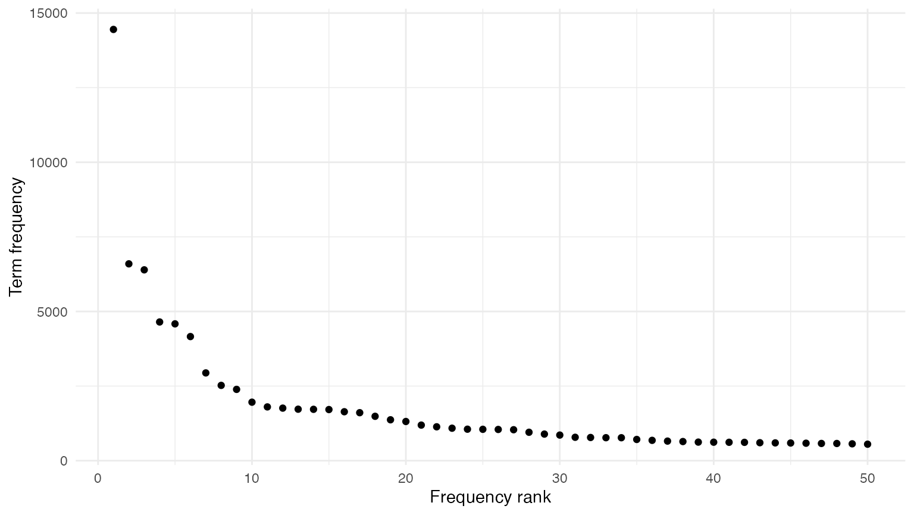
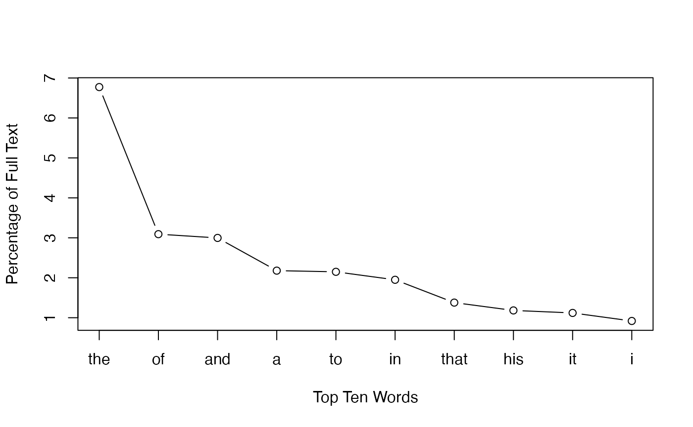
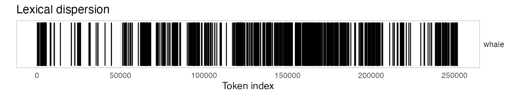
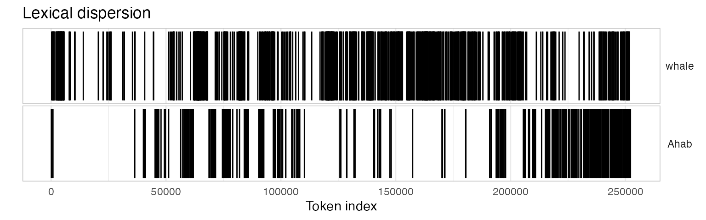
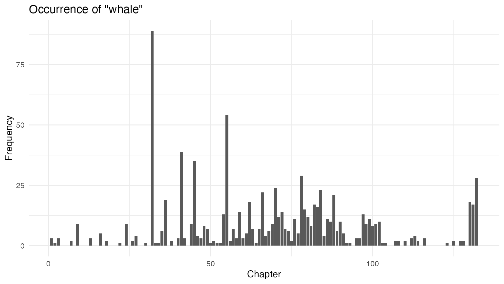
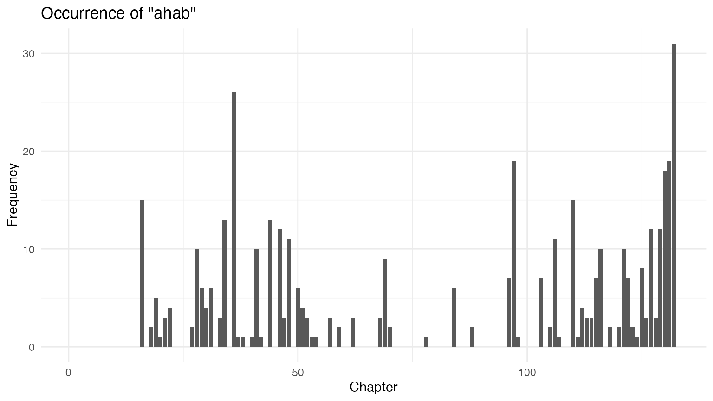
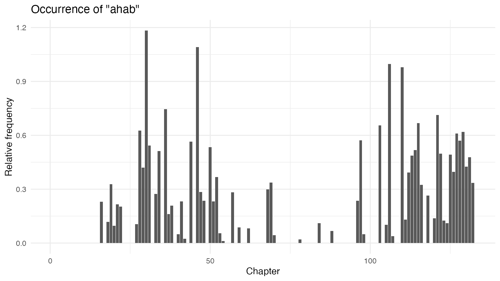
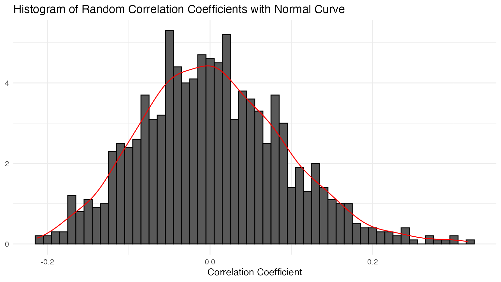
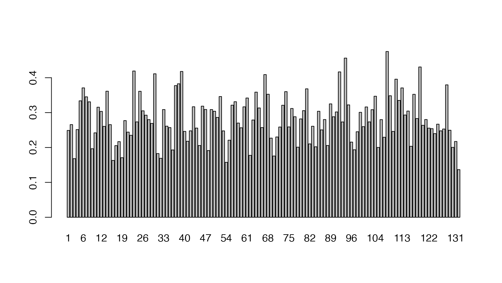
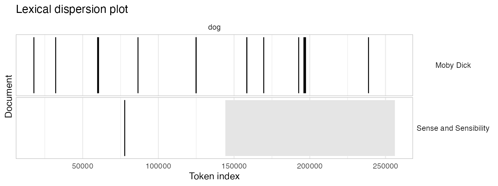

# Replication: Text Analysis with R for Students of Literature

In this vignette we show how the **quanteda** package can be used to
replicate the analysis from Matthew Jockers’ book [*Text Analysis with R
for Students of Literature*](http://doi.org/10.1007/978-3-319-03164-4)
(London: Springer, 2014). Most of the Jockers book consists of loading,
transforming, and analyzing quantities derived from text and data from
text. Because **quanteda** has built in most of the code to perform
these data transformations and analyses, it makes it possible to
replicate the results from the book with far less code. Throughout this
vignette, we name objects based on Jockers’ book, but follow the
**quanteda** [style
guide](https://github.com/quanetda/quanteda/wiki/Style-guide).

In what follows, each section corresponds to the respective chapter in
the book.

## 1 R Basics

Our closest equivalent is simply:

``` r

install.packages("quanteda")
install.packages("readtext")
```

But if you are reading this vignette, than chances are that you have
already completed this step.

## 2 First Foray

### 2.1 Loading the first text file

``` r

library("quanteda")
```

We can load the text from *Moby Dick* using the **readtext** package,
directly from the [Project Gutenberg
website](https://www.gutenberg.org/ebooks/2701).

``` r

data_char_mobydick <- as.character(readtext::readtext("http://www.gutenberg.org/cache/epub/2701/pg2701.txt"))
names(data_char_mobydick) <- "Moby Dick"
```

The `readtext()` function from the **readtext** package loads the text
files into a `data.frame` object. We can access the text from a
`data.frame` object (and also, as we will see, a `corpus` class object).
Here we will display just the first 75 characters, to prevent a massive
dump of the text of the entire novel. We do this using the
[`stri_sub()`](https://rdrr.io/pkg/stringi/man/stri_sub.html) function
from the **stringi** package, which shows the 1st through the 75th
characters of the texts of our new object `data_char_mobydick`. Because
we have not assigned the return from this command to any object, it
invokes a print method for character objects, and is displayed on the
screen.

``` r

library("stringi")
stri_sub(data_char_mobydick, 1, 75)
## [1] "The Project Gutenberg eBook of Moby Dick; Or, The Whale\n    \nThis ebook is "
```

### 2.2 Separate content from metadata

The Gutenburg edition of the text contains some metadata before and
after the text of the novel. The code below uses the `regexec` and
`substring` functions to separate this from the text.

``` r

# extract the header information
(start_v <- stri_locate_first_fixed(data_char_mobydick, "CHAPTER 1. Loomings.")[1])
## [1] 873
(end_v <- stri_locate_last_fixed(data_char_mobydick, "orphan.")[1])
## [1] 1219670
```

Here, we found the character index of the beginning and end of the
novel, rather than counting the lines as in the book, but the result
will be very similar. If we want to verify that “orphan.” is the end of
the novel, we can use the
[`kwic()`](https://quanteda.io/reference/kwic.md) function:

``` r

# verify that "orphan" is the end of the novel
kwic(tokens(data_char_mobydick), "orphan")
## Keyword-in-context with 1 match.
##                                                                      
##  [Moby Dick, 252772] children, only found another | orphan | .*** END
```

If we want to count the number of lines, we can do so by counting the
newlines in the text.

``` r

stri_count_fixed(data_char_mobydick, "\n")
## [1] 22314
```

To measure just the number lines in the novel itself, without the
metadata, we can subset the text from the start and end of the novel
part, as identified above.

``` r

stri_sub(data_char_mobydick, from = start_v, to = end_v) |>
    stri_count_fixed("\n")
## [1] 21917
```

To trim the non-book content, we use
[`stri_sub()`](https://rdrr.io/pkg/stringi/man/stri_sub.html) to extract
the text between the beginning and ending indexes found above:

``` r

novel_v <- stri_sub(data_char_mobydick, start_v, end_v)
length(novel_v)
## [1] 1
stri_sub(novel_v, 1, 94) |> cat()
## CHAPTER 1. Loomings.
## 
## CHAPTER 2. The Carpet-Bag.
## 
## CHAPTER 3. The Spouter-Inn.
## 
## CHAPTER 4. The
```

### 2.3 Reprocessing the content

We begin processing the text by converting to lower case. **quanteda**’s
`*_tolower()` functions work like the built-in
[`tolower()`](https://rdrr.io/r/base/chartr.html), with an extra option
to preserve upper-case acronyms when detected. To work with the novel
efficiently, however, we will first tokenise it. Then, we can manipulate
it using functions such as
[`tokens_tolower()`](https://quanteda.io/reference/tokens_tolower.md).

``` r

novel_v_toks <- tokens(novel_v)

# lowercase text
novel_v_toks_lower <- tokens_tolower(novel_v_toks)
```

**quanteda**’s [`tokens()`](https://quanteda.io/reference/tokens.md)
function splits the text into words, with many options available for
which characters should be preserved, and which should be used to define
word boundaries. The default behaviour works similarly to splitting on
the regular expression for non-word characters (`\W` as in the book),
but it much smarter. For instance, it does not treat apostrophes as word
boundaries, meaning that `'s` and `'t` are not treated as whole words
from possessive forms and contractions.

To remove punctuation, we can re-process the existing tokens:

``` r

moby_word_v <- tokens(novel_v_toks_lower, remove_punct = TRUE)
(total_length <- ntoken(moby_word_v))
##  text1 
## 213374
moby_word_v[["text1"]][1:10]
##  [1] "chapter"    "1"          "loomings"   "chapter"    "2"         
##  [6] "the"        "carpet-bag" "chapter"    "3"          "the"
moby_word_v[["text1"]][99986] 
## [1] "teeth"
moby_word_v[["text1"]][c(4, 5, 6)]
## [1] "chapter" "2"       "the"

# check positions of "whale"
which(moby_word_v[["text1"]] == "whale") |>
    head()
## [1] 166 275 291 333 500 566
```

### 2.4 Beginning the analysis

The code below uses the tokenized text to the occurrence of the word
*whale*. To include the possessive form *whale’s*, we may sum the counts
of both forms, count the keyword-in-context matches by regular
expression or glob. A *glob* is a simple wildcard matching pattern
common on Unix systems – asterisks match zero or more characters.

Note that the counts below do not match those in the book, due to
differences in how the book has split on any non-word character, while
**quanteda**’s tokenizer splits on a more comprehensive set of “word
boundaries”. **quanteda**’s
[`tokens()`](https://quanteda.io/reference/tokens.md) function by
default does not remove punctuation or numbers (both defined as
“non-word” characters) by default. To more closely match the counts in
the book, we have removed punctuation.

``` r

lengths(tokens_select(moby_word_v, "whale"))
## text1 
##   952

# total occurrences of "whale" including possessive
lengths(tokens_select(moby_word_v, c("whale", "whale's")))
## text1 
##   952

# same thing using kwic()
nrow(kwic(novel_v_toks_lower, pattern = "whale"))
## [1] 952
nrow(kwic(novel_v_toks_lower, pattern = "whale*")) # includes words like "whalemen"
## [1] 1676
(total_whale_hits <- nrow(kwic(novel_v_toks_lower, pattern = "^whale('s){0,1}$", valuetype = "regex")))
## [1] 952
```

What fraction of the total words (excluding punctuation) in the novel
are “whale”?

``` r

total_whale_hits / ntoken(novel_v_toks_lower, remove_punct = TRUE)  
##       text1 
## 0.004461649
```

With [`ntype()`](https://quanteda.io/reference/ntoken.md) we can
calculate the size of the vocabulary – includes possessive forms, but
excludes punctuation, symbols and numbers.

``` r

# total unique words
length(unique(moby_word_v))
## [1] 1
ntype(novel_v_toks_lower, remove_punct = TRUE)
## text1 
## 19975
```

To quickly sort the word types by their frequency, we can use the
[`dfm()`](https://quanteda.io/reference/dfm.md) command to create a
matrix of counts of each word type – a document-frequency matrix. In
this case there is only one document, the entire book.

``` r

# ten most frequent words
moby_dfm <- dfm(moby_word_v)
moby_dfm
## Document-feature matrix of: 1 document, 19,975 features (0.00% sparse) and 0
## docvars.
##        features
## docs    chapter 1 loomings 2   the carpet-bag 3 spouter-inn 4 counterpane
##   text1     308 3        2 2 14451          5 5           5 2           7
## [ reached max_nfeat ... 19,965 more features ]
```

Getting the list of the most frequent 10 terms is easy, using
[`textstat_frequency()`](https://quanteda.io/reference/textstat_frequency.html).

``` r

library("quanteda.textstats")
textstat_frequency(moby_dfm, n = 10) 
##    feature frequency rank docfreq group
## 1      the     14451    1       1   all
## 2       of      6596    2       1   all
## 3      and      6395    3       1   all
## 4        a      4648    4       1   all
## 5       to      4585    5       1   all
## 6       in      4159    6       1   all
## 7     that      2941    7       1   all
## 8      his      2523    8       1   all
## 9       it      2389    9       1   all
## 10       i      1960   10       1   all
```

Finally, if we wish to plot the most frequent (50) terms, we can supply
the results of
[`textstat_frequency()`](https://quanteda.io/reference/textstat_frequency.html)
to [`ggplot()`](https://ggplot2.tidyverse.org/reference/ggplot.html) to
plot their frequency by their rank:

``` r

# plot frequency of 50 most frequent terms 
library("ggplot2")
theme_set(theme_minimal())
textstat_frequency(moby_dfm, n = 50) |> 
  ggplot(aes(x = rank, y = frequency)) +
  geom_point() +
  labs(x = "Frequency rank", y = "Term frequency")
```



For direct comparison with the next chapter, we also create the sorted
list of the most frequently found words using this:

``` r

sorted_moby_freqs_t <- topfeatures(moby_dfm, n = nfeat(moby_dfm))
```

## 3 Accessing and Comparing Word Frequency Data

### 3.1 Accessing Word Data

We can query the document-frequency matrix to retrieve word frequencies,
as with a normal matrix:

``` r

# frequencies of "he" and "she" - these are matrixes, not numerics
sorted_moby_freqs_t[c("he", "she", "him", "her")]
##   he  she  him  her 
## 1761  116 1051  326
# another method: indexing the dfm
moby_dfm[, c("he", "she", "him", "her")]
## Document-feature matrix of: 1 document, 4 features (0.00% sparse) and 0 docvars.
##        features
## docs      he she  him her
##   text1 1761 116 1051 326
sorted_moby_freqs_t[1]
##   the 
## 14451
sorted_moby_freqs_t["the"]
##   the 
## 14451

# term frequency ratios
sorted_moby_freqs_t["him"] / sorted_moby_freqs_t["her"]
##      him 
## 3.223926
sorted_moby_freqs_t["he"] / sorted_moby_freqs_t["she"]
##       he 
## 15.18103
```

Total number of tokens:

``` r

ntoken(moby_dfm)
##  text1 
## 213374
sum(sorted_moby_freqs_t)
## [1] 213374
```

### 3.2 Recycling

Relative term frequencies:

``` r

sorted_moby_rel_freqs_t <- sorted_moby_freqs_t / sum(sorted_moby_freqs_t) * 100
sorted_moby_rel_freqs_t["the"]
##      the 
## 6.772615

# by weighting the dfm directly
moby_dfm_pct <- dfm_weight(moby_dfm, scheme = "prop") * 100

dfm_select(moby_dfm_pct, pattern = "the")
## Document-feature matrix of: 1 document, 1 feature (0.00% sparse) and 0 docvars.
##        features
## docs         the
##   text1 6.772615
```

Plotting the most frequent terms, replicating the plot from the book:

``` r

plot(sorted_moby_rel_freqs_t[1:10], type = "b",
     xlab = "Top Ten Words", ylab = "Percentage of Full Text", xaxt = "n")
axis(1,1:10, labels = names(sorted_moby_rel_freqs_t[1:10]))
```



Plotting the most frequent terms using **ggplot2**:

``` r

textstat_frequency(moby_dfm_pct, n = 10) |> 
  ggplot(aes(x = reorder(feature, -rank), y = frequency)) +
  geom_bar(stat = "identity") + coord_flip() + 
  labs(x = "", y = "Term Frequency as a Percentage")
```


## 4 Token Distribution Analysis

### 4.1 Dispersion plots

A dispersion plot allows us to visualize the occurrences of particular
terms throughout the text. The object returned by the `kwic` function
can be plotted to display a dispersion plot. The **quanteda**
`textplot_` objects are based on **ggplot2**, so you can easily change
the plot, for example by adding custom title.

``` r

# using words from tokenized corpus for dispersion
library("quanteda.textplots")
textplot_xray(kwic(novel_v_toks, pattern = "whale")) + 
    ggtitle("Lexical dispersion")
```



To produce multiple dispersion plots for comparison, you can simply send
more than one [`kwic()`](https://quanteda.io/reference/kwic.md) output
to
[`textplot_xray()`](https://rdrr.io/pkg/quanteda.textplots/man/textplot_xray.html):

``` r

textplot_xray(
    kwic(novel_v_toks, pattern = "whale"),
    kwic(novel_v_toks, pattern = "Ahab")) + 
    ggtitle("Lexical dispersion")
```



### 4.2 Searching with regular expression

``` r

# identify the chapter break locations
chap_positions_v <- kwic(novel_v_toks, phrase(c("CHAPTER \\d")), valuetype = "regex")$from
head(chap_positions_v)
## [1]  1  6 12 18 24 29
```

### 4.2 Identifying chapter breaks

Splitting the text into chapters means that we will have a collection of
documents, which makes this a good time to make a `corpus` object to
hold the texts. Initially, we make a single-document corpus, and then
use the
[`corpus_segment()`](https://quanteda.io/reference/corpus_segment.md)
function to split this by the string which specifies the chapter breaks.

Because of the header information, however, we want to discard the first
part. We can do this by segmenting the text according to the first
chapter, “CHAPTER 1. Loomings.”, which is preceded by 5 newlines.

``` r

chapters_char <- 
    data_char_mobydick |>
    char_segment(pattern = "\\n{5}CHAPTER 1\\. Loomings\\.\\n", 
                 valuetype = "regex", remove_pattern = FALSE)
sapply(chapters_char, substring, 1, 100)
##                                                                                               Moby Dick.1 
##  "The Project Gutenberg eBook of Moby Dick; Or, The Whale\n    \nThis ebook is for the use of anyone any" 
##                                                                                               Moby Dick.2 
## "CHAPTER 1. Loomings.\n\nCall me Ishmael. Some years ago—never mind how long precisely—having\nlittle or"
# remove header segment
chapters_char <- chapters_char[-1]

cat(substring(chapters_char, 1, 200))
## CHAPTER 1. Loomings.
## 
## Call me Ishmael. Some years ago—never mind how long precisely—having
## little or no money in my purse, and nothing particular to interest me
## on shore, I thought I would sail about
```

Now we can segment the text based on the chapter titles. These titles
are automatically extracted into the `pattern` document variables, and
the text of each chapter becomes the text of each new document unit. To
tidy this up, we can remove the trailing `\n` character, using
[`stri_trim_both()`](https://rdrr.io/pkg/stringi/man/stri_trim.html),
since the `\n` is a member of the “whitespace” group.

``` r

chapters_corp <- chapters_char |>
    corpus() |>
    corpus_segment(pattern = "CHAPTER\\s\\d+.*\\n\\n", valuetype = "regex")
chapters_corp$pattern <- stringi::stri_trim_both(chapters_corp$pattern)
chapters_corp <- corpus_subset(chapters_corp, chapters_corp != "")

summary(chapters_corp, 10)
## Corpus consisting of 132 documents, showing 10 documents:
## 
##            Text Types Tokens Sentences                     pattern
##   Moby Dick.2.1   919   2507       102        CHAPTER 1. Loomings.
##   Moby Dick.2.2   655   1668        60  CHAPTER 2. The Carpet-Bag.
##   Moby Dick.2.3  1777   6785       263 CHAPTER 3. The Spouter-Inn.
##   Moby Dick.2.4   686   1878        54 CHAPTER 4. The Counterpane.
##   Moby Dick.2.5   405    848        29       CHAPTER 5. Breakfast.
##   Moby Dick.2.6   467    933        44      CHAPTER 6. The Street.
##   Moby Dick.2.7   519   1072        41      CHAPTER 7. The Chapel.
##   Moby Dick.2.8   479   1070        29      CHAPTER 8. The Pulpit.
##   Moby Dick.2.9  1268   4219       168      CHAPTER 9. The Sermon.
##  Moby Dick.2.10   660   1773        66 CHAPTER 10. A Bosom Friend.
```

For better reference, let’s also rename the document labels with these
chapter headings:

``` r

docnames(chapters_corp) <- chapters_corp$pattern
```

#### 4.4.5 barplots of whale and ahab

With the corpus split into chapters, we can use the
[`dfm()`](https://quanteda.io/reference/dfm.md) function to create a
matrix of counts of each word in each chapter – a document-frequency
matrix.

``` r

# create a dfm
chap_dfm <- tokens(chapters_corp) |>
    dfm()

# extract row with count for "whale"/"ahab" in each chapter
# and convert to data frame for plotting
whales_ahabs_df <- chap_dfm |> 
    dfm_keep(pattern = c("whale", "ahab")) |> 
    convert(to = "data.frame")
    
whales_ahabs_df$chapter <- 1:nrow(whales_ahabs_df)

ggplot(data = whales_ahabs_df, aes(x = chapter, y = whale)) + 
    geom_bar(stat = "identity") +
    labs(x = "Chapter", 
         y = "Frequency",
         title = 'Occurrence of "whale"')
```



``` r


ggplot(data = whales_ahabs_df, aes(x = chapter, y = ahab)) + 
    geom_bar(stat = "identity") +
        labs(x = "Chapter", 
         y = "Frequency",
         title = 'Occurrence of "ahab"')
```



The above plots are raw frequency plots. For relative frequency plots,
(word count divided by the length of the chapter) we can weight the
document-frequency matrix. To obtain expected word frequency per 100
words, we multiply by 100. To get a feel for what the resulting weighted
dfm (document-feature matrix) looks like, you can inspect it with the
`head` function, which prints the first few rows and columns.

``` r

rel_dfm <- dfm_weight(chap_dfm, scheme = "prop") * 100
head(rel_dfm)
## Document-feature matrix of: 6 documents, 19,651 features (96.02% sparse) and 1
## docvar.
##                              features
## docs                                call        me    ishmael        .
##   CHAPTER 1. Loomings.        0.03988831 0.9573195 0.07977663 3.191065
##   CHAPTER 2. The Carpet-Bag.  0          0.3597122 0.23980815 2.697842
##   CHAPTER 3. The Spouter-Inn. 0.01473839 0.6190125 0          3.345615
##   CHAPTER 4. The Counterpane. 0          1.0117146 0          2.715655
##   CHAPTER 5. Breakfast.       0          0.1179245 0          3.066038
##   CHAPTER 6. The Street.      0          0.1071811 0          4.180064
##                              features
## docs                                some      years  ago—never       mind
##   CHAPTER 1. Loomings.        0.43877144 0.03988831 0.03988831 0.03988831
##   CHAPTER 2. The Carpet-Bag.  0.05995204 0.05995204 0          0.05995204
##   CHAPTER 3. The Spouter-Inn. 0.25055269 0.05895357 0          0.04421518
##   CHAPTER 4. The Counterpane. 0.05324814 0          0          0.05324814
##   CHAPTER 5. Breakfast.       0.23584906 0          0          0         
##   CHAPTER 6. The Street.      0.10718114 0          0          0         
##                              features
## docs                                 how       long
##   CHAPTER 1. Loomings.        0.11966494 0.07977663
##   CHAPTER 2. The Carpet-Bag.  0.05995204 0         
##   CHAPTER 3. The Spouter-Inn. 0.05895357 0.14738394
##   CHAPTER 4. The Counterpane. 0.21299255 0.10649627
##   CHAPTER 5. Breakfast.       0.23584906 0.23584906
##   CHAPTER 6. The Street.      0.21436227 0         
## [ reached max_nfeat ... 19,641 more features ]


# subset dfm and convert to data.frame object
rel_chap_freq <- rel_dfm |> 
    dfm_keep(pattern = c("whale", "ahab")) |> 
    convert(to = "data.frame")

rel_chap_freq$chapter <- 1:nrow(rel_chap_freq)
ggplot(data = rel_chap_freq, aes(x = chapter, y = whale)) + 
    geom_bar(stat = "identity") +
    labs(x = "Chapter", y = "Relative frequency",
         title = 'Occurrence of "whale"')
```


``` r


ggplot(data = rel_chap_freq, aes(x = chapter, y = ahab)) + 
    geom_bar(stat = "identity") +
    labs(x = "Chapter", y = "Relative frequency",
         title = 'Occurrence of "ahab"')
```



## 5 Correlation

### 5.2 Correlation Analysis

Correlation analysis (and many other similarity measures) can be
constructed using fast, sparse means through the
[`textstat_simil()`](https://quanteda.io/reference/textstat_simil.html)
function. Here, we select feature comparisons for just “whale” and
“ahab”, and convert this into a matrix as in the book. Because
correlations are sensitive to document length, we first convert this
into a relative frequency using
[`dfm_weight()`](https://quanteda.io/reference/dfm_weight.md).

``` r

dfm_weight(chap_dfm, scheme = "prop") |> 
    textstat_simil(y = chap_dfm[, c("whale", "ahab")], method = "correlation", margin = "features") |>
    as.matrix() |>
    head(2)
##           whale        ahab
## call  0.1003068 -0.03578342
## me   -0.1656477  0.07728298
```

With the ahab frequency and whale frequency vectors extracted from the
dfm, it is easy to calculate the significance of the correlation.

### 5.4 Testing Correlation with Randomization

``` r

cor_data_df <- dfm_weight(chap_dfm, scheme = "prop") |> 
    dfm_keep(pattern = c("ahab", "whale")) |> 
    convert(to = "data.frame")

# sample 1000 replicates and create data frame
n <- 1000
samples <- data.frame(
    cor_sample = replicate(n, cor(sample(cor_data_df$whale), cor_data_df$ahab)),
    id_sample = 1:n
)

# plot distribution of resampled correlations
ggplot(data = samples, aes(x = cor_sample, y = after_stat(density))) +
    geom_histogram(colour = "black", binwidth = 0.01) +
    geom_density(colour = "red") +
    labs(x = "Correlation Coefficient", y = NULL,
         title = "Histogram of Random Correlation Coefficients with Normal Curve")
```



## 6 Measures of Lexical Variety

### 6.2 Mean word frequency

``` r

# length of the book in chapters
ndoc(chapters_corp)
## [1] 132

# chapter names
docnames(chapters_corp) |> head()
## [1] "CHAPTER 1. Loomings."        "CHAPTER 2. The Carpet-Bag." 
## [3] "CHAPTER 3. The Spouter-Inn." "CHAPTER 4. The Counterpane."
## [5] "CHAPTER 5. Breakfast."       "CHAPTER 6. The Street."
```

Calculating the mean word frequencies is easy:

``` r

# for first few chapters
ntoken(chapters_corp) |> head()
##        CHAPTER 1. Loomings.  CHAPTER 2. The Carpet-Bag. 
##                        2507                        1668 
## CHAPTER 3. The Spouter-Inn. CHAPTER 4. The Counterpane. 
##                        6785                        1878 
##       CHAPTER 5. Breakfast.      CHAPTER 6. The Street. 
##                         848                         933

# average
(ntoken(chapters_corp) / ntype(chapters_corp)) |> head()
##        CHAPTER 1. Loomings.  CHAPTER 2. The Carpet-Bag. 
##                    2.727965                    2.546565 
## CHAPTER 3. The Spouter-Inn. CHAPTER 4. The Counterpane. 
##                    3.818233                    2.737609 
##       CHAPTER 5. Breakfast.      CHAPTER 6. The Street. 
##                    2.093827                    1.997859
```

### 6.3 Extracting Word Usage Means

Since the quotient of the number of tokens and number of types is a
vector, we can simply feed this to
[`plot()`](https://rdrr.io/r/graphics/plot.default.html) using the pipe
operator:

``` r

(ntoken(chapters_corp) / ntype(chapters_corp)) |>
    plot(type = "h", ylab = "Mean word frequency")
```


For the scaled plot:

``` r

(ntoken(chapters_corp) / ntype(chapters_corp)) |>
    scale() |>
    plot(type = "h", ylab = "Scaled mean word frequency")
```


### 6.4 Ranking the values

``` r

mean_word_use_m <- (ntoken(chapters_corp) / ntype(chapters_corp))
sort(mean_word_use_m, decreasing = TRUE) |> head()
## CHAPTER 135. The Chase.—Third Day.   CHAPTER 54. The Town-Ho’s Story. 
##                           4.110568                           4.069409 
##              CHAPTER 16. The Ship.        CHAPTER 3. The Spouter-Inn. 
##                           3.892216                           3.818233 
##              CHAPTER 32. Cetology.       CHAPTER 72. The Monkey-Rope. 
##                           3.662275                           3.585056
```

### 6.5 Calculating the TTR

Measures of lexical diversity can be estimated using
[`textstat_lexdiv()`](https://quanteda.io/reference/textstat_lexdiv.html).
The TTR (Type-Token Ratio), a measure used in section 6.5, can be
calculated for each document of the `dfm`.

``` r

tokens(chapters_corp) |>
    dfm() |>
    textstat_lexdiv(measure = "TTR") |>
    head(n = 10)
##                       document       TTR
## 1         CHAPTER 1. Loomings. 0.3893443
## 2   CHAPTER 2. The Carpet-Bag. 0.4330764
## 3  CHAPTER 3. The Spouter-Inn. 0.2900000
## 4  CHAPTER 4. The Counterpane. 0.4014599
## 5        CHAPTER 5. Breakfast. 0.5190736
## 6       CHAPTER 6. The Street. 0.5396040
## 7       CHAPTER 7. The Chapel. 0.5122732
## 8       CHAPTER 8. The Pulpit. 0.4862288
## 9       CHAPTER 9. The Sermon. 0.3350154
## 10 CHAPTER 10. A Bosom Friend. 0.4018088
```

## 7 Hapax Richness

Another measure of lexical diversity is Hapax richness, defined as the
number of words that occur only once divided by the total number of
words. We can calculate Hapax richness very simply by using a logical
operation on the document-feature matrix, to return a logical value for
each term that occurs once, and then sum these to get a count.

``` r

# hapaxes per document
rowSums(chap_dfm == 1) |> head()
##        CHAPTER 1. Loomings.  CHAPTER 2. The Carpet-Bag. 
##                         624                         443 
## CHAPTER 3. The Spouter-Inn. CHAPTER 4. The Counterpane. 
##                        1140                         472 
##       CHAPTER 5. Breakfast.      CHAPTER 6. The Street. 
##                         283                         346

# as a proportion
hapax_proportion <- rowSums(chap_dfm == 1) / ntoken(chap_dfm)
head(hapax_proportion)
##        CHAPTER 1. Loomings.  CHAPTER 2. The Carpet-Bag. 
##                   0.2489031                   0.2655875 
## CHAPTER 3. The Spouter-Inn. CHAPTER 4. The Counterpane. 
##                   0.1680177                   0.2513312 
##       CHAPTER 5. Breakfast.      CHAPTER 6. The Street. 
##                   0.3337264                   0.3708467
```

To plot this:

``` r

barplot(hapax_proportion, beside = TRUE, col = "grey", names.arg = seq_len(ndoc(chap_dfm)))
```



## 8 Do it KWIC

For this, and the next chapter, we simply use **quanteda**’s excellent
[`kwic()`](https://quanteda.io/reference/kwic.md) function. To find the
indexes of the token positions for “gutenberg”, for instance, we use the
following, which returns a data.frame with the name `from` indicating
the index position of the start of the token match:

``` r

data_tokens_mobydick <- tokens(data_char_mobydick)
gutenberg_kwic <- kwic(data_tokens_mobydick, pattern = "gutenberg")
head(gutenberg_kwic$from, 10)
##  [1]      3     60    142 252781 252879 252887 252894 252930 252977 253024
```

## 9 Do it KWIC (Better)

This is going to be super easy since we don’t need to reinvent the wheel
here, since [`kwic()`](https://quanteda.io/reference/kwic.md) already
does all that we need.

Let’s create a corpus containing *Moby Dick* but also Jane Austen’s
*Sense and Sensibility*.

``` r

data_char_senseandsensibility <- as.character(readtext::readtext("http://www.gutenberg.org/files/161/161-0.txt"))
names(data_char_senseandsensibility) <- "Sense and Sensibility"

litcorpus <- corpus(c(data_char_mobydick, data_char_senseandsensibility))
```

Now we can use [`kwic()`](https://quanteda.io/reference/kwic.md) to find
out where in each novel this occurred:

``` r

(dogkwic <- kwic(tokens(litcorpus), pattern = "dog"))
## Keyword-in-context with 17 matches.
##                                                                        
##              [Moby Dick, 17804]    all over like a Newfoundland | dog |
##              [Moby Dick, 32180]        was seen swimming like a | dog |
##              [Moby Dick, 59875]                   last. — Down, | dog |
##              [Moby Dick, 59976]          not tamely be called a | dog |
##              [Moby Dick, 60485]             didn’t he call me a | dog |
##              [Moby Dick, 86548]   sacrifice of the sacred White | Dog |
##             [Moby Dick, 124868]            life that lives in a | dog |
##             [Moby Dick, 124964]   the sagacious kindness of the | dog |
##             [Moby Dick, 158387] “ The ungracious and ungrateful | dog |
##             [Moby Dick, 158427]           Give way, greyhounds! | Dog |
##             [Moby Dick, 169591]             to the whale that a | dog |
##             [Moby Dick, 192660]     Aries, or the Ram—lecherous | dog |
##             [Moby Dick, 196112]                 . ( Bunger, you | dog |
##             [Moby Dick, 196573]              die in pickle, you | dog |
##             [Moby Dick, 197193]                Ahab, and like a | dog |
##             [Moby Dick, 238784]       air as a sagacious ship’s | dog |
##  [Sense and Sensibility, 77779]        fellow! such a deceitful | dog |
##                            
##  just from the water,      
##  , throwing his long arms  
##  , and kennel! ”           
##  , sir. ” “                
##  ? blazes! he called       
##  was by far the holiest    
##  or a horse. Indeed        
##  ? The accursed shark alone
##  ! ” cried Starbuck;       
##  to it! ” “                
##  does to the elephant;     
##  , he begets us;           
##  , laugh out! why          
##  ; you should be preserved 
##  , strangely snuffing; “   
##  will, in drawing nigh     
##  ! It was only the
```

We can plot this easily too, as a lexical dispersion plot. By specifying
the scale as “absolute”, we are looking at absolute token index position
rather than relative position, and therefore we see that *Moby Dick* is
nearly twice as long as *Sense and Sensibility*.

``` r

textplot_xray(dogkwic, scale = "absolute")
```



## 10 Text Quality, Text Variety, and Parsing XML

## 11 Clustering

Chapter 11 describes how to detect clusters in a corpus. While the book
uses the `XMLAuthorCorpus`, we describe clustering using U.S. State of
the Union addresses included in the **quanteda.corpora** package. We
trim the corpus with
[`dfm_trim()`](https://quanteda.io/reference/dfm_trim.md) by keeping
only those words that occur at least five times in the corpus and in at
least three speeches.

``` r

library(quanteda.corpora)
pres_dfm <- tokens(corpus_subset(data_corpus_sotu, Date > "1980-01-01"), remove_punct = TRUE) |>
  tokens_wordstem("en") |>
  tokens_remove(stopwords("en")) |>
  dfm() |>
  dfm_trim(min_termfreq = 5, min_docfreq = 3)

# hierarchical clustering - get distances on normalized dfm
pres_dist_mat <- dfm_weight(pres_dfm, scheme = "prop") |>
    textstat_dist(method = "euclidean") |> 
    as.dist()

# hiarchical clustering the distance object
pres_cluster <- hclust(pres_dist_mat)

# label with document names
pres_cluster$labels <- docnames(pres_dfm)

# plot as a dendrogram
plot(pres_cluster, xlab = "", sub = "", 
     main = "Euclidean Distance on Normalized Token Frequency")
```


## 12 Classification

## 13 Topic Modelling

Finally, Jockers’ book introduces topic modelling of a corpus and the
visualisation through wordclouds. We can easily apply functions from the
**topicmodels** package by using **quanteda**’s
[`convert()`](https://quanteda.io/reference/convert.md) function. In our
example, we use the Irish budget speeches from 2010
(`data_corpus_irishbudget2010`) and classify 20 topics using Latent
Dirichlet Allocation.

``` r

data(data_corpus_irishbudget2010, package = "quanteda.textmodels")
dfm_speeches <- tokens(data_corpus_irishbudget2010, remove_punct = TRUE, remove_numbers = TRUE) |>
  tokens_remove(stopwords("en")) |> 
  dfm() |>
  dfm_trim(min_termfreq = 4, max_docfreq = 10)

library(topicmodels)
LDA_fit_20 <- convert(dfm_speeches, to = "topicmodels") |> 
    LDA(k = 20)

# get top five terms per topic
get_terms(LDA_fit_20, 5)
##      Topic 1     Topic 2    Topic 3  Topic 4       Topic 5 Topic 6    Topic 7  
## [1,] "failed"    "welfare"  "fianna" "irish"       "face"  "today"    "levy"   
## [2,] "strategy"  "care"     "fáil"   "employment"  "bank"  "measures" "million"
## [3,] "needed"    "families" "side"   "welfare"     "much"  "benefit"  "carbon" 
## [4,] "ministers" "workers"  "level"  "sustainable" "just"  "child"    "change" 
## [5,] "system"    "hit"      "third"  "creating"    "debt"  "taxes"    "welfare"
##      Topic 8       Topic 9      Topic 10   Topic 11  Topic 12   Topic 13    
## [1,] "alternative" "measures"   "fianna"   "child"   "hospital" "million"   
## [2,] "citizenship" "spending"   "fáil"     "benefit" "fianna"   "support"   
## [3,] "wealth"      "changes"    "national" "day"     "modest"   "investment"
## [4,] "adjustment"  "welfare"    "irish"    "society" "benefit"  "back"      
## [5,] "breaks"      "investment" "support"  "fianna"  "family"   "welfare"   
##      Topic 14    Topic 15    Topic 16       Topic 17   Topic 18    Topic 19   
## [1,] "taoiseach" "review"    "society"      "measures" "taoiseach" "allowance"
## [2,] "fine"      "million"   "enterprising" "welfare"  "employees" "per"      
## [3,] "gael"      "reduction" "create"       "million"  "rate"      "care"     
## [4,] "may"       "scheme"    "kind"         "reduce"   "referred"  "hit"      
## [5,] "irish"     "reduced"   "sense"        "create"   "debate"    "million"  
##      Topic 20  
## [1,] "system"  
## [2,] "taxation"
## [3,] "fianna"  
## [4,] "fáil"    
## [5,] "stimulus"
```
