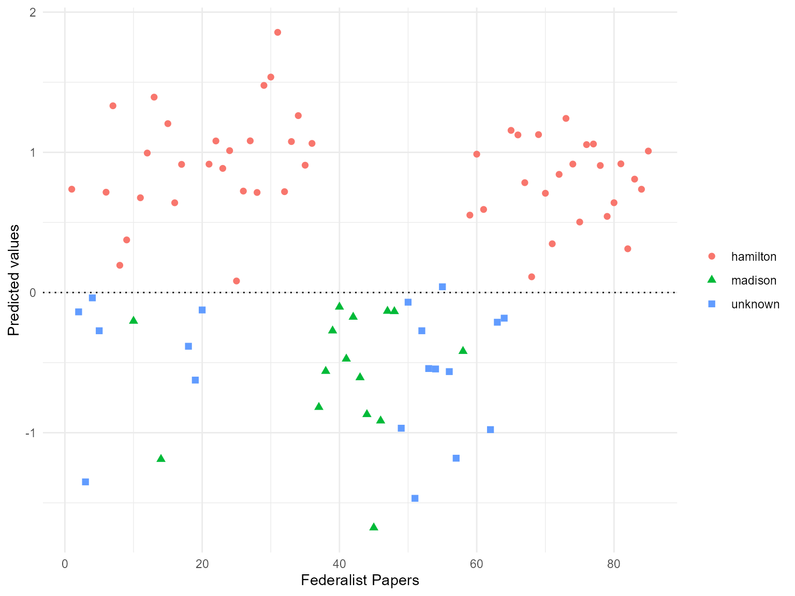

# Replication of Chapter 5 of \_Quantitative Social Science: An Introduction\_

In this vignette we show how the **quanteda** package can be used to
replicate the text analysis part (Chapter 5.1) from Kosuke Imai’s book
[*Quantitative Social Science: An
Introduction*](http://qss.princeton.press) (Princeton: Princeton
University Press, 2017).

``` r

library("quanteda")
```

## Download the Corpus

To get the textual data, you need to install and load the **qss**
package first that comes with the book.

``` r

remotes::install_github("kosukeimai/qss-package", build_vignettes = TRUE)
```

## Section 5.1.1: The Disputed Authorship of ‘The Federalist Papers’

First, we use the **readtext** package to import the Federalist Papers
as a data frame and create a **quanteda** corpus.

``` r

# use readtext package to import all documents as a dataframe
corpus_texts <- readtext::readtext(system.file("extdata/federalist/", package = "qss"))

# create docvar with number of paper
corpus_texts$paper_number <- paste("No.", seq_len(nrow(corpus_texts)), sep = " ")

# transform to a quanteda corpus object
corpus_raw <- corpus(corpus_texts, text_field = "text", docid_field = "paper_number")

# create docvar with authorship (used in Section  5.1.4)
docvars(corpus_raw, "paper_numeric") <- seq_len(ndoc(corpus_raw))

# create docvar with authorship (used in Section  5.1.4)
docvars(corpus_raw, "author") <- factor(NA, levels = c("madison", "hamilton"))
docvars(corpus_raw, "author")[c(1, 6:9, 11:13, 15:17, 21:36, 59:61, 65:85)] <- "hamilton"
docvars(corpus_raw, "author")[c(10, 14, 37:48, 58)] <- "madison"
```

``` r

# inspect Paper No. 10 (output suppressed)
corpus_raw[10] |> 
    stringi::stri_sub(1, 240) |> 
    cat()
## AMONG the numerous advantages promised by a well-constructed Union, none 
##         deserves to be more accurately developed than its tendency to break and 
##         control the violence of faction. The friend of popular governments never 
## 
```

## Section 5.1.2: Document-Term Matrix

Next, we transform the corpus to a document-feature matrix. `dfm_prep`
(used in sections 5.1.4 and 5.1.5) is a dfm in which numbers and
punctuation have been removed, and in which terms have been converted to
lowercase. In `dfm_papers`, the words have also been stemmed and a
standard set of stopwords removed.

``` r

# transform corpus to a document-feature matrix
dfm_prep <- tokens(corpus_raw, remove_numbers = TRUE, remove_punct = TRUE) |>
  dfm(tolower = TRUE)

# remove stop words and stem words
dfm_papers <- dfm_prep |>
  dfm_remove(stopwords("en")) |>
  dfm_wordstem("en")

# inspect
dfm_papers
## Document-feature matrix of: 85 documents, 4,860 features (89.11% sparse) and 3
## docvars.
##        features
## docs    unequivoc experi ineffici subsist feder govern call upon deliber new
##   No. 1         1      1        1       1     1      9    1    6       3   5
##   No. 2         0      3        0       0     2      9    1    1       1   2
##   No. 3         0      1        0       0     2     20    0    0       0   1
##   No. 4         0      2        0       0     0     21    1    0       0   0
##   No. 5         0      1        0       0     0      3    0    0       0   0
##   No. 6         0      3        0       0     0      4    0    4       0   1
## [ reached max_ndoc ... 79 more documents, reached max_nfeat ... 4,850 more
## features ]

# sort into alphabetical order of features, to match book example
dfm_papers <- dfm_papers[, order(featnames(dfm_papers))]

# inspect some documents in the dfm
head(dfm_papers, nf = 8)
## Warning: nf argument is not used.
## Document-feature matrix of: 6 documents, 4,860 features (90.51% sparse) and 3
## docvars.
##        features
## docs    ` 1st 2d 3d 4th 5th abandon abat abb abet
##   No. 1 0   0  0  0   0   0       0    0   0    0
##   No. 2 0   0  0  0   0   0       0    0   0    0
##   No. 3 0   0  0  0   0   0       0    0   0    0
##   No. 4 0   0  0  0   0   0       0    0   0    0
##   No. 5 0   1  0  0   0   0       0    0   0    0
##   No. 6 0   0  0  0   0   0       0    0   0    0
## [ reached max_nfeat ... 4,850 more features ]
```

The **tm** package considers features such as “1st” to be numbers,
whereas **quanteda** does not. We can remove these easily using a
wildcard removal:

``` r

dfm_papers <- dfm_remove(dfm_papers, "[0-9]", valuetype = "regex", verbose = TRUE)
## dfm_remove() changed from 4,860 features (85 documents) to 4,855 features (85 documents)
head(dfm_papers, nf = 8)
## Warning: nf argument is not used.
## Document-feature matrix of: 6 documents, 4,855 features (90.50% sparse) and 3
## docvars.
##        features
## docs    ` abandon abat abb abet abhorr abil abject abl ablest
##   No. 1 0       0    0   0    0      0    0      0   1      0
##   No. 2 0       0    0   0    0      0    1      0   0      0
##   No. 3 0       0    0   0    0      0    0      0   2      0
##   No. 4 0       0    0   0    0      0    0      0   1      1
##   No. 5 0       0    0   0    0      0    0      0   0      0
##   No. 6 0       0    0   0    0      0    0      0   0      0
## [ reached max_nfeat ... 4,845 more features ]
```

## Section 5.1.3: Topic Discovery

We can use the
[`textplot_wordcloud()`](https://rdrr.io/pkg/quanteda.textplots/man/textplot_wordcloud.html)
function to plot word clouds of the most frequent words in Papers 12 and
24.

``` r

set.seed(100)
library("quanteda.textplots")
textplot_wordcloud(dfm_papers[c("No. 12", "No. 24"), ], 
                   max.words = 50, comparison = TRUE)
```


Since **quanteda** cannot do stem completion, we will skip that part.

Next, we identify clusters of similar essay based on term
frequency-inverse document frequency (*tf-idf*) and apply the
$`k`$-means algorithm to the weighted dfm.

``` r

# tf-idf calculation
dfm_papers_tfidf <- dfm_tfidf(dfm_papers, base = 2)

# 10 most important words for Paper No. 12
topfeatures(dfm_papers_tfidf[12, ], n = 10)
##     revenu contraband     patrol      excis      coast      trade        per 
##   19.42088   19.22817   19.22817   19.12214   16.22817   15.01500   14.47329 
##        tax       cent     gallon 
##   13.20080   12.81878   12.81878

# 10 most important words for Paper No. 24
topfeatures(dfm_papers_tfidf[24, ], n = 10)
##   garrison  dock-yard settlement      spain       armi   frontier    arsenal 
##  24.524777  19.228173  16.228173  13.637564  12.770999  12.262389  10.818782 
##    western       post     nearer 
##  10.806108  10.228173   9.648857
```

We can match the clustering as follows:

``` r

k <- 4  # number of clusters

# subset The Federalist papers written by Hamilton

dfm_papers_tfidf_hamilton <- dfm_subset(dfm_papers_tfidf, author == "hamilton")

# run k-means
km_out <- stats::kmeans(dfm_papers_tfidf_hamilton, centers = k)

km_out$iter # check the convergence; number of iterations may vary
## [1] 2

colnames(km_out$centers) <- featnames(dfm_papers_tfidf_hamilton)

for (i in 1:k) { # loop for each cluster
  cat("CLUSTER", i, "\n")
  cat("Top 10 words:\n") # 10 most important terms at the centroid
  print(head(sort(km_out$centers[i, ], decreasing = TRUE), n = 10))
  cat("\n")
  cat("Federalist Papers classified: \n") # extract essays classified
  print(docnames(dfm_papers_tfidf_hamilton)[km_out$cluster == i])
  cat("\n")
}
## CLUSTER 1 
## Top 10 words:
##     armi  militia   revenu militari      war    trade    taxat     upon 
## 6.271473 5.204072 4.634529 4.413837 4.349851 4.222969 4.065847 4.049374 
##     land      tax 
## 4.007387 3.889522 
## 
## Federalist Papers classified: 
##  [1] "No. 6"  "No. 7"  "No. 8"  "No. 11" "No. 12" "No. 15" "No. 21" "No. 22"
##  [9] "No. 24" "No. 25" "No. 26" "No. 29" "No. 30" "No. 34" "No. 35" "No. 36"
## 
## CLUSTER 2 
## Top 10 words:
##       juri      trial      court     crimin  admiralti     equiti   chanceri 
##  218.20102   84.74567   62.47940   42.06871   40.87463   38.24428   37.86574 
## common-law     probat      civil 
##   27.04695   27.04695   26.77843 
## 
## Federalist Papers classified: 
## [1] "No. 83"
## 
## CLUSTER 3 
## Top 10 words:
##     court     appel jurisdict    suprem      juri    tribun    cogniz  inferior 
##  69.68857  35.27513  25.46591  24.79126  22.16104  21.27125  19.12214  18.76875 
##    appeal re-examin 
##  16.21098  13.52348 
## 
## Federalist Papers classified: 
## [1] "No. 81" "No. 82"
## 
## CLUSTER 4 
## Top 10 words:
##    senat   presid    claus     upon    court governor    offic  appoint 
## 5.459987 4.228173 3.530536 3.456783 3.254136 3.134332 3.071945 2.823580 
##  impeach    nomin 
## 2.737110 2.658907 
## 
## Federalist Papers classified: 
##  [1] "No. 1"  "No. 9"  "No. 13" "No. 16" "No. 17" "No. 23" "No. 27" "No. 28"
##  [9] "No. 31" "No. 32" "No. 33" "No. 59" "No. 60" "No. 61" "No. 65" "No. 66"
## [17] "No. 67" "No. 68" "No. 69" "No. 70" "No. 71" "No. 72" "No. 73" "No. 74"
## [25] "No. 75" "No. 76" "No. 77" "No. 78" "No. 79" "No. 80" "No. 84" "No. 85"
```

## Section 5.1.4: Authorship Prediction

In a next step, we want to predict authorship for the Federalist Papers
whose authorship is unknown. As the topics of the Papers differs
remarkably, Imai focuses on 10 articles, prepositions and conjunctions
to predict authorship.

``` r

# term frequency per 1000 words
tfm <- dfm_weight(dfm_prep, "prop") * 1000

# select words of interest
words <- c("although", "always", "commonly", "consequently",
           "considerable", "enough", "there", "upon", "while", "whilst")
tfm <- dfm_select(tfm, words, valuetype = "fixed")

# average among Hamilton/Madison essays
tfm_ave <- dfm_group(dfm_subset(tfm, !is.na(author)), groups = author) /
  as.numeric(table(docvars(tfm, "author")))

# bind docvars from corpus and tfm to a data frame
author_data <- data.frame(docvars(corpus_raw), convert(tfm, to = "data.frame"))

# create numeric variable that takes value 1 for Hamilton's essays,
# -1 for Madison's essays and NA for the essays with unknown authorship
author_data$author_numeric <- ifelse(author_data$author == "hamilton", 1, 
                                     ifelse(author_data$author == "madison", -1, NA))

# use only known authors for training set
author_data_known <- na.omit(author_data)

hm_fit <- lm(author_numeric ~ upon + there + consequently + whilst,
             data = author_data_known)
hm_fit
## 
## Call:
## lm(formula = author_numeric ~ upon + there + consequently + whilst, 
##     data = author_data_known)
## 
## Coefficients:
##  (Intercept)          upon         there  consequently        whilst  
##      -0.2728        0.2240        0.1278       -0.5597       -0.8379

hm_fitted <- fitted(hm_fit) # fitted values
sd(hm_fitted)
## [1] 0.7175463
```

## Section 5.1.5: Cross-Validation

Finally, we assess how well the model fits the data by classifying each
essay based on its fitted value.

``` r

# proportion of correctly classified essays by Hamilton
mean(hm_fitted[author_data_known$author == "hamilton"] > 0)
## [1] 1

# proportion of correctly classified essays by Madison
mean(hm_fitted[author_data_known$author == "madison"] < 0)
## [1] 1

n <- nrow(author_data_known)
hm_classify <- rep(NA, n) # a container vector with missing values

for (i in 1:n) {
  # fit the model to the data after removing the ith observation
  sub_fit <- lm(author_numeric ~ upon + there + consequently + whilst,
                data = author_data_known[-i, ]) # exclude ith row
  # predict the authorship for the ith observation
  hm_classify[i] <- predict(sub_fit, newdata = author_data_known[i, ])
}

# proportion of correctly classified essays by Hamilton
mean(hm_classify[author_data_known$author == "hamilton"] > 0)
## [1] 1

# proportion of correctly classified essays by Madison
mean(hm_classify[author_data_known$author == "madison"] < 0)
## [1] 1

disputed <- c(49, 50:57, 62, 63) # 11 essays with disputed authorship
tf_disputed <- dfm_subset(tfm, is.na(author)) |> 
    convert(to = "data.frame")

author_data$prediction <- predict(hm_fit, newdata = author_data)

author_data$prediction # predicted values
##  [1]  0.73688561 -0.13805744 -1.35078839 -0.03818220 -0.27281185  0.71544514
##  [7]  1.33186598  0.19419487  0.37522873 -0.20366262  0.67591728  0.99485942
## [13]  1.39358870 -1.18910700  1.20454811  0.64005758  0.91397681 -0.38337508
## [19] -0.62468302 -0.12449276  0.91560123  1.08105705  0.88535667  1.01199958
## [25]  0.08231865  0.72345360  1.08185398  0.71361766  1.47727897  1.53681013
## [31]  1.85581851  0.71928207  1.07671057  1.26171629  0.90807385  1.06348441
## [37] -0.81827318 -0.56125155 -0.27281185 -0.10304108 -0.47339830 -0.17488801
## [43] -0.60651986 -0.86943120 -1.67771035 -0.91485858 -0.13263458 -0.13495322
## [49] -0.96785069 -0.06902493 -1.46794406 -0.27281185 -0.54226168 -0.54530152
## [55]  0.04087236 -0.56414912 -1.18176926 -0.41900312  0.55206970  0.98683635
## [61]  0.59244239 -0.97797908 -0.21198475 -0.18292385  1.15647955  1.12410607
## [67]  0.78355251  0.11202677  1.12627538  0.70796660  0.34757045  0.84264937
## [73]  1.24189733  0.91619843  0.50283000  1.05488104  1.05933797  0.90593132
## [79]  0.54299626  0.64042173  0.91780877  0.31194485  0.80874960  0.73655199
## [85]  1.00901860
```

Finally, we plot the fitted values for each Federalist paper with the
**ggplot2** package.

``` r

author_data$author_plot <- ifelse(is.na(author_data$author), "unknown", as.character(author_data$author))

library(ggplot2)
ggplot(data = author_data, aes(x = paper_numeric, 
                               y = prediction, 
                               shape = author_plot, 
                               colour = author_plot)) +
    geom_point(size = 2) +
    geom_hline(yintercept = 0, linetype = "dotted") + 
    labs(x = "Federalist Papers", y = "Predicted values") +
    theme_minimal() + 
    theme(legend.title=element_blank())
```


