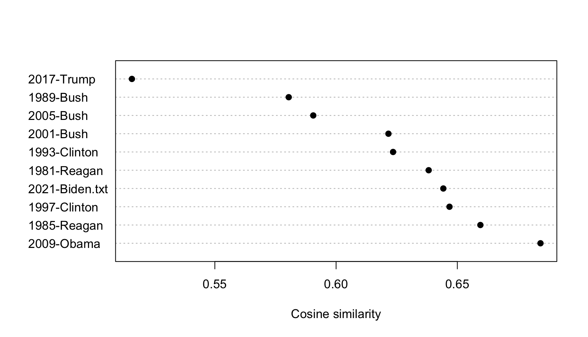
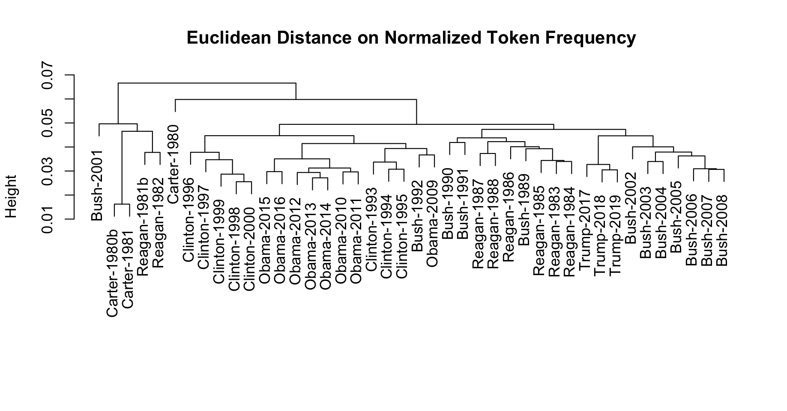

```{r, echo = FALSE}
knitr::opts_chunk$set(collapse = FALSE,
                      comment = "##")

```

```{r}
library("quanteda")
```

# Plotting a wordcloud

Plotting a word cloud can be done using the **quanteda.textplots** package, for any `dfm` class object.

```{r}
dfmat_uk <- tokens(data_char_ukimmig2010, remove_punct = TRUE) |>
  tokens_remove(stopwords("en")) |>
  dfm()

# 20 most frequent words
topfeatures(dfmat_uk, 50)
```

```{r fig.width = 7, fig.height = 7}
set.seed(100)
library("quanteda.textplots")
textplot_wordcloud(dfmat_uk, min_count = 6, random_order = FALSE,
                   rotation = .25, max_words = 50,
                   color = RColorBrewer::brewer.pal(8, "Dark2"))
```


# Further examples

## Similarities between texts

```{r fig.width = 6, fig.height = 3, eval = FALSE}
library("quanteda.textstats")
dfmat_inaug_post1980 <- corpus_subset(data_corpus_inaugural, Year > 1980) |>
  tokens(remove_punct = TRUE) |>
  tokens_wordstem(language = "en") |>
  tokens_remove(stopwords("en")) |>
  dfm()
tstat_obama <- textstat_simil(dfmat_inaug_post1980,
                              dfmat_inaug_post1980[c("2009-Obama", "2013-Obama"), ],
                              margin = "documents", method = "cosine")
as.list(tstat_obama)
dotchart(as.list(tstat_obama)$"2013-Obama", xlab = "Cosine similarity", pch = 19)
```



We can use these distances to plot a dendrogram, clustering presidents.  
First, load some data.
```{r, eval = FALSE}
data_corpus_sotu <- readRDS(url("https://quanteda.org/data/data_corpus_sotu.rds"))
dfmat_sotu <- corpus_subset(data_corpus_sotu, Date > as.Date("1980-01-01")) |>
  tokens(remove_punct = TRUE) |>
  tokens_wordstem(language = "en") |>
  tokens_remove(stopwords("en")) |>
  dfm()
dfmat_sotu <- dfm_trim(dfmat_sotu, min_termfreq = 5, min_docfreq = 3)
```

```{r echo = FALSE}
load("../../tests/data/dfmat_sotu.rda")
```

Now we compute clusters and plot the dendrogram:
```{r, fig.width = 8, fig.height = 5, eval = FALSE}
# hierarchical clustering - get distances on normalized dfm
tstat_dist <- dfmat_sotu |>
    dfm_weight(scheme = "prop") |>
    textstat_dist()
# hiarchical clustering the distance object
pres_cluster <- hclust(as.dist(tstat_dist))
# label with document names
pres_cluster$labels <- docnames(dfmat_sotu)
# plot as a dendrogram
plot(pres_cluster, xlab = "", sub = "",
     main = "Euclidean Distance on Normalized Token Frequency")
```



We can also look at term similarities:
```{r, eval = FALSE}
tstat_sim <- textstat_simil(dfmat_sotu, dfmat_sotu[, c("fair", "health", "terror")],
                          method = "cosine", margin = "features")
lapply(as.list(tstat_sim), head, 10)
```
```
## $fair
##      time    better       far  strategi        us     lower      long       one   practic      onli 
## 0.8266617 0.8135324 0.8036487 0.8002557 0.8000581 0.7995066 0.7977770 0.7949795 0.7944127 0.7899963 
## 
## $health
##    system      issu    privat      need    expand    reform   support      hous    dramat      mani 
## 0.9232094 0.9229859 0.9175231 0.9145142 0.9118901 0.9072380 0.9072374 0.9063870 0.9051588 0.9045851 
## 
## $terror
## terrorist    coalit    cheney      evil  homeland   liberti      11th    sudden     regim   septemb 
## 0.8539894 0.8179609 0.8175618 0.7949619 0.7878223 0.7697739 0.7603221 0.7556575 0.7533021 0.7502925 
```

## Scaling document positions

Here is a demonstration of unsupervised document scaling comparing the "Wordfish" model: 
```{r fig.width = 7, fig.height = 5}
if (require("quanteda.textmodels") && require("quanteda.textplots")) {
  dfmat_ire <- tokens(data_corpus_irishbudget2010) |> 
      dfm()
  tmod_wf <- textmodel_wordfish(dfmat_ire, dir = c(2, 1))
  
  # plot the Wordfish estimates by party
  textplot_scale1d(tmod_wf, groups = docvars(dfmat_ire, "party"))
}
```

## Topic models

**quanteda** makes it very easy to fit topic models as well, e.g.:

```{r}
if (require("quanteda.textmodels")) {
    quant_dfm <- tokens(data_corpus_irishbudget2010, remove_punct = TRUE, remove_numbers = TRUE) |>
        tokens_remove(stopwords("en")) |>
        dfm()
    quant_dfm <- dfm_trim(quant_dfm, min_termfreq = 4, max_docfreq = 10)
    quant_dfm 
}
```

Now we can fit the topic model and plot it:
```{r fig.width = 7, fig.height = 5}
if (require("stm") && require("quanteda.textmodels")) {
    set.seed(100)
    my_lda_fit20 <- stm(quant_dfm, K = 20, verbose = FALSE)
    plot(my_lda_fit20)    
}
```
