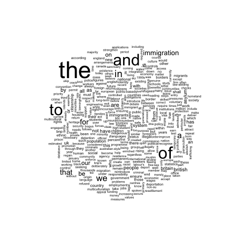
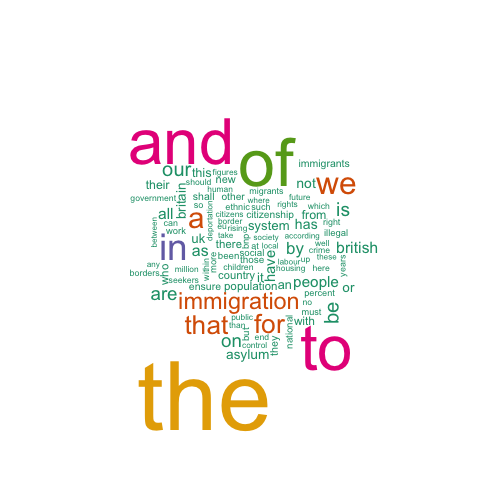

<!--
%\VignetteEngine{knitr::knitr}
%\VignetteIndexEntry{Quickstart}
-->


# Introduction

An R package for managing and analyzing text, by Ken Benoit and Paul Nulty.[^thanks]

[^thanks]: This research was supported by the European
    Research Council grant ERC-2011-StG 283794-QUANTESS.  Code
    contributors to the project include Ben Lauderdale, Pablo Barberà, and 
    Kohei Watanabe.

**quanteda** makes it easy to manage texts in the form of a
corpus, defined as a collection of texts that includes document-level
variables specific to each text, as well as meta-data for documents
and for the collection as a whole.  **quanteda** includes tools to make it
easy and fast to manuipulate the texts in a corpus, by performing the most common
natural language processing tasks simply and quickly, such as tokenizing,
stemming, or forming ngrams.  **quanteda**'s functions for tokenizing texts
and forming multiple tokenized documents into a *document-feature matrix* are
both extremely fast and extremely simple to use.  **quanteda** can segment texts
easily by words, paragraphs, sentences, or even user-supplied delimiters and tags.

Built on the text processing
functions in the **stringi** package,
which is in turn built on C++ implementation of the [ICU](http://www.icu-project.org/)
libraries for Unicode text handling, **quanteda** pays special attention to fast and correct
implementation of Unicode and the handling of text in any character set, following conversion
internally to UTF-8.

**quanteda** is built for efficiency and speed, through its design around three infrastructures: the **string** package for text processing, the **data.table** package for indexing large documents efficiently, and the **Matrix** package for sparse matrix objects.  If you can fit it into memory, **quanteda** will handle it quickly.  (And eventually, we will make it possible to process objects even larger than available memory.)

**quanteda** is principally designed to allow users a fast and convenient method to go from 
a corpus of texts to a selected matrix of documents by features, after defining what 
the documents and features.  The package makes it easy to redefine documents, for instance by splitting them into sentences or paragraphs, or by tags, as well as to group them into larger documents by document variables, or to subset them based on logical conditions or combinations of document variables.  The package also implements common NLP feature selection functions, such as removing stopwords and stemming in numerous languages, selecting words found in dictionaries, treating words as equivalent based on a user-defined "thesaurus", and trimming and weighting features based on document frequency, feature frequency, and related measures such as *tf-idf*.
 
# quanteda Features

## Corpus management tools

The tools for getting texts into a corpus object include: 

* loading texts from directories of individual files
* loading texts ``manually'' by inserting them into a corpus using
  helper functions
*  managing text encodings and conversions from source files into
  corpus texts
* attaching variables to each text that can be used for grouping,
  reorganizing a corpus, or simply recording additional information to
  supplement quantitative analyses with non-textual data
* recording meta-data about the sources and creation details for
  the corpus.
  
The tools for working with a corpus include:

* summarizing the corpus in terms of its language units
* reshaping the corpus into smaller units or more aggregated units
* adding to or extracting subsets of a corpus
* resampling texts of the corpus, for example for use in
  non-parametric bootstrapping of the texts
* Easy extraction and saving, as a new data frame or corpus, key
    words in context (KWIC)

## Natural-Language Processing tools

For extracting features from a corpus, `quanteda` provides the following tools:

* extraction of word types
* extraction of word n-grams
* extraction of dictionary entries from user-defined dictionaries
* feature selection through
    - stemming
    - random selection
    - document frequency
    - word frequency
* and a variety of options for cleaning word types, such as
    capitalization and rules for handling punctuation.

## Document-Feature Matrix analysis tools

For analyzing the resulting *document-feature* matrix created
when features are abstracted from a corpus, `quanteda` provides:

* scaling methods, such as correspondence analysis, Wordfish, and Wordscores
* topic models, such as LDA
* classifiers, such as Naive Bayes or k-nearest neighbour
* sentiment analysis, using dictionaries

## Additional and planned features

**Additional features** of quanteda include:

*  the ability to explore texts using *key-words-in-context*;

*  fast computation of a variety of readability indexes;

*  fast computation of a variety of lexical diversity measures;

*  quick computation of word or document association measures, for clustering or to compute similarity scores for other purposes; and

*  a comprehensive suite of descriptive statistics on text such as the number of sentences, words, characters, or syllables per document.

**Planned features** coming soon to **quanteda** are:

*  bootstrapping methods for texts that makes it easy to resample texts
   from pre-defined units, to facilitate computation of confidence
   intervals on textual statistics using techniques of non-parametric
   bootstrapping, but applied to the original texts as data. 
   
*  expansion of the document-feature matrix structure through a standard interface called `textmodel()`.  (As of version 0.8.0, textmodel works in a basic fashion only for the "Wordscores" and "wordfish" scaling models.)


## Working with other text analysis packages

`quanteda` is hardly unique in providing facilities for working with
text -- the excellent *tm* package already provides many of the
features we have described.  `quanteda` is designed to complement those
packages, as well to simplify the implementation of the
text-to-analysis workflow.  `quanteda` corpus structures are simpler
objects than in *tm*s, as are the document-feature matrix
objects from `quanteda`, compared to the sparse matrix implementation
found in *tm*.  However, there is no need to choose only one
package, since we provide translator functions from one matrix or
corpus object to the other in `quanteda`.

Once constructed, a **quanteda** "dfm"" can be easily passed to other text-analysis packages for 
additional analysis of topic models or scaling, such as:

*  topic models (including converters for direct use with the **topicmodels**, **LDA**, and **stm** packages)

*  document scaling (using **quanteda**'s own functions for the "wordfish" and "Wordscores" models, direct use with the **ca** package for correspondence analysis, or scaling with the **austin** package)

*  document classification methods, using (for example) Naive Bayes, k-nearest neighbour, or Support Vector Machines

*  more sophisticated machine learning through a variety of other packages that take matrix or matrix-like inputs.

*  graphical analysis, including word clouds and strip plots for selected themes or words.


# How to Install

As of version 0.8.0, the GitHub master repository will always contain the development version of quanteda, while the CRAN version will contain the latest "stable" version.  You therefore have two options for installing the package:

1.  From CRAN, using your R package installer, or simply

    
    ```r
    install.packages("quanteda")
    ```

2.  (For the development version) From GitHub, using

    
    ```r
    devtools::install_github("kbenoit/quanteda")
    ```

    Because this compiles some C++ source code, you will need a compiler installed.  If you are using a Windows platform, this means you will need also to install the [Rtools](http://cran.r-project.org/bin/windows/Rtools/) software available from CRAN.  If you are using OS X, you will probably need to install XCode, available for free from the App Store.

3.  (Optional) You can install some additional corpus data from **quantedaData** using

    
    ```r
    ## devtools required to install quanteda from Github
    devtools::install_github("kbenoit/quantedaData")
    ```


# Creating and Working with a Corpus


```r
require(quanteda)
```


## Currently available corpus sources

quanteda has a simple and powerful tool for loading texts: `textfile()`.  This function takes a file or fileset from disk or a URL, and loads it as a special class of pre-corpus object, known as a `corpusSource` object, from which a corpus can be constructed using a second command, `corpus()`.

`textfile()` works on:

* text (`.txt`) files;
* comma-separated-value (`.csv`) files;
* XML formatted data;
* data from the Facebook API, in JSON format;
* data from the Twitter API, in JSON format; and
* generic JSON data.

The corpus constructor command `corpus()` works directly on:

* a vector of character objects, for instance that you have already loaded into the workspace using other tools;
* a `corpusSource` object created using `textfile()`; and
* a `VCorpus` corpus object from the **tm** package.

### Example: building a corpus from a character vector

The simplest case is to create a corpus from a vector of texts already in memory in R.  This gives the advanced R user complete flexbility with his or her choice of text inputs, as there are almost endless
ways to get a vector of texts into R.

If we already have the texts in this form, we can call the corpus constructor function directly.  We can demonstrate this on the built-in character vector of 57 US president inaugural speeches called `inaugTexts`.


```r
str(inaugTexts)  # this gives us some information about the object
#>  Named chr [1:57] "Fellow-Citizens of the Senate and of the House of Representatives:\n\nAmong the vicissitudes incident to life no event could ha"| __truncated__ ...
#>  - attr(*, "names")= chr [1:57] "1789-Washington" "1793-Washington" "1797-Adams" "1801-Jefferson" ...
myCorpus <- corpus(inaugTexts)  # build the corpus
summary(myCorpus, n=5)
#> Corpus consisting of 57 documents, showing 5 documents.
#> 
#>             Text Types Tokens Sentences
#>  1789-Washington   595   1430        24
#>  1793-Washington    90    135         4
#>       1797-Adams   794   2318        37
#>   1801-Jefferson   681   1726        42
#>   1805-Jefferson   776   2166        45
#> 
#> Source:  /Users/kbenoit/Dropbox/quantess/quanteda_kenlocal_gh/vignettes/* on x86_64 by kbenoit
#> Created: Thu Sep 24 16:48:13 2015
#> Notes:
```

If we wanted, we could add some document-level variables -- what quanteda calls `docvars` -- to this corpus.

We can do this using the R's `substring()` function to extract characters from a name -- in this case, the 
name of the character vector `inaugTexts`.  This works using our fixed starting and ending positions with
`substring()` because these names are a very regular format of `YYYY-PresidentName`.

```r
docvars(myCorpus, "President") <- substring(names(inaugTexts), 6)
docvars(myCorpus, "Year") <- as.integer(substring(names(inaugTexts), 1, 4))
summary(myCorpus, n=5)
#> Corpus consisting of 57 documents, showing 5 documents.
#> 
#>             Text Types Tokens Sentences  President Year
#>  1789-Washington   595   1430        24 Washington 1789
#>  1793-Washington    90    135         4 Washington 1793
#>       1797-Adams   794   2318        37      Adams 1797
#>   1801-Jefferson   681   1726        42  Jefferson 1801
#>   1805-Jefferson   776   2166        45  Jefferson 1805
#> 
#> Source:  /Users/kbenoit/Dropbox/quantess/quanteda_kenlocal_gh/vignettes/* on x86_64 by kbenoit
#> Created: Thu Sep 24 16:48:13 2015
#> Notes:
```

If we wanted to tag each document with additional meta-data not considered a document variable of interest for analysis, but rather something that we need to know as an attribute of the document, we could also 
add those to our corpus.

```r
metadoc(myCorpus, "language") <- "english"
metadoc(myCorpus, "docsource")  <- paste("inaugTexts", 1:ndoc(myCorpus), sep="_")
summary(myCorpus, n=5, showmeta=TRUE)
#> Corpus consisting of 57 documents, showing 5 documents.
#> 
#>             Text Types Tokens Sentences  President Year _language
#>  1789-Washington   595   1430        24 Washington 1789   english
#>  1793-Washington    90    135         4 Washington 1793   english
#>       1797-Adams   794   2318        37      Adams 1797   english
#>   1801-Jefferson   681   1726        42  Jefferson 1801   english
#>   1805-Jefferson   776   2166        45  Jefferson 1805   english
#>    _docsource
#>  inaugTexts_1
#>  inaugTexts_2
#>  inaugTexts_3
#>  inaugTexts_4
#>  inaugTexts_5
#> 
#> Source:  /Users/kbenoit/Dropbox/quantess/quanteda_kenlocal_gh/vignettes/* on x86_64 by kbenoit
#> Created: Thu Sep 24 16:48:13 2015
#> Notes:
```

The last command, `metadoc`, allows you to define your own document meta-data fields.  Note that in assiging just the single value of `"english"`, R has recycled the value until it matches the number of documents in the corpus.  In creating
a simple tag for our custom metadoc field `docsource`, we used the quanteda function `ndoc()` to retrieve
the number of documents in our corpus.  This function is deliberately designed to work in a way similar to 
functions you may already use in R, such as `nrow()` and `ncol()`.

### Example: loading in files using `textfile()`


```r
# Twitter json
mytf1 <- textfile("~/Dropbox/QUANTESS/social media/zombies/tweets.json")
myCorpusTwitter <- corpus(mytf1)
summary(myCorpusTwitter, 5)
# generic json - needs a textField specifier
mytf2 <- textfile("~/Dropbox/QUANTESS/Manuscripts/collocations/Corpora/sotu/sotu.json",
                  textField = "text")
summary(corpus(mytf2), 5)
# text file
mytf3 <- textfile("~/Dropbox/QUANTESS/corpora/project_gutenberg/pg2701.txt", cache = FALSE)
summary(corpus(mytf3), 5)
# multiple text files
mytf4 <- textfile("~/Dropbox/QUANTESS/corpora/inaugural/*.txt", cache = FALSE)
summary(corpus(mytf4), 5)
# multiple text files with docvars from filenames
mytf5 <- textfile("~/Dropbox/QUANTESS/corpora/inaugural/*.txt", 
                  docvarsfrom="filenames", sep="-", docvarnames=c("Year", "President"))
summary(corpus(mytf5), 5)
# XML data
mytf6 <- textfile("~/Dropbox/QUANTESS/quanteda_working_files/xmlData/plant_catalog.xml", 
                  textField = "COMMON")
summary(corpus(mytf6), 5)
# csv file
write.csv(data.frame(inaugSpeech = texts(inaugCorpus), docvars(inaugCorpus)), 
          file = "/tmp/inaugTexts.csv", row.names = FALSE)
mytf7 <- textfile("/tmp/inaugTexts.csv", textField = "inaugSpeech")
summary(corpus(mytf7), 5)
```

### Creating a corpus from a Twitter search

`quanteda` provides an interface to retrieve and store data from a twitter search as a corpus object. The REST API query uses the [twitteR package](https://github.com/geoffjentry/twitteR), and an API authorization from twitter is required. The process of obtaining this authorization is described in detail here: <https://openhatch.org/wiki/Community_Data_Science_Workshops/Twitter_authentication_setup>, correct as of October 2014. The twitter API is a commercial service, and rate limits and the data returned are determined by twitter.

Four keys are required, to be passed to `quanteda`'s `getTweets` source function, in addition to the search query term and the number of results required. The maximum number of results that can be obtained is not exactly identified in the API documentation, but experimentation indicates an upper bound of around 1500 results from a single query, with a frequency limit of one query per minute.

The code below performs authentication and runs a search for the string 'quantitative'. Many other functions for working with the API are available from the [twitteR package](https://github.com/geoffjentry/twitteR). An R interface to the streaming API is also available [link](link).


```r
# These keys are examples and may not work! Get your own key at dev.twitter.com
consumer_key="vRLy03ef6OFAZB7oCL4jA"
consumer_secret="wWF35Lr1raBrPerVHSDyRftv8qB1H7ltV0T3Srb3s"
access_token="1577780816-wVbOZEED8KZs70PwJ2q5ld2w9CcvcZ2kC6gPnAo"
token_secret="IeC6iYlgUK9csWiP524Jb4UNM8RtQmHyetLi9NZrkJA"


tw <- getTweets('quantitative', numResults=20, consumer_key, consumer_secret, access_token, token_secret)
```

The return value from the above query is a source object which can be passed to quanteda's corpus constructor, and the document variables are set to correspond with tweet metadata returned by the API.


```r
twCorpus <- corpus(tw)
names(docvars(twCorpus))
```


## How a quanteda corpus works

### Corpus principles

A corpus is designed to be a "library" of original documents that have been converted to plain, UTF-8 encoded text, and stored along with meta-data at the corpus level and at the document-level.  We have a special name for document-level meta-data: *docvars*.  These are variables or features that describe attributes of each document.

A corpus is designed to be a more or less static container of texts with respect to processing and analysis.  This means that the texts in corpus are not designed to be changed internally through (for example) cleaning or pre-processing steps, such as stemming or removing punctuation.  Rather, texts can be extracted from the corpus as part of processing, and assigned to new objects, but the idea is that the corpus will remain as an original reference copy so that other analyses -- for instance those in which stems and punctuation were required, such as analyzing a reading ease index -- can be performed on the same corpus.

To extract texts from a a corpus, we use an extractor, called `texts()`.  


```r
texts(inaugCorpus)[2]
#>                                                                                                                                                                                                                                                                                                                                                                                                                                                                                                                                                                                                                                                                                                                                                                                                              1793-Washington 
#> "Fellow citizens, I am again called upon by the voice of my country to execute the functions of its Chief Magistrate. When the occasion proper for it shall arrive, I shall endeavor to express the high sense I entertain of this distinguished honor, and of the confidence which has been reposed in me by the people of united America.\n\nPrevious to the execution of any official act of the President the Constitution requires an oath of office. This oath I am now about to take, and in your presence: That if it shall be found during my administration of the Government I have in any instance violated willingly or knowingly the injunctions thereof, I may (besides incurring constitutional punishment) be subject to the upbraidings of all who are now witnesses of the present solemn ceremony.\n\n "
```

To summarize the texts from a corpus, we can call a `summary()` method defined for a corpus.


```r
summary(ie2010Corpus)
#> Corpus consisting of 14 documents.
#> 
#>                                   Text Types Tokens Sentences year debate
#>        2010_BUDGET_01_Brian_Lenihan_FF  1754   7916       404 2010 BUDGET
#>       2010_BUDGET_02_Richard_Bruton_FG   995   4086       217 2010 BUDGET
#>         2010_BUDGET_03_Joan_Burton_LAB  1521   5790       309 2010 BUDGET
#>        2010_BUDGET_04_Arthur_Morgan_SF  1499   6510       345 2010 BUDGET
#>          2010_BUDGET_05_Brian_Cowen_FF  1544   5964       252 2010 BUDGET
#>           2010_BUDGET_06_Enda_Kenny_FG  1087   3896       155 2010 BUDGET
#>      2010_BUDGET_07_Kieran_ODonnell_FG   638   2086       133 2010 BUDGET
#>       2010_BUDGET_08_Eamon_Gilmore_LAB  1123   3807       202 2010 BUDGET
#>     2010_BUDGET_09_Michael_Higgins_LAB   457   1149        44 2010 BUDGET
#>        2010_BUDGET_10_Ruairi_Quinn_LAB   415   1181        60 2010 BUDGET
#>      2010_BUDGET_11_John_Gormley_Green   381    939        50 2010 BUDGET
#>        2010_BUDGET_12_Eamon_Ryan_Green   486   1519        90 2010 BUDGET
#>      2010_BUDGET_13_Ciaran_Cuffe_Green   426   1144        45 2010 BUDGET
#>  2010_BUDGET_14_Caoimhghin_OCaolain_SF  1110   3699       177 2010 BUDGET
#>  number      foren     name party
#>      01      Brian  Lenihan    FF
#>      02    Richard   Bruton    FG
#>      03       Joan   Burton   LAB
#>      04     Arthur   Morgan    SF
#>      05      Brian    Cowen    FF
#>      06       Enda    Kenny    FG
#>      07     Kieran ODonnell    FG
#>      08      Eamon  Gilmore   LAB
#>      09    Michael  Higgins   LAB
#>      10     Ruairi    Quinn   LAB
#>      11       John  Gormley Green
#>      12      Eamon     Ryan Green
#>      13     Ciaran    Cuffe Green
#>      14 Caoimhghin OCaolain    SF
#> 
#> Source:  /home/paul/Dropbox/code/quantedaData/* on x86_64 by paul
#> Created: Tue Sep 16 15:58:21 2014
#> Notes:
```

We can save the output from the summary command as a data frame, and plot some basic descriptive statistics with this information:


```r
tokenInfo <- summary(inaugCorpus)
#> Corpus consisting of 57 documents.
#> 
#>             Text Types Tokens Sentences Year  President
#>  1789-Washington   595   1430        24 1789 Washington
#>  1793-Washington    90    135         4 1793 Washington
#>       1797-Adams   794   2318        37 1797      Adams
#>   1801-Jefferson   681   1726        42 1801  Jefferson
#>   1805-Jefferson   776   2166        45 1805  Jefferson
#>     1809-Madison   520   1175        21 1809    Madison
#>     1813-Madison   518   1210        33 1813    Madison
#>      1817-Monroe   980   3370       121 1817     Monroe
#>      1821-Monroe  1200   4470       131 1821     Monroe
#>       1825-Adams   962   2915        74 1825      Adams
#>     1829-Jackson   500   1128        25 1829    Jackson
#>     1833-Jackson   474   1176        30 1833    Jackson
#>    1837-VanBuren  1252   3839        95 1837   VanBuren
#>    1841-Harrison  1806   8446       210 1841   Harrison
#>        1845-Polk  1262   4803       153 1845       Polk
#>      1849-Taylor   480   1088        22 1849     Taylor
#>      1853-Pierce  1115   3333       104 1853     Pierce
#>    1857-Buchanan   892   2824        89 1857   Buchanan
#>     1861-Lincoln  1011   3634       138 1861    Lincoln
#>     1865-Lincoln   336    699        27 1865    Lincoln
#>       1869-Grant   464   1127        41 1869      Grant
#>       1873-Grant   522   1338        44 1873      Grant
#>       1877-Hayes   803   2484        59 1877      Hayes
#>    1881-Garfield   973   2975       112 1881   Garfield
#>   1885-Cleveland   645   1683        44 1885  Cleveland
#>    1889-Harrison  1300   4386       157 1889   Harrison
#>   1893-Cleveland   797   2014        58 1893  Cleveland
#>    1897-McKinley  1187   3965       130 1897   McKinley
#>    1901-McKinley   815   2212       100 1901   McKinley
#>   1905-Roosevelt   384    984        33 1905  Roosevelt
#>        1909-Taft  1376   5429       159 1909       Taft
#>      1913-Wilson   627   1699        68 1913     Wilson
#>      1917-Wilson   524   1529        60 1917     Wilson
#>     1921-Harding  1120   3327       149 1921    Harding
#>    1925-Coolidge  1160   4056       197 1925   Coolidge
#>      1929-Hoover   997   3558       171 1929     Hoover
#>   1933-Roosevelt   708   1880        85 1933  Roosevelt
#>   1937-Roosevelt   683   1808        96 1937  Roosevelt
#>   1941-Roosevelt   495   1341        68 1941  Roosevelt
#>   1945-Roosevelt   259    557        26 1945  Roosevelt
#>      1949-Truman   742   2272       116 1949     Truman
#>  1953-Eisenhower   857   2454       123 1953 Eisenhower
#>  1957-Eisenhower   586   1659        93 1957 Eisenhower
#>     1961-Kennedy   535   1366        52 1961    Kennedy
#>     1965-Johnson   528   1489        98 1965    Johnson
#>       1969-Nixon   708   2124       106 1969      Nixon
#>       1973-Nixon   508   1802        69 1973      Nixon
#>      1977-Carter   493   1224        53 1977     Carter
#>      1981-Reagan   844   2433       128 1981     Reagan
#>      1985-Reagan   866   2564       125 1985     Reagan
#>        1989-Bush   749   2317       143 1989       Bush
#>     1993-Clinton   600   1598        81 1993    Clinton
#>     1997-Clinton   719   2157       112 1997    Clinton
#>        2001-Bush   585   1584        97 2001       Bush
#>        2005-Bush   725   2071       101 2005       Bush
#>       2009-Obama   893   2390       112 2009      Obama
#>       2013-Obama   781   2097        90 2013      Obama
#> 
#> Source:  /home/paul/Dropbox/code/quanteda/* on x86_64 by paul
#> Created: Fri Sep 12 12:41:17 2014
#> Notes:
if (require(ggplot2))
    ggplot(data=tokenInfo, aes(x=Year, y=Tokens, group=1)) + geom_line() + geom_point() +
        scale_x_discrete(labels=c(seq(1789,2012,12)), breaks=seq(1789,2012,12) ) 
#> Loading required package: ggplot2
```

 

```r

# Longest inaugural address: William Henry Harrison
tokenInfo[which.max(tokenInfo$Tokens),] 
#>                        Text Types Tokens Sentences Year President
#> 1841-Harrison 1841-Harrison  1806   8446       210 1841  Harrison
```


## Tools for handling corpus objects

### Adding two corpus objects together

The `+` operator provides a simple method for concatenating two corpus objects.  If they contain
different sets of document-level variables, these will be stitched together in a fashion that guarantees
that no information is lost.  Corpus-level medata data is also concatenated.


```r
library(quanteda)
mycorpus1 <- corpus(inaugTexts[1:5], note="First five inaug speeches.")
mycorpus2 <- corpus(inaugTexts[53:57], note="Last five inaug speeches.")
mycorpus3 <- mycorpus1 + mycorpus2
summary(mycorpus3)
#> Corpus consisting of 10 documents.
#> 
#>             Text Types Tokens Sentences
#>  1789-Washington   595   1430        24
#>  1793-Washington    90    135         4
#>       1797-Adams   794   2318        37
#>   1801-Jefferson   681   1726        42
#>   1805-Jefferson   776   2166        45
#>     1997-Clinton   719   2157       112
#>        2001-Bush   585   1584        97
#>        2005-Bush   725   2071       101
#>       2009-Obama   893   2390       112
#>       2013-Obama   781   2097        90
#> 
#> Source:  Combination of corpuses mycorpus1 and mycorpus2
#> Created: Thu Sep 24 16:48:14 2015
#> Notes:   First five inaug speeches. Last five inaug speeches.
```

### subsetting corpus objects

There is a method of the `subset()` function defined for corpus objects, where a new corpus can 
be extracted based on logical conditions applied to docvars:


```r
summary(subset(inaugCorpus, Year > 1990))
#> Corpus consisting of 6 documents.
#> 
#>          Text Types Tokens Sentences Year President
#>  1993-Clinton   600   1598        81 1993   Clinton
#>  1997-Clinton   719   2157       112 1997   Clinton
#>     2001-Bush   585   1584        97 2001      Bush
#>     2005-Bush   725   2071       101 2005      Bush
#>    2009-Obama   893   2390       112 2009     Obama
#>    2013-Obama   781   2097        90 2013     Obama
#> 
#> Source:  /home/paul/Dropbox/code/quanteda/* on x86_64 by paul
#> Created: Fri Sep 12 12:41:17 2014
#> Notes:
summary(subset(inaugCorpus, President == "Adams"))
#> Corpus consisting of 2 documents.
#> 
#>        Text Types Tokens Sentences Year President
#>  1797-Adams   794   2318        37 1797     Adams
#>  1825-Adams   962   2915        74 1825     Adams
#> 
#> Source:  /home/paul/Dropbox/code/quanteda/* on x86_64 by paul
#> Created: Fri Sep 12 12:41:17 2014
#> Notes:
```


## Exploring corpus texts

The `kwic` function (KeyWord In Context) performs a search for a word and allows us to view the contexts in which it occurs:


```r
options(width = 200)
kwic(inaugCorpus, "terror")
#>                                                            preword      word                              postword
#>    [1797-Adams, 1183]                     by fraud or violence, by   terror, intrigue, or venality, the Government
#> [1933-Roosevelt, 100] itself -- nameless, unreasoning, unjustified    terror which paralyzes needed efforts to    
#> [1941-Roosevelt, 252]                seemed frozen by a fatalistic   terror, we proved that this is               
#>   [1961-Kennedy, 763]              alter that uncertain balance of   terror  that stays the hand of               
#>   [1961-Kennedy, 872]                    of science instead of its  terrors. Together let us explore the          
#>    [1981-Reagan, 691]               freeing all Americans from the  terror   of runaway living costs. All         
#>   [1981-Reagan, 1891]             understood by those who practice terrorism and prey upon their neighbors.\n\nI  
#>   [1997-Clinton, 929]                  They fuel the fanaticism of   terror. And they torment the lives           
#>  [1997-Clinton, 1462]            maintain a strong defense against   terror  and destruction. Our children will   
#>    [2009-Obama, 1433]               advance their aims by inducing    terror and slaughtering innocents, we say
kwic(inaugCorpus, "terror", wholeword = TRUE)
#>                                                            preword   word                           postword
#> [1933-Roosevelt, 100] itself -- nameless, unreasoning, unjustified terror which paralyzes needed efforts to 
#>   [1961-Kennedy, 763]              alter that uncertain balance of terror that stays the hand of            
#>    [1981-Reagan, 691]               freeing all Americans from the terror of runaway living costs. All      
#>  [1997-Clinton, 1462]            maintain a strong defense against terror and destruction. Our children will
#>    [2009-Obama, 1433]               advance their aims by inducing terror and slaughtering innocents, we say
kwic(inaugCorpus, "communist")
#>                                            preword       word                   postword
#>  [1949-Truman, 728] the actions resulting from the  Communist philosophy are a threat to
#> [1961-Kennedy, 453]    required -- not because the Communists may be doing it, not
```


In the above summary, `Year` and `President` are variables associated with each document. We can access such variables with the `docvars()` function.


```r
# inspect the document-level variables
head(docvars(inaugCorpus))
#>                 Year  President
#> 1789-Washington 1789 Washington
#> 1793-Washington 1793 Washington
#> 1797-Adams      1797      Adams
#> 1801-Jefferson  1801  Jefferson
#> 1805-Jefferson  1805  Jefferson
#> 1809-Madison    1809    Madison

# inspect the corpus-level metadata
metacorpus(inaugCorpus)
#> $source
#> [1] "/home/paul/Dropbox/code/quanteda/* on x86_64 by paul"
#> 
#> $created
#> [1] "Fri Sep 12 12:41:17 2014"
#> 
#> $notes
#> NULL
#> 
#> $citation
#> NULL
```

More corpora are available from the [quantedaData](http://github.com/kbenoit/quantedaData) package.


# Extracting Features from a Corpus

In order to perform statistical analysis such as document scaling, we
must extract a matrix associating values for certain features with each
document. In quanteda, we use the `dfm` function to produce such a matrix.  "dfm" is short for *document-feature matrix*, and always refers to documents
in rows and "features" as columns.  We fix this dimensional orientation because is is 
standard in data analysis to have a unit of analysis as a row, and features or variables
pertaining to each unit as columns.  We call them "features" rather than terms, because
features are more general than terms: they can be defined as raw terms, stemmed terms, the parts of speech of terms, terms after stopwords have been removed,
or a dictionary class to which a term belongs.  Features can be entirely general, such as ngrams or syntactic dependencies, and we leave this open-ended.

## Tokenizing texts

To simply tokenize a text, quanteda provides a powerful command called `tokenize()`.  This produces an 
intermediate object, consisting of a list of tokens in the form of character vectors, where each element
of the list corresponds to an input document.

`tokenize()` is deliberately conservative, meaning that it does not remove anything from the text unless
told to do so.


```r
txt <- c(text1 = "This is $10 in 999 different ways,\n up and down; left and right!", 
         text2 = "@kenbenoit working: on #quanteda 2day\t4ever, http://textasdata.com?page=123.")
tokenize(txt)
#> $text1
#>  [1] "This"      "is"        "$"         "10"        "in"        "999"       "different" "ways"      ","         "up"        "and"       "down"      ";"         "left"      "and"       "right"    
#> [17] "!"        
#> 
#> $text2
#>  [1] "@kenbenoit"     "working"        ":"              "on"             "#quanteda"      "2day"           "4ever"          ","              "http"           ":"              "/"             
#> [12] "/"              "textasdata.com" "?"              "page"           "="              "123"            "."             
#> 
#> attr(,"class")
#> [1] "tokenizedTexts" "tokenizedTexts" "list"
tokenize(txt, removeNumbers=TRUE, removePunct=TRUE)
#> $text1
#>  [1] "This"      "is"        "in"        "different" "ways"      "up"        "and"       "down"      "left"      "and"       "right"    
#> 
#> $text2
#> [1] "@kenbenoit"     "working"        "on"             "#quanteda"      "2day"           "4ever"          "http"           "textasdata.com" "page"          
#> 
#> attr(,"class")
#> [1] "tokenizedTexts" "tokenizedTexts" "list"
tokenize(txt, removeNumbers=FALSE, removePunct=TRUE)
#> $text1
#>  [1] "This"      "is"        "10"        "in"        "999"       "different" "ways"      "up"        "and"       "down"      "left"      "and"       "right"    
#> 
#> $text2
#>  [1] "@kenbenoit"     "working"        "on"             "#quanteda"      "2day"           "4ever"          "http"           "textasdata.com" "page"           "123"           
#> 
#> attr(,"class")
#> [1] "tokenizedTexts" "tokenizedTexts" "list"
tokenize(txt, removeNumbers=TRUE, removePunct=FALSE)
#> $text1
#>  [1] "This"      "is"        "$"         "in"        "different" "ways"      ","         "up"        "and"       "down"      ";"         "left"      "and"       "right"     "!"        
#> 
#> $text2
#>  [1] "@kenbenoit"     "working"        ":"              "on"             "#quanteda"      "2day"           "4ever"          ","              "http"           ":"              "/"             
#> [12] "/"              "textasdata.com" "?"              "page"           "="              "."             
#> 
#> attr(,"class")
#> [1] "tokenizedTexts" "tokenizedTexts" "list"
tokenize(txt, removeNumbers=FALSE, removePunct=FALSE)
#> $text1
#>  [1] "This"      "is"        "$"         "10"        "in"        "999"       "different" "ways"      ","         "up"        "and"       "down"      ";"         "left"      "and"       "right"    
#> [17] "!"        
#> 
#> $text2
#>  [1] "@kenbenoit"     "working"        ":"              "on"             "#quanteda"      "2day"           "4ever"          ","              "http"           ":"              "/"             
#> [12] "/"              "textasdata.com" "?"              "page"           "="              "123"            "."             
#> 
#> attr(,"class")
#> [1] "tokenizedTexts" "tokenizedTexts" "list"
tokenize(txt, removeNumbers=FALSE, removePunct=FALSE, removeSeparators=FALSE)
#> $text1
#>  [1] "This"      " "         "is"        " "         "$"         "10"        " "         "in"        " "         "999"       " "         "different" " "         "ways"      ","         "\n"       
#> [17] " "         "up"        " "         "and"       " "         "down"      ";"         " "         "left"      " "         "and"       " "         "right"     "!"        
#> 
#> $text2
#>  [1] "@kenbenoit"     " "              "working"        ":"              " "              "on"             " "              "#quanteda"      " "              "2day"           "\t"            
#> [12] "4ever"          ","              " "              "http"           ":"              "/"              "/"              "textasdata.com" "?"              "page"           "="             
#> [23] "123"            "."             
#> 
#> attr(,"class")
#> [1] "tokenizedTexts" "tokenizedTexts" "list"
```

We also have the option to tokenize characters:

```r
tokenize("Great website: http://textasdata.com?page=123.", what="character")
#> [[1]]
#>  [1] "G" "r" "e" "a" "t" "w" "e" "b" "s" "i" "t" "e" ":" "h" "t" "t" "p" ":" "/" "/" "t" "e" "x" "t" "a" "s" "d" "a" "t" "a" "." "c" "o" "m" "?" "p" "a" "g" "e" "=" "1" "2" "3" "."
#> 
#> attr(,"class")
#> [1] "tokenizedTexts" "tokenizedTexts" "list"
tokenize("Great website: http://textasdata.com?page=123.", what="character", 
         removeSeparators=FALSE)
#> [[1]]
#>  [1] "G" "r" "e" "a" "t" " " "w" "e" "b" "s" "i" "t" "e" ":" " " "h" "t" "t" "p" ":" "/" "/" "t" "e" "x" "t" "a" "s" "d" "a" "t" "a" "." "c" "o" "m" "?" "p" "a" "g" "e" "=" "1" "2" "3" "."
#> 
#> attr(,"class")
#> [1] "tokenizedTexts" "tokenizedTexts" "list"
```

and sentences:

```r
# sentence level         
tokenize(c("Kurt Vongeut said; only assholes use semi-colons.", 
           "Today is Thursday in Canberra:  It is yesterday in London.", 
           "En el caso de que no puedas ir con ellos, ¿quieres ir con nosotros?"), 
          what = "sentence")
#> [[1]]
#> [1] "Kurt Vongeut said; only assholes use semi-colons."
#> 
#> [[2]]
#> [1] "Today is Thursday in Canberra:  It is yesterday in London."
#> 
#> [[3]]
#> [1] "En el caso de que no puedas ir con ellos, ¿quieres ir con nosotros?"
#> 
#> attr(,"class")
#> [1] "tokenizedTexts" "tokenizedTexts" "list"
```

## Constructing a document-frequency matrix

Tokenizing texts is an intermediate option, and most users will want to skip straight to constructing
a document-feature matrix.  For this, we have a Swiss-army knife function, called `dfm()`, which performs
tokenization and tabulates the extracted features into a matrix of documents by features.  Unlike
the conservative approach taken by `tokenize()`, the `dfm()` function applies certain options by default,
such as `toLower()` -- a separate function for lower-casing texts -- and removes punctuation.  All of the options to `tokenize()` can be passed to `dfm()`, however.


```r
myCorpus <- subset(inaugCorpus, Year > 1990)

# make a dfm
myDfm <- dfm(myCorpus)
#> Creating a dfm from a corpus ...
#>    ... lowercasing
#>    ... tokenizing
#>    ... indexing documents: 6 documents
#>    ... indexing features: 2,303 feature types
#>    ... created a 6 x 2303 sparse dfm
#>    ... complete. 
#> Elapsed time: 0.033 seconds.
myDfm[, 1:5]
#> Document-feature matrix of: 6 documents, 5 features.
#> 6 x 5 sparse Matrix of class "dfmSparse"
#>               features
#> docs           my fellow citizens today we
#>   1993-Clinton  7      5        2    10 52
#>   1997-Clinton  6      7        7     5 42
#>   2001-Bush     3      1        9     2 47
#>   2005-Bush     2      3        6     3 37
#>   2009-Obama    2      1        1     6 62
#>   2013-Obama    3      3        6     4 68
```

Other options for a `dfm()` include removing stopwords, and stemming the tokens.

```r
# make a dfm, removing stopwords and applying stemming
myStemMat <- dfm(myCorpus, ignoredFeatures = stopwords("english"), stem=TRUE)
#> Creating a dfm from a corpus ...
#>    ... lowercasing
#>    ... tokenizing
#>    ... indexing documents: 6 documents
#>    ... indexing features: 2,303 feature types
#>    ... stemming features (English), trimmed 509 feature variants
#>    ... created a 6 x 1794 sparse dfm
#>    ... complete. 
#> Elapsed time: 0.029 seconds.
myStemMat[, 1:5]
#> Document-feature matrix of: 6 documents, 5 features.
#> 6 x 5 sparse Matrix of class "dfmSparse"
#>               features
#> docs           my fellow citizen today we
#>   1993-Clinton  7      5       2    10 52
#>   1997-Clinton  6      7       8     6 42
#>   2001-Bush     3      1      10     2 47
#>   2005-Bush     2      3       7     3 37
#>   2009-Obama    2      1       1     6 62
#>   2013-Obama    3      3       8     6 68
```

The option `ignoredFeatures` provides a list of tokens to be ignored.  Most users will 
supply a list of pre-defined "stop words", defined for numerous languages, accessed through 
the `stopwords()` function:

```r
head(stopwords("english"), 20)
#> NULL
head(stopwords("russian"), 10)
#> NULL
head(stopwords("arabic"), 10)
#> NULL
```


### Viewing the document-frequency matrix

The dfm can be inspected in the Enviroment pane in RStudio, or by calling R's `View` function. Calling `plot` on a dfm will display a wordcloud using the [wordcloud package](link.)

```r
mydfm <- dfm(ukimmigTexts, ignoredFeatures=c("will", stopwords("english")))
#> 
#>    ... lowercasing
#>    ... tokenizing
#>    ... indexing documents: 9 documents
#>    ... indexing features: 1,586 feature types
#>    ... removed 1 feature, from 1 supplied feature types
#>    ... created a 9 x 1585 sparse dfm
#>    ... complete. 
#> Elapsed time: 0.013 seconds.
mydfm
#> Document-feature matrix of: 9 documents, 1,585 features.
```

To access a list of the most frequently occurring features, we can use `topfeatures()`:

```r
topfeatures(mydfm, 20)  # 20 top words
#>         the          of         and          to          in          we           a         for        that immigration          be         our          is         are          on          by 
#>         339         228         218         217         117          97          89          77          76          66          54          53          50          48          48          41 
#>          as     british         all      people 
#>          38          37          36          35
```

Plotting a word cloud is very simple, since this is the default `plot()` method for a `dfm` class object:

```r
plot(mydfm)
```

 

The `plot.dfm()` method passes arguments through to `wordcloud()` from the **wordcloud** package, and can prettify the plot using the same arguments:

```r
if (require(RColorBrewer))
    plot(mydfm, max.words=100, colors = brewer.pal(6, "Dark2"), scale=c(8, .5))
#> Loading required package: RColorBrewer
```

 

### Grouping documents by document variable 

Often, we are interested in analysing how texts differ according to substantive factors which may be encoded in the document variables, rather than simply by the boundaries of the document files. We can group documents which share the same value for a document variable when creating a dfm:


```r
byPartyDfm <- dfm(ie2010Corpus, groups = "party", ignoredFeatures = stopwords("english"))
#> Creating a dfm from a corpus ...
#>    ... grouping texts by variable: party
#>    ... lowercasing
#>    ... tokenizing
#>    ... indexing documents: 5 documents
#>    ... indexing features: 4,881 feature types
#>    ... created a 5 x 4881 sparse dfm
#>    ... complete. 
#> Elapsed time: 0.062 seconds.
```

We can sort this dfm, and inspect it:

```r
sort(byPartyDfm)[, 1:10]
#> Document-feature matrix of: 5 documents, 10 features.
#> 5 x 10 sparse Matrix of class "dfmSparse"
#>        features
#> docs    the  to  of and  in   a  is that  we for
#>   FF    933 514 475 392 405 265 160  135 211 168
#>   FG    802 359 296 242 206 207 231  224 120 106
#>   Green 224 114  87 106  88  74  65  114  97  32
#>   LAB   856 333 370 309 262 297 225  217 113 142
#>   SF    783 313 309 310 270 170 187  114  77 130
```

Note that the most frequently occurring feature is "will", a word usually on English stop lists, but
one that is not included in quanteda's built-in English stopword list.  


### Grouping words by dictionary or equivalence class

For some applications we have prior knowledge of sets of words that are indicative of traits we would like to measure from the text. For example, a general list of positive words might indicate positive sentiment in a movie review, or we might have a dictionary of political terms which are associated with a particular ideological stance. In these cases, it is sometimes useful to treat these groups of words as equivalent for the purposes of analysis, and sum their counts into classes. 

For example, let's look at how words associated with terrorism and words associated with the economy vary by President in the inaugural speeches corpus. From the original corpus, we select Presidents since Clinton:


```r
recentCorpus <- subset(inaugCorpus, Year > 1991)
```

Now we define a demonstration dictionary:

```r
myDict <- dictionary(list(terror = c("terrorism", "terrorists", "threat"),
                          economy = c("jobs", "business", "grow", "work")))
```


We can use the dictionary when making the dfm:

```r
byPresMat <- dfm(recentCorpus, dictionary = myDict)
#> Creating a dfm from a corpus ...
#>    ... lowercasing
#>    ... tokenizing
#>    ... indexing documents: 6 documents
#>    ... indexing features: 2,303 feature types
#>    ... applying a dictionary consisting of 2 keys
#>    ... created a 6 x 2 sparse dfm
#>    ... complete. 
#> Elapsed time: 0.045 seconds.
byPresMat
#> Document-feature matrix of: 6 documents, 2 features.
#> 6 x 2 sparse Matrix of class "dfmSparse"
#>               features
#> docs           terror economy
#>   1993-Clinton      0       8
#>   1997-Clinton      1       8
#>   2001-Bush         0       4
#>   2005-Bush         1       6
#>   2009-Obama        1      10
#>   2013-Obama        1       6
```

The constructor function `dictionary()` also works with two common "foreign" dictionary formats: the 
LIWC and Provalis Research's Wordstat format.  For instance, we can load the LIWC and apply this to the Presidential inaugural speech corpus:

```r
liwcdict <- dictionary(file = "~/Dropbox/QUANTESS/dictionaries/LIWC/LIWC2001_English.dic",
                       format = "LIWC")
liwcdfm <- dfm(inaugTexts[52:57], dictionary = liwcdict, verbose = FALSE)
liwcdfm[, 1:10]
```


# Further Examples

## Similarities between texts


```r
presDfm <- dfm(subset(inaugCorpus, Year>1980), 
               ignoredFeatures = stopwords("english"),
               stem=TRUE, verbose=FALSE)
obamaSimil <- similarity(presDfm, c("2009-Obama" , "2013-Obama"), n = NULL, 
                            margin = "documents", method = "cosine", normalize = FALSE)
dotchart(obamaSimil$`2009-Obama`, xlab = "Cosine similarity")
```

 


We can use these distances to plot a dendrogram, clustering presidents:

```r
data(SOTUCorpus, package="quantedaData")
presDfm <- dfm(subset(SOTUCorpus, year > 1960), verbose = FALSE, stem = TRUE,
               ignoredFeatures = stopwords("english"))
presDfm <- trim(presDfm, minCount=5, minDoc=3)
# hierarchical clustering - get distances on normalized dfm
presDistMat <- dist(as.matrix(weight(presDfm, "relFreq")))
# hiarchical clustering the distance object
presCluster <- hclust(presDistMat)
# label with document names
presCluster$labels <- docnames(presDfm)
# plot as a dendrogram
plot(presCluster)
```


We can also look at term similarities:

```r
similarity(presDfm, c("fair", "health", "terror"), method = "cosine", normalize = FALSE)
#> $fair
#>   economi     begin      mani jefferson    author     howev     faith        so       god   struggl 
#>    0.9080    0.9076    0.9039    0.8981    0.8944    0.8944    0.8867    0.8812    0.8723    0.8660 
#> 
#> $terror
#>    factori  adversari commonplac     miracl     racial     bounti     martin   guarante       solv    potenti 
#>     0.9526     0.9526     0.9428     0.9428     0.9428     0.9428     0.9428     0.8944     0.8944     0.8944 
#> 
#> $health
#> knowledg    shape  generat    wrong    defin   common    child     fear   demand   planet 
#>   0.9428   0.9045   0.8971   0.8944   0.8893   0.8889   0.8889   0.8889   0.8845   0.8819
```

## Scaling document positions

We have a lot of development work to do on the `textmodel()` function, but here is a demonstration of unsupervised document scaling comparing the "wordfish" model to scaling from correspondence analysis:

```r
# make prettier document names
docnames(ie2010Corpus) <- 
    paste(docvars(ie2010Corpus, "name"), docvars(ie2010Corpus, "party"))
ieDfm <- dfm(ie2010Corpus, verbose = FALSE)
wf <- textmodel(ieDfm, model = "wordfish", dir=c(2,1))
wca <- textmodel(ieDfm, model = "ca")
# plot the results
plot(wf@theta, -1*wca$rowcoord[,1], 
     xlab="Wordfish theta-hat", ylab="CA dim 1 coordinate", pch=19)
text(wf@theta, -1*wca$rowcoord[,1], docnames(ieDfm), cex=.8, pos=1)
abline(lm(-1*wca$rowcoord[,1] ~ wf@theta), col="grey50", lty="dotted")
```

 

## Topic models


```r
quantdfm <- dfm(ie2010Corpus, verbose = FALSE, 
                ignoredFeatures = c("will", stopwords("english")))

if (require(topicmodels)) {
    myLDAfit20 <- LDA(convert(quantdfm, to = "topicmodels"), k = 20)
    get_terms(myLDAfit20, 5)
    topics(myLDAfit20, 3)
}
#> Loading required package: topicmodels
#> 
#> Attaching package: 'topicmodels'
#> 
#> The following objects are masked from 'package:quanteda':
#> 
#>     dtm2ldaformat, ldaformat2dtm
#>      Lenihan FF Bruton FG Burton LAB Morgan SF Cowen FF Kenny FG ODonnell FG Gilmore LAB Higgins LAB Quinn LAB Gormley Green Ryan Green Cuffe Green OCaolain SF
#> [1,]         16        18          5        10       11        4          12          20           8         3            13          7           2          19
#> [2,]          6        17         15        15        7       14           8           1          13         2             3         13           8          15
#> [3,]          9        15         10        14        6       15           3          15          12         8             2          3           3          16
```
