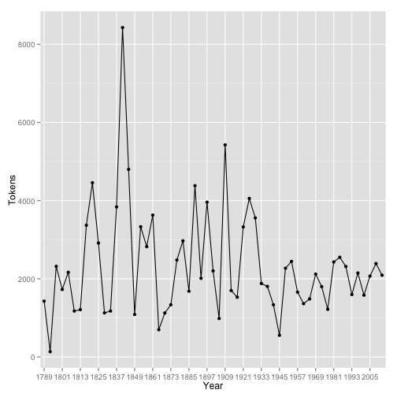
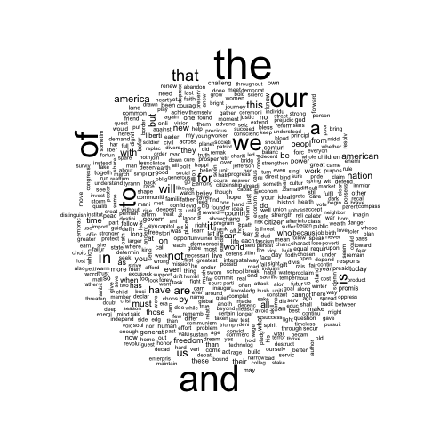
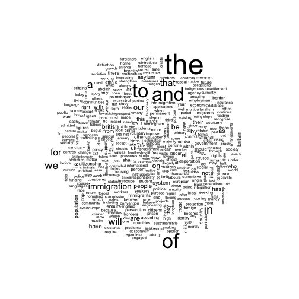

<!--
%\VignetteEngine{knitr::rmarkdown}
%\VignetteIndexEntry{Quickstart}
-->


## The Rationale for `quanteda`

`quanteda`[^thanks] is an R package designed to simplify the process of
quantitative analysis of text from start to finish, making it possible
to turn texts into a structured corpus, conver this corpus into a
quantitative matrix of features extracted from the texts, and to
perform a variety of quanttative analyses on this matrix.

[^thanks]: This research was supported by the European
    Research Council grant ERC-2011-StG 283794-QUANTESS.  Code
    contributors to the project include Ben Lauderdale, Pablo Barberà, and 
    Kohei Watanabe.

The object is inference about the data contained in the texts, whether this means
describing characteristics of the texts, inferring quantities of
interests about the texts of their authors, or determining the tone or
topics contained in the texts.  The emphasis of `quanteda` is on
*simplicity*: creating a corpus to manage texts and variables
attached to these texts in a straightforward way, and providing
powerful tools to extract features from this corpus that can be
analyzed using quantitative techniques.

The tools for getting texts into a corpus object include: 

* loading texts from directories of individual files
* loading texts ``manually'' by inserting them into a corpus using
  helper functions
*  managing text encodings and conversions from source files into
  corpus texts
* attaching variables to each text that can be used for grouping,
  reorganizing a corpus, or simply recording additional information to
  supplement quantitative analyses with non-textual data
* recording meta-data about the sources and creation details for
  the corpus.
  
The tools for working with a corpus include:

* summarizing the corpus in terms of its language units
* reshaping the corpus into smaller units or more aggregated units
* adding to or extracting subsets of a corpus
* resampling texts of the corpus, for example for use in
  non-parametric bootstrapping of the texts
* Easy extraction and saving, as a new data frame or corpus, key
    words in context (KWIC)

For extracting features from a corpus, `quanteda` provides the following tools:

* extraction of word types
* extraction of word n-grams
* extraction of dictionary entries from user-defined dictionaries
* feature selection through
    - stemming
    - random selection
    - document frequency
    - word frequency
* and a variety of options for cleaning word types, such as
    capitalization and rules for handling punctuation.

For analyzing the resulting *document-feature* matrix created
when features are abstracted from a corpus, `quanteda` provides:

* scaling models, such as the Poisson scaling model or Wordscores
* nonparametric visualization, such as correspondence analysis
* topic models, such as LDA
* classifiers, such as Naive Bayes or k-nearest neighbour
* sentiment analysis, using dictionaries

`quanteda` is hardly unique in providing facilities for working with
text -- the excellent *tm* package already provides many of the
features we have described.  `quanteda` is designed to complement those
packages, as well to simplify the implementation of the
text-to-analysis workflow.  `quanteda` corpus structures are simpler
objects than in *tm*s, as are the document-feature matrix
objects from `quanteda`, compared to the sparse matrix implementation
found in *tm*.  However, there is no need to choose only one
package, since we provide translator functions from one matrix or
corpus object to the other in `quanteda`.

This vignette is designed to introduce you to `quanteda` as well as
provide a tutorial overview of its features.


## Installing quanteda

The code for the `quanteda` package currently resides on
<http://github.com/kbenoit/quanteda>.  From an Internet-connected
computer, you can install the package directly using the
`devtools` package:


```r
library(devtools)
if (!require(quanteda)) install_github("kbenoit/quanteda")
```

This will download the package from github and install it on your computer.
For other branches, for instance if you wish to install the
development branch (containing work in progress) rather than the
master, you should instead run:


```r
# to install the latest dev branch version quanteda from Github use:
install_github("kbenoit/quanteda", dependencies=TRUE, quick=TRUE, ref="dev")
```

Typically, the `dev` branch of a software package is under active
development --- so while it contains the latest updates, it is more likely
to have bugs. The `master` branch might be missing some of the newer
features, but should be more reliable.


## A text corpus: descriptive analysis

To try the functions provided for interacting with corpora, load the `inaugCorpus` object packaged with `quanteda`. This corpus contains US presidents' inaugural addresses since 1789, with document-level variables for the year of each address (`Year`) and the last name of the president (`President`). The `summary` command gives a brief description of the corpus, and a summary of the first `n` documents: 


```r
# make sure quanteda is loaded and load the corpus of inaugural addresses
library(quanteda)
data(inaugCorpus)
summary(inaugCorpus, n=3)
#> Corpus consisting of 57 documents, showing 3 documents.
#> 
#>             Text Types Tokens Sentences Year  President
#>  1789-Washington   594   1429        23 1789 Washington
#>  1793-Washington    90    135         4 1793 Washington
#>       1797-Adams   794   2318        37 1797      Adams
#> 
#> Source:  /home/paul/Dropbox/code/quanteda/* on x86_64 by paul.
#> Created: Fri Sep 12 12:41:17 2014.
#> Notes:   .
```

We can save the output from the summary command as a data frame, and plot some basic descriptive statistics with this information:


```r
tokenInfo <- summary(inaugCorpus)
```

```r
if (require(ggplot2))
    ggplot(data=tokenInfo, aes(x=Year, y=Tokens, group=1)) + geom_line() + geom_point() +
        scale_x_discrete(labels=c(seq(1789,2012,12)), breaks=seq(1789,2012,12) ) 
#> Loading required package: ggplot2
```

 

```r


tokenInfo[which.max(tokenInfo$Tokens),] # Longest inaugural address: William Henry Harrison
#>                        Text Types Tokens Sentences Year President
#> 1841-Harrison 1841-Harrison  1819   8428       215 1841  Harrison
```

A simple measure of the complexity of a text is lexical diversity, or the ratio of the number of unique word types (the vocabulary size) to the total number of word tokens (the length of the document in words). We can get this ratio from the corpus summary also. The type-token ratio is a simplistic measure, and is usually higher for short texts.

```r

ttr <- tokenInfo$Types/tokenInfo$Tokens
if (require(ggplot2))
    ggplot(data=tokenInfo, aes(x=Year, y=ttr, group=1)) + geom_line() + geom_point() +
        scale_x_discrete(labels=c(seq(1789,2012,12)), breaks=seq(1789,2012,12) )
#> Error in eval(expr, envir, enclos): object 'ttr' not found

tokenInfo[which.max(ttr),]
#>                            Text Types Tokens Sentences Year  President
#> 1793-Washington 1793-Washington    90    135         4 1793 Washington
```


The `kwic` function (KeyWord In Context) performs a search for a word and allows us to view the contexts in which it occurs:

```r
options(width = 200)
kwic(inaugCorpus, "terror")
#>                                                            preword      word                              postword
#>    [1797-Adams, 1183]                     by fraud or violence, by   terror, intrigue, or venality, the Government
#> [1933-Roosevelt, 100] itself -- nameless, unreasoning, unjustified    terror which paralyzes needed efforts to    
#> [1941-Roosevelt, 252]                seemed frozen by a fatalistic   terror, we proved that this is               
#>   [1961-Kennedy, 763]              alter that uncertain balance of   terror  that stays the hand of               
#>   [1961-Kennedy, 872]                    of science instead of its  terrors. Together let us explore the          
#>    [1981-Reagan, 691]               freeing all Americans from the  terror   of runaway living costs. All         
#>   [1981-Reagan, 1891]             understood by those who practice terrorism and prey upon their neighbors.\n\nI  
#>   [1997-Clinton, 929]                  They fuel the fanaticism of   terror. And they torment the lives           
#>  [1997-Clinton, 1462]            maintain a strong defense against   terror  and destruction. Our children will   
#>    [2009-Obama, 1433]               advance their aims by inducing    terror and slaughtering innocents, we say
kwic(inaugCorpus, "terror", wholeword=TRUE)
#>                                                            preword   word                           postword
#> [1933-Roosevelt, 100] itself -- nameless, unreasoning, unjustified terror which paralyzes needed efforts to 
#>   [1961-Kennedy, 763]              alter that uncertain balance of terror that stays the hand of            
#>    [1981-Reagan, 691]               freeing all Americans from the terror of runaway living costs. All      
#>  [1997-Clinton, 1462]            maintain a strong defense against terror and destruction. Our children will
#>    [2009-Obama, 1433]               advance their aims by inducing terror and slaughtering innocents, we say
kwic(inaugCorpus, "communist")
#>                                            preword       word                   postword
#>  [1949-Truman, 728] the actions resulting from the  Communist philosophy are a threat to
#> [1961-Kennedy, 453]    required -- not because the Communists may be doing it, not
```


In the above summary, `Year` and `President` are variables associated with each document. We can access such variables with the `docvars()` function.


```r
# check the document-level variable names
names(docvars(inaugCorpus))
#> [1] "Year"      "President"

# list the first few values
head(docvars(inaugCorpus))
#>                 Year  President
#> 1789-Washington 1789 Washington
#> 1793-Washington 1793 Washington
#> 1797-Adams      1797      Adams
#> 1801-Jefferson  1801  Jefferson
#> 1805-Jefferson  1805  Jefferson
#> 1809-Madison    1809    Madison

# check the corpus-level metadata
metacorpus(inaugCorpus)
#> $source
#> [1] "/home/paul/Dropbox/code/quanteda/* on x86_64 by paul"
#> 
#> $created
#> [1] "Fri Sep 12 12:41:17 2014"
#> 
#> $notes
#> NULL
#> 
#> $citation
#> NULL
```


Many more corpora are available in the [quantedaData](http://github.com/kbenoit/quantedaData) package.


## Creating a corpus

The simplest case is to create a corpus from a vector of texts already in memory in R. If we already have the texts in this form, we can call the corpus constructor function directly. `inaugTexts` is a character vector of the inaugural addresses included with `quanteda`.


```r
data(inaugTexts)
myCorpus <- corpus(inaugTexts)
```

Often, texts aren't available as pre-made R character vectors, and we need to load them from an external source.
To do this, we first create a *source* for the documents, which defines how they are loaded from the source into the corpus. The source may be a character vector, a directory of text files, a zip file, a twitter search, or several external package formats such as `tm`'s `VCorpus`.

Once a source has been defined, we make a new corpus by calling the `corpus` constructor with the source as the first argument. The corpus constructor also accepts arguments which can set some corpus metadata, and define how the document variables are set.

### From a directory of files
A very common source of files for creating
a corpus will be a set of text files found on a local (or remote)
directory. To load texts in this way, we first define a source for the directory, and pass this source as an argument to the corpus constructor. We create a directory source by calling the `directory` function. 


```r
# Basic file import from directory
d <- directory('~/Dropbox/QUANTESS/corpora/inaugural')
myCorpus <- corpus(d)
```

If the document variables are specified in the filenames of the texts, we can read them by setting the `docvarsfrom` argument (`docvarsfrom = "filenames"`) and specifiying how the filenames are formatted with the `sep` argument. For example, if the inaugural address texts were stored on disk in the format `Year-President.txt` (e.g. `1973-Nixon.txt`), then we can load them and automatically populate the document variables. The `docvarnames` argument sets the names of the document variables --- it must be the same length as the parts of the filenames.


```r
# File import reading document variables from filenames
d <- directory('~/Dropbox/QUANTESS/corpora/inaugural')

# In this example the format of the filenames is `Year-President.txt`. 
# Because there are two variables in the filename, docvarnames must contain two names
myCorpus <- corpus(d, docvarsfrom="filenames", sep="-", docvarnames=c("Year", "President") )
```

### From a twitter search

`quanteda` provides an interface to retrieve and store data from a twitter search as a corpus object. The REST API query uses the [twitteR package](https://github.com/geoffjentry/twitteR), and an API authorization from twitter is required. The process of obtaining this authorization is described in detail here: <https://openhatch.org/wiki/Community_Data_Science_Workshops/Twitter_authentication_setup>, correct as of October 2014. The twitter API is a commercial service, and rate limits and the data returned are determined by twitter.

Four keys are required, to be passed to `quanteda`'s `getTweets` source function, in addition to the search query term and the number of results required. The maximum number of results that can be obtained is not exactly identified in the API documentation, but experimentation indicates an upper bound of around 1500 results from a single query, with a frequency limit of one query per minute.

The code below performs authentication and runs a search for the string 'quantitative'. Many other functions for working with the API are available from the [twitteR package](https://github.com/geoffjentry/twitteR). An R interface to the streaming API is also available [link](link).


```r
# These keys are examples and may not work! Get your own key at dev.twitter.com
consumer_key="vRLy03ef6OFAZB7oCL4jA"
consumer_secret="wWF35Lr1raBrPerVHSDyRftv8qB1H7ltV0T3Srb3s"
access_token="1577780816-wVbOZEED8KZs70PwJ2q5ld2w9CcvcZ2kC6gPnAo"
token_secret="IeC6iYlgUK9csWiP524Jb4UNM8RtQmHyetLi9NZrkJA"


tw <- getTweets('quantitative', numResults=20, consumer_key, consumer_secret, access_token, token_secret)
```

The return value from the above query is a source object which can be passed to quanteda's corpus constructor, and the document variables are set to correspond with tweet metadata returned by the API.


```r
twCorpus <- corpus(tw)
names(docvars(twCorpus))
```


## Extracting Features


In order to perform statistical analysis such as document scaling, we
must extract a matrix associating values for certain features with each
document. In quanteda, we use the `dfm` function to produce such a matrix.
[^1].

### Basic document-frequency matrix
By far the most common approach is to consider each word type to be a
feature, and the number of occurrences of the word type in each document
the values. This is easy to see with a concrete example, so lets use the `dfm` command on the inaugural address corpus. To simplify the example output, we reduce the size of the inaugCorpus object using the corpus `subset` function, which can create a new corpus from a subset, selecting by document variables.


```r
data(inaugCorpus)
myCorpus <- subset(inaugCorpus, Year > 1990)

# make a dfm
myDfm <- dfm(myCorpus)
#> Creating a dfm from a corpus ...
#>    ... indexing 6 documents
#>    ... tokenizing texts, found 11,948 total tokens
#>    ... cleaning the tokens, 70 removed entirely
#>    ... summing tokens by document
#>    ... indexing 2,291 feature types
#>    ... building sparse matrix
#>    ... created a 6 x 2291 sparse dfm
#>    ... complete. Elapsed time: 0.124 seconds.
myDfm [,1:5]
#> Document-feature matrix of: 6 documents, 5 features.
#> 6 x 5 sparse Matrix of class "dfmSparse"
#>               features
#> docs            a abandon abandoned abandonment abiding
#>   1993-Clinton 17       0         0           0       1
#>   1997-Clinton 59       0         0           0       0
#>   2001-Bush    44       0         0           1       0
#>   2005-Bush    27       2         0           0       0
#>   2009-Obama   47       0         1           0       0
#>   2013-Obama   37       0         0           0       0

# make a dfm, removing stopwords and applying stemming
myStemMat <- dfm(myCorpus, stopwords=TRUE, stem=TRUE)
#> Creating a dfm from a corpus ...
#>    ... indexing 6 documents
#>    ... tokenizing texts, found 11,948 total tokens
#>    ... cleaning the tokens, 70 removed entirely
#>    ... stemming the tokens (english)
#>    ... summing tokens by document
#>    ... indexing 1,790 feature types
#>    ... building sparse matrix
#>    ... created a 6 x 1790 sparse dfm
#>    ... complete. Elapsed time: 0.128 seconds.
myStemMat [,1:5]
#> Document-feature matrix of: 6 documents, 5 features.
#> 6 x 5 sparse Matrix of class "dfmSparse"
#>               features
#> docs            a abandon abid abil abl
#>   1993-Clinton 17       0    1    0   1
#>   1997-Clinton 59       0    0    0   0
#>   2001-Bush    44       1    0    0   0
#>   2005-Bush    27       2    0    0   0
#>   2009-Obama   47       1    0    1   0
#>   2013-Obama   37       0    0    0   0
```

### Viewing the document-frequency matrix

The dfm can be inspected in the Enviroment pane in RStudio, or by calling R's `View` function. Calling `plot` on a dfm will display a wordcloud using the [wordcloud package](link.)

```r
plot(myStemMat)
```

 

### Grouping documents by document variable 

Often, we are interested in analysing how texts differ according to substantive factors which may be encoded in the document variables, rather than simply by the boundaries of the document files. We can group documents which share the same value for a document variable when creating a dfm:


```r
byPresMat <- dfm(myCorpus, groups=c('President'), stopwords=TRUE)
#> Creating a dfm from a corpus ...
#>    ... grouping texts by variable: President
#>    ... indexing 3 documents
#>    ... tokenizing texts, found 11,948 total tokens
#>    ... cleaning the tokens, 70 removed entirely
#>    ... summing tokens by document
#>    ... indexing 2,291 feature types
#>    ... building sparse matrix
#>    ... created a 3 x 2291 sparse dfm
#>    ... complete. Elapsed time: 0.132 seconds.
byPresMat[,1:5] # the counts here are sums of counts from speeches by the same President.
#> Document-feature matrix of: 3 documents, 5 features.
#> 3 x 5 sparse Matrix of class "dfmSparse"
#>          features
#> docs       a abandon abandoned abandonment abiding
#>   Bush    71       2         0           1       0
#>   Clinton 76       0         0           0       1
#>   Obama   84       0         1           0       0
```

### Grouping words by dictionary or equivalence class

For some applications we have prior knowledge of sets of words that are indicative of traits we would like to measure from the text. For example, a general list of positive words might indicate positive sentiment in a movie review, or we might have a dictionary of political terms which are associated with a particular ideological stance. In these cases, it is sometimes useful to treat these groups of words as equivalent for the purposes of analysis, and sum their counts into classes. 

For example, let's look at how words associated with terrorism and words associated with the economy vary by President in the inaugural speeches corpus. From the original corpus, we select Presidents since Clinton:


```r
data(inaugCorpus)
recentCorpus <- subset(inaugCorpus, Year > 1991)
```

Now we define a toy dictionary:

```r
myDict<-list(terror=c("terrorism", "terrorists", "threat","a"),
             economy=c("jobs", "business", "grow","work"))
```


We can use the dictionary when making the dfm:

```r
# I don't think this is working
byPresMat <- dfm(myCorpus, dictionary=myDict)
#> Creating a dfm from a corpus ...
#>    ... indexing 6 documents
#>    ... tokenizing texts, found 11,948 total tokens
#>    ... cleaning the tokens, 70 removed entirely
#>    ... applying a dictionary consisting of 2 key entries
#>    ... created a 6 x 3 sparse dfm
#>    ... complete. Elapsed time: 0.139 seconds.
```

[^1]: dfm stands for document-feature matrix — we say "feature" as
    opposed to "term", since it is possible to use other properties of
    documents (e.g. ngrams or syntactic dependencies) for further
    analysis
    


## Further example:


```r
library(quanteda)
# create a corpus from the immigration texts from UK party platforms
uk2010immigCorpus <- corpus(ukimmigTexts,
                            docvars=data.frame(party=names(ukimmigTexts)),
                            notes="Immigration-related sections of 2010 UK party manifestos",
                            enc="UTF-8")
#>   note: converted texts from UTF-8 to UTF-8.
uk2010immigCorpus
#> Corpus consisting of 9 documents.
summary(uk2010immigCorpus, showmeta=TRUE)
#> Corpus consisting of 9 documents.
#> 
#>          Text Types Tokens Sentences        party _encoding
#>           BNP   969   2765       130          BNP     UTF-8
#>     Coalition   133    231        12    Coalition     UTF-8
#>  Conservative   234    452        15 Conservative     UTF-8
#>        Greens   301    608        29       Greens     UTF-8
#>        Labour   279    615        29       Labour     UTF-8
#>        LibDem   239    434        22       LibDem     UTF-8
#>            PC    72    101         5           PC     UTF-8
#>           SNP    81    124         4          SNP     UTF-8
#>          UKIP   303    625        41         UKIP     UTF-8
#> 
#> Source:  /Users/kbenoit/Dropbox/QUANTESS/quanteda_kenlocal_gh/vignettes/* on x86_64 by kbenoit.
#> Created: Tue May  5 18:11:10 2015.
#> Notes:   Immigration-related sections of 2010 UK party manifestos.

# key words in context for "deport", 3 words of context
kwic(uk2010immigCorpus, "deport", 3)
#>                                               preword         word                     postword
#>     [BNP, 71]                further immigration, the deportation  of all illegal              
#>    [BNP, 139]                            The BNP will    deport    all foreigners convicted    
#>   [BNP, 1628] long-term resettlement programme.\n\n2.    Deport    all illegal immigrants\n\nWe
#>   [BNP, 1633]          illegal immigrants\n\nWe shall    deport    all illegal immigrants      
#>   [BNP, 1653]                current unacceptably lax deportation  policies, thousands of      
#>   [BNP, 1659]                           of people are   deported   from the UK                 
#>   [BNP, 2169]                     enforced by instant deportation, for anyone found            
#>   [BNP, 2180]         British immigration laws.\n\n8. Deportation  of all Foreign              
#>   [BNP, 2186]           Foreign Criminals\n\nWe shall    deport    all criminal entrants,      
#>   [BNP, 2198]                       This includes the deportation  of all Muslim               
#> [Greens, 566]                      subject to summary deportation. They should receive         
#> [LibDem, 194]         illegal labour.\n\n- Prioritise deportation  efforts on criminals,       
#> [LibDem, 394]                  flight risks.\n\n- End deportations of refugees to              
#>   [UKIP, 317]                            laws or face deportation. Such citizens will

# create a dfm, removing stopwords
mydfm <- dfm(uk2010immigCorpus, stopwords=TRUE)
#> Creating a dfm from a corpus ...
#>    ... indexing 9 documents
#>    ... tokenizing texts, found 6,141 total tokens
#>    ... cleaning the tokens, 186 removed entirely
#>    ... summing tokens by document
#>    ... indexing 1,587 feature types
#>    ... building sparse matrix
#>    ... created a 9 x 1587 sparse dfm
#>    ... complete. Elapsed time: 0.066 seconds.
dim(mydfm)              # basic dimensions of the dfm
#> [1]    9 1587
topfeatures(mydfm, 15)  # 15 top words
#>         the          of         and          to          in          we           a        will         for        that immigration          be         our          is         are 
#>         339         228         217         217         117          95          89          86          77          76          66          53          53          50          48
# if (Sys.info()["sysname"] == "Darwin") quartz(width=8, height=8)
plot(mydfm)             # word cloud  
```

 


